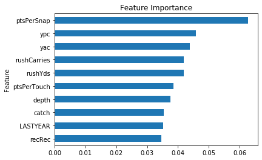
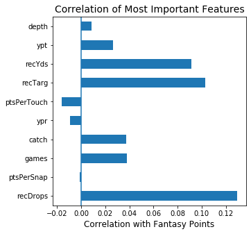
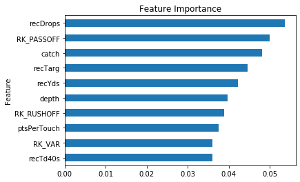

# ABSTRACT


This data science project  investigates the relationship between NFL player statistics and which ones are the most productive to win fantasy football games.

Fantasy sports in the U.S. continues to grow. The fantasy sports industry has grown from an estimated 32 million players in the US and Canada in 2010 to over 64 million in 2019. The industry grew in the U.S. from 42 million in 2015 to 45.9 million in 2019 (according to TheFSGA.org).  In addition, according to the legal betting congress bill tracker (https://www.legalsportsreport.com/sportsbetting-bill-tracker/) there could be 41 states with some form of legalized sports gambling in the U.S in 2020.  In addition, more and more people are betting on daily fantasy football with the popularity of sites like FanDuel, DraftKings and draft.com.

There’s essentially 3 outcomes/goals for this project:

* Win season long fantasy football against your friends and colleagues. Think about the “bragging rights.”  In addition, some of these leagues have financial gains too
* Don't waste money for statistical services that don't provide good research
* Saving you from the worst case scenario of coming in last place with season long fantasy football.   

These goals can be achieved by providing better knowledge of which statistical features are more likely to win in fantasy football

These predictors will not only increase chances of winning more fantasy football but reduce coming in last place in season long leagues.  This can be a “big deal” because of the last place punishments with many leagues.  Some of these punishments are small like being forced display a loser trophy or brand a t-shirt declaring the loss for the year.  Some of these punishments can be more dramatic.  Every year, I read about punishments like tattoos, walking in underwear on a freezing cold day on a busy city sidewalk, eyebrow shavings and more.  One of the leagues that I am involved there’s a public posting on a particular well known blog site of the person who took last place and that person has to write a recap of their season long errors.  

Data

I researched data from multiple data sources, including but not limited to following:  

* SportsDataIO via API
* ProFootball Focus (PFF) via CSV files
* Football Outsiders via web scraping 
* The Football database via API.

There were others but wanted to mention these because they have had good information.   Many of the above sources supplied similar datasets so I ultimately decided to merge data from PFF and Football Outsiders.  Football Outsiders data was different with some of its stats for offensive lines (the role of the team that blocks QB from being tackled and helps in many areas of the running portion of the game).  I decided to narrow my data to just one year of data.  I originally did analytics for a 3 year time horizon but ultimately decided that the most previous year of data would be the best option because of the very high turnover of NFL players based upon changing teams and injuries.  

All and all the final datasets were not super large.  There were 544 rows and 74 columns.  I did remove approximately 10 rows throughout the Explore and Modeling phases of the project.  

The models were done with two separate datasets:  
* One for running backs  
* another for wide receivers. 

This was done to improve model accuracy by training models with the most relevant features.

Models

I trained and evaluated several machine learning models to decipher which statical  features should be used to target the best possible players to draft. 

I originally  tried to train several regression based machine learning models but was not happy with the models score evaluations.  I converted data to classification models.  The following models were deployed

* Decision Tree
* Random Forest
* XGBoost


# BACKGROUND

  Rules of the Game

I wanted to provide some of the rules of the game for daily fantasy football first.  You select a lineup of actual NFL players given several constraints.   The biggest limitation is a set salary cap that cannot be exceeded.  You can spend credits based upon a market evaluation of players costs.  Typically, invest these credits into 8 player positions.  The most common lineup for daily fantasy are the following positions:  

* 1 quarterback (QB)
* 2 running backs (RB)
* 3 wide receivers (WR)
* 1 tight end (TE)
* 1 kicker (K)
* 1 defense 

This project is predicting best stats to invest into for just RB.  There are many ways for these players to score or even lose fantasy points based upon actual game day production. How most points are scored and lost:

* Receive 0.1 point for every yard gained in a game and can also lose .1 point for every 0.1 yard lost
* Receive 6 points for touchdowns
* Receive 2 point for 2 point conversions
* Lose 2 points for lost fumbles
* Many fantasy games also score 1 point per reception or half point 

For the analysis conducted in this project, I gathered and wrangled data for .5 PPR (Points Per Reception) leagues where players are awarded 0.5 points for every reception.  

For season long fantasy football (vs. daily) the football players are normally drafted prior to the beginning of the season; whereas, daily fantasy is just a one time draft occurrence.  There are not a lot of differences between daily and season long fantasy football.  For the most part, scoring is the same.  The main difference is that season long fantasy league players can’t play the same players.  I should note that the term player can sometime be confusing because it's used for both NFL players and for those players participated in the fantasy football leagues.


# OBTAIN


## Imports


```python
import pandas as pd
import os
import numpy as np 
import matplotlib.pyplot as plt
%matplotlib inline
import seaborn as sns
import requests
```


```python
from sklearn.model_selection import train_test_split, GridSearchCV, cross_val_score
from sklearn.tree import DecisionTreeClassifier 
from sklearn.metrics import accuracy_score, plot_confusion_matrix
from sklearn.tree import export_graphviz
from sklearn.preprocessing import OneHotEncoder 
from sklearn.tree import export_graphviz
from pydotplus import graph_from_dot_data
from sklearn.ensemble import RandomForestClassifier, AdaBoostClassifier
```


```python

```

## PFF (ProFootball Focus)


```python
pwd
```


    '/Users/jlemaster/mod6_capstone/CapstoneFantasyFootball'


```python
ls
```

    Capstone presentation.key*            fantasyfootball.ipynb
    Capstone presentation.pdf             footballoutsiders2018.csv
    README.md                             footballoutsiders2019.csv
    Untitled.ipynb                        pff_stas_rr_2019.csv
    allpff.csv                            pff_stats_rr_2017.csv
    fantasyfootball-Copy1.ipynb           pff_stats_rr_2018.csv
    fantasyfootball-classification.ipynb  players_sportsio.json


```python
# Set Max Display..showing all columns
pd.set_option("display.max_columns", 0)
```

### DFF 2019


```python
df_pff2019 = pd.read_csv('pff_stas_rr_2019.csv')
df_pff2019['year']=2019
df_pff2019.head()
```


<div>
<style scoped>
    .dataframe tbody tr th:only-of-type {
        vertical-align: middle;
    }

    .dataframe tbody tr th {
        vertical-align: top;
    }

    .dataframe thead th {
        text-align: right;
    }
</style>
<table border="1" class="dataframe">
  <thead>
    <tr style="text-align: right;">
      <th></th>
      <th>player</th>
      <th>team</th>
      <th>games</th>
      <th>position</th>
      <th>recTarg</th>
      <th>recRec</th>
      <th>recRec40s</th>
      <th>recYds</th>
      <th>recYds100Games</th>
      <th>recTds</th>
      <th>recTd40s</th>
      <th>recDrops</th>
      <th>catch</th>
      <th>depth</th>
      <th>ypt</th>
      <th>ypr</th>
      <th>rac</th>
      <th>rzRecTarg</th>
      <th>rzRecRec</th>
      <th>rzRecTds</th>
      <th>rzRecTargPct</th>
      <th>rzRecRecPct</th>
      <th>rzRecTdPct</th>
      <th>ezRecTarg</th>
      <th>ezRecTds</th>
      <th>ezRecTargPct</th>
      <th>ezRecRecPct</th>
      <th>ezRecTdPct</th>
      <th>rushCarries</th>
      <th>rush40s</th>
      <th>rushYds</th>
      <th>rushYds100Games</th>
      <th>rushTds</th>
      <th>rushTd40s</th>
      <th>ypc</th>
      <th>yac</th>
      <th>rushTa</th>
      <th>tat</th>
      <th>fumbles</th>
      <th>rzRushCarries</th>
      <th>rzRushTds</th>
      <th>rzRushPct</th>
      <th>rzRushTdPct</th>
      <th>i5RushCarries</th>
      <th>i5RushTds</th>
      <th>i5RushPct</th>
      <th>i5RushTdPct</th>
      <th>patConversions</th>
      <th>patAttempts</th>
      <th>fantasyPts</th>
      <th>ptsPerSnap</th>
      <th>ptsPerTouch</th>
      <th>year</th>
    </tr>
  </thead>
  <tbody>
    <tr>
      <td>0</td>
      <td>Brandon Zylstra</td>
      <td>CAR</td>
      <td>7</td>
      <td>WR</td>
      <td>12</td>
      <td>8</td>
      <td>1</td>
      <td>106</td>
      <td>0</td>
      <td>0</td>
      <td>0</td>
      <td>1</td>
      <td>66.7</td>
      <td>13.50</td>
      <td>8.83</td>
      <td>13.25</td>
      <td>1.63</td>
      <td>NaN</td>
      <td>NaN</td>
      <td>NaN</td>
      <td>NaN</td>
      <td>NaN</td>
      <td>NaN</td>
      <td>NaN</td>
      <td>NaN</td>
      <td>NaN</td>
      <td>NaN</td>
      <td>NaN</td>
      <td>0</td>
      <td>0</td>
      <td>0</td>
      <td>0</td>
      <td>0</td>
      <td>0</td>
      <td>0.0</td>
      <td>0.0</td>
      <td>0</td>
      <td>0.0</td>
      <td>0</td>
      <td>NaN</td>
      <td>NaN</td>
      <td>NaN</td>
      <td>NaN</td>
      <td>NaN</td>
      <td>NaN</td>
      <td>NaN</td>
      <td>NaN</td>
      <td>0</td>
      <td>0</td>
      <td>14.6</td>
      <td>0.21</td>
      <td>1.82</td>
      <td>2019</td>
    </tr>
    <tr>
      <td>1</td>
      <td>Alexander Hollins</td>
      <td>MIN</td>
      <td>5</td>
      <td>WR</td>
      <td>4</td>
      <td>2</td>
      <td>0</td>
      <td>46</td>
      <td>0</td>
      <td>0</td>
      <td>0</td>
      <td>1</td>
      <td>50.0</td>
      <td>19.00</td>
      <td>11.50</td>
      <td>23.00</td>
      <td>2.50</td>
      <td>NaN</td>
      <td>NaN</td>
      <td>NaN</td>
      <td>NaN</td>
      <td>NaN</td>
      <td>NaN</td>
      <td>NaN</td>
      <td>NaN</td>
      <td>NaN</td>
      <td>NaN</td>
      <td>NaN</td>
      <td>0</td>
      <td>0</td>
      <td>0</td>
      <td>0</td>
      <td>0</td>
      <td>0</td>
      <td>0.0</td>
      <td>0.0</td>
      <td>0</td>
      <td>0.0</td>
      <td>0</td>
      <td>NaN</td>
      <td>NaN</td>
      <td>NaN</td>
      <td>NaN</td>
      <td>NaN</td>
      <td>NaN</td>
      <td>NaN</td>
      <td>NaN</td>
      <td>0</td>
      <td>0</td>
      <td>5.6</td>
      <td>0.08</td>
      <td>2.80</td>
      <td>2019</td>
    </tr>
    <tr>
      <td>2</td>
      <td>Darious Williams</td>
      <td>LA</td>
      <td>1</td>
      <td>WR</td>
      <td>0</td>
      <td>0</td>
      <td>0</td>
      <td>0</td>
      <td>0</td>
      <td>0</td>
      <td>0</td>
      <td>0</td>
      <td>0.0</td>
      <td>0.00</td>
      <td>0.00</td>
      <td>0.00</td>
      <td>0.00</td>
      <td>NaN</td>
      <td>NaN</td>
      <td>NaN</td>
      <td>NaN</td>
      <td>NaN</td>
      <td>NaN</td>
      <td>NaN</td>
      <td>NaN</td>
      <td>NaN</td>
      <td>NaN</td>
      <td>NaN</td>
      <td>0</td>
      <td>0</td>
      <td>0</td>
      <td>0</td>
      <td>0</td>
      <td>0</td>
      <td>0.0</td>
      <td>0.0</td>
      <td>0</td>
      <td>0.0</td>
      <td>0</td>
      <td>NaN</td>
      <td>NaN</td>
      <td>NaN</td>
      <td>NaN</td>
      <td>NaN</td>
      <td>NaN</td>
      <td>NaN</td>
      <td>NaN</td>
      <td>0</td>
      <td>0</td>
      <td>0.0</td>
      <td>0.00</td>
      <td>NaN</td>
      <td>2019</td>
    </tr>
    <tr>
      <td>3</td>
      <td>Keelan Cole</td>
      <td>JAX</td>
      <td>16</td>
      <td>WR</td>
      <td>36</td>
      <td>24</td>
      <td>2</td>
      <td>361</td>
      <td>0</td>
      <td>3</td>
      <td>0</td>
      <td>1</td>
      <td>66.7</td>
      <td>12.08</td>
      <td>10.03</td>
      <td>15.04</td>
      <td>4.38</td>
      <td>NaN</td>
      <td>NaN</td>
      <td>NaN</td>
      <td>NaN</td>
      <td>NaN</td>
      <td>NaN</td>
      <td>NaN</td>
      <td>NaN</td>
      <td>NaN</td>
      <td>NaN</td>
      <td>NaN</td>
      <td>1</td>
      <td>0</td>
      <td>6</td>
      <td>0</td>
      <td>0</td>
      <td>0</td>
      <td>6.0</td>
      <td>5.0</td>
      <td>0</td>
      <td>0.0</td>
      <td>0</td>
      <td>NaN</td>
      <td>NaN</td>
      <td>NaN</td>
      <td>NaN</td>
      <td>NaN</td>
      <td>NaN</td>
      <td>NaN</td>
      <td>NaN</td>
      <td>0</td>
      <td>1</td>
      <td>66.7</td>
      <td>0.18</td>
      <td>2.67</td>
      <td>2019</td>
    </tr>
    <tr>
      <td>4</td>
      <td>Gary Jennings</td>
      <td>MIA</td>
      <td>1</td>
      <td>WR</td>
      <td>0</td>
      <td>0</td>
      <td>0</td>
      <td>0</td>
      <td>0</td>
      <td>0</td>
      <td>0</td>
      <td>0</td>
      <td>0.0</td>
      <td>0.00</td>
      <td>0.00</td>
      <td>0.00</td>
      <td>0.00</td>
      <td>NaN</td>
      <td>NaN</td>
      <td>NaN</td>
      <td>NaN</td>
      <td>NaN</td>
      <td>NaN</td>
      <td>NaN</td>
      <td>NaN</td>
      <td>NaN</td>
      <td>NaN</td>
      <td>NaN</td>
      <td>0</td>
      <td>0</td>
      <td>0</td>
      <td>0</td>
      <td>0</td>
      <td>0</td>
      <td>0.0</td>
      <td>0.0</td>
      <td>0</td>
      <td>0.0</td>
      <td>0</td>
      <td>NaN</td>
      <td>NaN</td>
      <td>NaN</td>
      <td>NaN</td>
      <td>NaN</td>
      <td>NaN</td>
      <td>NaN</td>
      <td>NaN</td>
      <td>0</td>
      <td>0</td>
      <td>0.0</td>
      <td>0.00</td>
      <td>NaN</td>
      <td>2019</td>
    </tr>
  </tbody>
</table>
</div>


### DFF 2018


```python
df_pff2018 = pd.read_csv('pff_stats_rr_2018.csv')
df_pff2018['year']=2018
df_pff2018.head()
```


<div>
<style scoped>
    .dataframe tbody tr th:only-of-type {
        vertical-align: middle;
    }

    .dataframe tbody tr th {
        vertical-align: top;
    }

    .dataframe thead th {
        text-align: right;
    }
</style>
<table border="1" class="dataframe">
  <thead>
    <tr style="text-align: right;">
      <th></th>
      <th>player</th>
      <th>team</th>
      <th>games</th>
      <th>position</th>
      <th>recTarg</th>
      <th>recRec</th>
      <th>recRec40s</th>
      <th>recYds</th>
      <th>recYds100Games</th>
      <th>recTds</th>
      <th>recTd40s</th>
      <th>recDrops</th>
      <th>catch</th>
      <th>depth</th>
      <th>ypt</th>
      <th>ypr</th>
      <th>rac</th>
      <th>rzRecTarg</th>
      <th>rzRecRec</th>
      <th>rzRecTds</th>
      <th>rzRecTargPct</th>
      <th>rzRecRecPct</th>
      <th>rzRecTdPct</th>
      <th>ezRecTarg</th>
      <th>ezRecTds</th>
      <th>ezRecTargPct</th>
      <th>ezRecRecPct</th>
      <th>ezRecTdPct</th>
      <th>rushCarries</th>
      <th>rush40s</th>
      <th>rushYds</th>
      <th>rushYds100Games</th>
      <th>rushTds</th>
      <th>rushTd40s</th>
      <th>ypc</th>
      <th>yac</th>
      <th>rushTa</th>
      <th>tat</th>
      <th>fumbles</th>
      <th>rzRushCarries</th>
      <th>rzRushTds</th>
      <th>rzRushPct</th>
      <th>rzRushTdPct</th>
      <th>i5RushCarries</th>
      <th>i5RushTds</th>
      <th>i5RushPct</th>
      <th>i5RushTdPct</th>
      <th>patConversions</th>
      <th>patAttempts</th>
      <th>fantasyPts</th>
      <th>ptsPerSnap</th>
      <th>ptsPerTouch</th>
      <th>year</th>
    </tr>
  </thead>
  <tbody>
    <tr>
      <td>0</td>
      <td>Vyncint Smith</td>
      <td>HST</td>
      <td>6</td>
      <td>WR</td>
      <td>9</td>
      <td>5</td>
      <td>0</td>
      <td>91</td>
      <td>0</td>
      <td>1</td>
      <td>0</td>
      <td>1</td>
      <td>55.6</td>
      <td>23.33</td>
      <td>10.11</td>
      <td>18.20</td>
      <td>0.80</td>
      <td>NaN</td>
      <td>NaN</td>
      <td>NaN</td>
      <td>NaN</td>
      <td>NaN</td>
      <td>NaN</td>
      <td>NaN</td>
      <td>NaN</td>
      <td>NaN</td>
      <td>NaN</td>
      <td>NaN</td>
      <td>0</td>
      <td>0</td>
      <td>0</td>
      <td>0</td>
      <td>0</td>
      <td>0</td>
      <td>0.00</td>
      <td>0.00</td>
      <td>0</td>
      <td>0.00</td>
      <td>0</td>
      <td>NaN</td>
      <td>NaN</td>
      <td>NaN</td>
      <td>NaN</td>
      <td>NaN</td>
      <td>NaN</td>
      <td>NaN</td>
      <td>NaN</td>
      <td>0</td>
      <td>0</td>
      <td>17.6</td>
      <td>0.10</td>
      <td>3.52</td>
      <td>2018</td>
    </tr>
    <tr>
      <td>1</td>
      <td>Keelan Cole</td>
      <td>JAX</td>
      <td>16</td>
      <td>WR</td>
      <td>64</td>
      <td>38</td>
      <td>0</td>
      <td>491</td>
      <td>1</td>
      <td>1</td>
      <td>0</td>
      <td>6</td>
      <td>59.4</td>
      <td>10.19</td>
      <td>7.67</td>
      <td>12.92</td>
      <td>3.63</td>
      <td>NaN</td>
      <td>NaN</td>
      <td>NaN</td>
      <td>NaN</td>
      <td>NaN</td>
      <td>NaN</td>
      <td>NaN</td>
      <td>NaN</td>
      <td>NaN</td>
      <td>NaN</td>
      <td>NaN</td>
      <td>0</td>
      <td>0</td>
      <td>0</td>
      <td>0</td>
      <td>0</td>
      <td>0</td>
      <td>0.00</td>
      <td>0.00</td>
      <td>0</td>
      <td>0.00</td>
      <td>2</td>
      <td>NaN</td>
      <td>NaN</td>
      <td>NaN</td>
      <td>NaN</td>
      <td>NaN</td>
      <td>NaN</td>
      <td>NaN</td>
      <td>NaN</td>
      <td>0</td>
      <td>0</td>
      <td>74.1</td>
      <td>0.11</td>
      <td>1.95</td>
      <td>2018</td>
    </tr>
    <tr>
      <td>2</td>
      <td>Derrick Willies</td>
      <td>CLV</td>
      <td>4</td>
      <td>WR</td>
      <td>5</td>
      <td>3</td>
      <td>0</td>
      <td>61</td>
      <td>0</td>
      <td>0</td>
      <td>0</td>
      <td>0</td>
      <td>60.0</td>
      <td>11.80</td>
      <td>12.20</td>
      <td>20.33</td>
      <td>11.00</td>
      <td>NaN</td>
      <td>NaN</td>
      <td>NaN</td>
      <td>NaN</td>
      <td>NaN</td>
      <td>NaN</td>
      <td>NaN</td>
      <td>NaN</td>
      <td>NaN</td>
      <td>NaN</td>
      <td>NaN</td>
      <td>0</td>
      <td>0</td>
      <td>0</td>
      <td>0</td>
      <td>0</td>
      <td>0</td>
      <td>0.00</td>
      <td>0.00</td>
      <td>0</td>
      <td>0.00</td>
      <td>1</td>
      <td>NaN</td>
      <td>NaN</td>
      <td>NaN</td>
      <td>NaN</td>
      <td>NaN</td>
      <td>NaN</td>
      <td>NaN</td>
      <td>NaN</td>
      <td>0</td>
      <td>0</td>
      <td>7.6</td>
      <td>0.25</td>
      <td>2.53</td>
      <td>2018</td>
    </tr>
    <tr>
      <td>3</td>
      <td>D.J. Moore</td>
      <td>CAR</td>
      <td>16</td>
      <td>WR</td>
      <td>76</td>
      <td>54</td>
      <td>3</td>
      <td>781</td>
      <td>1</td>
      <td>2</td>
      <td>1</td>
      <td>4</td>
      <td>71.1</td>
      <td>9.62</td>
      <td>10.28</td>
      <td>14.46</td>
      <td>7.91</td>
      <td>NaN</td>
      <td>NaN</td>
      <td>NaN</td>
      <td>NaN</td>
      <td>NaN</td>
      <td>NaN</td>
      <td>NaN</td>
      <td>NaN</td>
      <td>NaN</td>
      <td>NaN</td>
      <td>NaN</td>
      <td>13</td>
      <td>0</td>
      <td>172</td>
      <td>0</td>
      <td>0</td>
      <td>0</td>
      <td>13.23</td>
      <td>7.77</td>
      <td>6</td>
      <td>0.46</td>
      <td>3</td>
      <td>NaN</td>
      <td>NaN</td>
      <td>NaN</td>
      <td>NaN</td>
      <td>NaN</td>
      <td>NaN</td>
      <td>NaN</td>
      <td>NaN</td>
      <td>0</td>
      <td>0</td>
      <td>134.3</td>
      <td>0.18</td>
      <td>2.00</td>
      <td>2018</td>
    </tr>
    <tr>
      <td>4</td>
      <td>Calvin Ridley</td>
      <td>ATL</td>
      <td>16</td>
      <td>WR</td>
      <td>91</td>
      <td>64</td>
      <td>4</td>
      <td>821</td>
      <td>1</td>
      <td>10</td>
      <td>3</td>
      <td>8</td>
      <td>70.3</td>
      <td>10.38</td>
      <td>9.02</td>
      <td>12.83</td>
      <td>5.73</td>
      <td>NaN</td>
      <td>NaN</td>
      <td>NaN</td>
      <td>NaN</td>
      <td>NaN</td>
      <td>NaN</td>
      <td>NaN</td>
      <td>NaN</td>
      <td>NaN</td>
      <td>NaN</td>
      <td>NaN</td>
      <td>5</td>
      <td>0</td>
      <td>24</td>
      <td>0</td>
      <td>0</td>
      <td>0</td>
      <td>4.80</td>
      <td>3.00</td>
      <td>1</td>
      <td>0.20</td>
      <td>2</td>
      <td>NaN</td>
      <td>NaN</td>
      <td>NaN</td>
      <td>NaN</td>
      <td>NaN</td>
      <td>NaN</td>
      <td>NaN</td>
      <td>NaN</td>
      <td>0</td>
      <td>0</td>
      <td>176.5</td>
      <td>0.27</td>
      <td>2.56</td>
      <td>2018</td>
    </tr>
  </tbody>
</table>
</div>


```python
ls
```

    Capstone presentation.key*            fantasyfootball.ipynb
    Capstone presentation.pdf             footballoutsiders2018.csv
    README.md                             footballoutsiders2019.csv
    Untitled.ipynb                        pff_stas_rr_2019.csv
    allpff.csv                            pff_stats_rr_2017.csv
    fantasyfootball-Copy1.ipynb           pff_stats_rr_2018.csv
    fantasyfootball-classification.ipynb  players_sportsio.json


### DFF 2017


```python
df_pff2017 = pd.read_csv('pff_stats_rr_2017.csv')
df_pff2017['year']=2017
df_pff2017.head()
```


<div>
<style scoped>
    .dataframe tbody tr th:only-of-type {
        vertical-align: middle;
    }

    .dataframe tbody tr th {
        vertical-align: top;
    }

    .dataframe thead th {
        text-align: right;
    }
</style>
<table border="1" class="dataframe">
  <thead>
    <tr style="text-align: right;">
      <th></th>
      <th>player</th>
      <th>team</th>
      <th>games</th>
      <th>position</th>
      <th>recTarg</th>
      <th>recRec</th>
      <th>recRec40s</th>
      <th>recYds</th>
      <th>recYds100Games</th>
      <th>recTds</th>
      <th>recTd40s</th>
      <th>recDrops</th>
      <th>catch</th>
      <th>depth</th>
      <th>ypt</th>
      <th>ypr</th>
      <th>rac</th>
      <th>rzRecTarg</th>
      <th>rzRecRec</th>
      <th>rzRecTds</th>
      <th>rzRecTargPct</th>
      <th>rzRecRecPct</th>
      <th>rzRecTdPct</th>
      <th>ezRecTarg</th>
      <th>ezRecTds</th>
      <th>ezRecTargPct</th>
      <th>ezRecRecPct</th>
      <th>ezRecTdPct</th>
      <th>rushCarries</th>
      <th>rush40s</th>
      <th>rushYds</th>
      <th>rushYds100Games</th>
      <th>rushTds</th>
      <th>rushTd40s</th>
      <th>ypc</th>
      <th>yac</th>
      <th>rushTa</th>
      <th>tat</th>
      <th>fumbles</th>
      <th>rzRushCarries</th>
      <th>rzRushTds</th>
      <th>rzRushPct</th>
      <th>rzRushTdPct</th>
      <th>i5RushCarries</th>
      <th>i5RushTds</th>
      <th>i5RushPct</th>
      <th>i5RushTdPct</th>
      <th>patConversions</th>
      <th>patAttempts</th>
      <th>fantasyPts</th>
      <th>ptsPerSnap</th>
      <th>ptsPerTouch</th>
      <th>year</th>
    </tr>
  </thead>
  <tbody>
    <tr>
      <td>0</td>
      <td>Isaac Whitney</td>
      <td>OAK</td>
      <td>2</td>
      <td>WR</td>
      <td>1</td>
      <td>0</td>
      <td>0</td>
      <td>0</td>
      <td>0</td>
      <td>0</td>
      <td>0</td>
      <td>0</td>
      <td>0.0</td>
      <td>52.00</td>
      <td>0.00</td>
      <td>0.00</td>
      <td>0.00</td>
      <td>NaN</td>
      <td>NaN</td>
      <td>NaN</td>
      <td>NaN</td>
      <td>NaN</td>
      <td>NaN</td>
      <td>NaN</td>
      <td>NaN</td>
      <td>NaN</td>
      <td>NaN</td>
      <td>NaN</td>
      <td>0</td>
      <td>0</td>
      <td>0</td>
      <td>0</td>
      <td>0</td>
      <td>0</td>
      <td>0.0</td>
      <td>0.0</td>
      <td>0</td>
      <td>0.0</td>
      <td>0</td>
      <td>NaN</td>
      <td>NaN</td>
      <td>NaN</td>
      <td>NaN</td>
      <td>NaN</td>
      <td>NaN</td>
      <td>NaN</td>
      <td>NaN</td>
      <td>0</td>
      <td>0</td>
      <td>0.0</td>
      <td>0.00</td>
      <td>NaN</td>
      <td>2017</td>
    </tr>
    <tr>
      <td>1</td>
      <td>Tanner Gentry</td>
      <td>CHI</td>
      <td>4</td>
      <td>WR</td>
      <td>5</td>
      <td>3</td>
      <td>0</td>
      <td>35</td>
      <td>0</td>
      <td>0</td>
      <td>0</td>
      <td>1</td>
      <td>60.0</td>
      <td>10.80</td>
      <td>7.00</td>
      <td>11.67</td>
      <td>0.00</td>
      <td>NaN</td>
      <td>NaN</td>
      <td>NaN</td>
      <td>NaN</td>
      <td>NaN</td>
      <td>NaN</td>
      <td>NaN</td>
      <td>NaN</td>
      <td>NaN</td>
      <td>NaN</td>
      <td>NaN</td>
      <td>0</td>
      <td>0</td>
      <td>0</td>
      <td>0</td>
      <td>0</td>
      <td>0</td>
      <td>0.0</td>
      <td>0.0</td>
      <td>0</td>
      <td>0.0</td>
      <td>0</td>
      <td>NaN</td>
      <td>NaN</td>
      <td>NaN</td>
      <td>NaN</td>
      <td>NaN</td>
      <td>NaN</td>
      <td>NaN</td>
      <td>NaN</td>
      <td>0</td>
      <td>1</td>
      <td>5.0</td>
      <td>0.03</td>
      <td>1.67</td>
      <td>2017</td>
    </tr>
    <tr>
      <td>2</td>
      <td>Bug Howard</td>
      <td>CLV</td>
      <td>0</td>
      <td>WR</td>
      <td>0</td>
      <td>0</td>
      <td>0</td>
      <td>0</td>
      <td>0</td>
      <td>0</td>
      <td>0</td>
      <td>0</td>
      <td>0.0</td>
      <td>0.00</td>
      <td>0.00</td>
      <td>0.00</td>
      <td>0.00</td>
      <td>NaN</td>
      <td>NaN</td>
      <td>NaN</td>
      <td>NaN</td>
      <td>NaN</td>
      <td>NaN</td>
      <td>NaN</td>
      <td>NaN</td>
      <td>NaN</td>
      <td>NaN</td>
      <td>NaN</td>
      <td>0</td>
      <td>0</td>
      <td>0</td>
      <td>0</td>
      <td>0</td>
      <td>0</td>
      <td>0.0</td>
      <td>0.0</td>
      <td>0</td>
      <td>0.0</td>
      <td>0</td>
      <td>NaN</td>
      <td>NaN</td>
      <td>NaN</td>
      <td>NaN</td>
      <td>NaN</td>
      <td>NaN</td>
      <td>NaN</td>
      <td>NaN</td>
      <td>0</td>
      <td>0</td>
      <td>0.0</td>
      <td>NaN</td>
      <td>NaN</td>
      <td>2017</td>
    </tr>
    <tr>
      <td>3</td>
      <td>Michael Clark</td>
      <td>GB</td>
      <td>2</td>
      <td>WR</td>
      <td>14</td>
      <td>4</td>
      <td>0</td>
      <td>41</td>
      <td>0</td>
      <td>0</td>
      <td>0</td>
      <td>1</td>
      <td>28.6</td>
      <td>16.71</td>
      <td>2.93</td>
      <td>10.25</td>
      <td>2.25</td>
      <td>NaN</td>
      <td>NaN</td>
      <td>NaN</td>
      <td>NaN</td>
      <td>NaN</td>
      <td>NaN</td>
      <td>NaN</td>
      <td>NaN</td>
      <td>NaN</td>
      <td>NaN</td>
      <td>NaN</td>
      <td>0</td>
      <td>0</td>
      <td>0</td>
      <td>0</td>
      <td>0</td>
      <td>0</td>
      <td>0.0</td>
      <td>0.0</td>
      <td>0</td>
      <td>0.0</td>
      <td>0</td>
      <td>NaN</td>
      <td>NaN</td>
      <td>NaN</td>
      <td>NaN</td>
      <td>NaN</td>
      <td>NaN</td>
      <td>NaN</td>
      <td>NaN</td>
      <td>0</td>
      <td>0</td>
      <td>6.1</td>
      <td>0.08</td>
      <td>1.52</td>
      <td>2017</td>
    </tr>
    <tr>
      <td>4</td>
      <td>C.J. Board</td>
      <td>CLV</td>
      <td>0</td>
      <td>WR</td>
      <td>0</td>
      <td>0</td>
      <td>0</td>
      <td>0</td>
      <td>0</td>
      <td>0</td>
      <td>0</td>
      <td>0</td>
      <td>0.0</td>
      <td>0.00</td>
      <td>0.00</td>
      <td>0.00</td>
      <td>0.00</td>
      <td>NaN</td>
      <td>NaN</td>
      <td>NaN</td>
      <td>NaN</td>
      <td>NaN</td>
      <td>NaN</td>
      <td>NaN</td>
      <td>NaN</td>
      <td>NaN</td>
      <td>NaN</td>
      <td>NaN</td>
      <td>0</td>
      <td>0</td>
      <td>0</td>
      <td>0</td>
      <td>0</td>
      <td>0</td>
      <td>0.0</td>
      <td>0.0</td>
      <td>0</td>
      <td>0.0</td>
      <td>0</td>
      <td>NaN</td>
      <td>NaN</td>
      <td>NaN</td>
      <td>NaN</td>
      <td>NaN</td>
      <td>NaN</td>
      <td>NaN</td>
      <td>NaN</td>
      <td>0</td>
      <td>0</td>
      <td>0.0</td>
      <td>NaN</td>
      <td>NaN</td>
      <td>2017</td>
    </tr>
  </tbody>
</table>
</div>


```python

```

## Football Outsiders (FO)

### Web Scraping (WS)

### WS Imports


```python
from bs4 import BeautifulSoup
import requests
import re
```

### FO HTML


```python
# A get request to retrieve the page
html_page = requests.get('https://www.footballoutsiders.com/stats/nfl/team-offense/2018')

# Pass the page contents to BeautifulSoup for parsing
soup = BeautifulSoup(html_page.content, 'html.parser') 
```


### HTML Table from FO


```python
table = soup.find_all('table')
```


```python
#table
```


```python
full_table = []#headers]
for row in rows[1:]:
    test_row = row.text
    #import pdb
    #pdb.set_trace()
    split_row = test_row.split('\n')
    cut_row = split_row[1:-1]
    display(cut_row,len(cut_row))

    full_table.append(cut_row)
    
#full_table
```


```python
#Loop to build final table
for i in range(len(headers)):
    headers[i] =  headers[i].replace('\t','')
headers = headers[:17]
len(headers)
```


```python
df_FO = pd.DataFrame(full_table[1:],columns=headers)#full_table[0])
#columns = df_FO.columns
df_FO.head(3)

```


<div>
<style scoped>
    .dataframe tbody tr th:only-of-type {
        vertical-align: middle;
    }

    .dataframe tbody tr th {
        vertical-align: top;
    }

    .dataframe thead th {
        text-align: right;
    }
</style>
<table border="1" class="dataframe">
  <thead>
    <tr style="text-align: right;">
      <th></th>
      <th>RK</th>
      <th>TEAM</th>
      <th>OFFENSEDVOA</th>
      <th>LASTYEAR</th>
      <th>WEI.OFFENSE</th>
      <th>RK</th>
      <th>PASSOFF</th>
      <th>RK</th>
      <th>RUSHOFF</th>
      <th>RK</th>
      <th>NON-ADJTOTAL</th>
      <th>NON-ADJPASS</th>
      <th>NON-ADJRUSH</th>
      <th>VAR</th>
      <th>RK</th>
      <th>SCHED</th>
      <th>RK</th>
    </tr>
  </thead>
  <tbody>
    <tr>
      <td>0</td>
      <td>1</td>
      <td>KC</td>
      <td>34.2%</td>
      <td>4</td>
      <td>30.6%</td>
      <td>1</td>
      <td>62.9%</td>
      <td>1</td>
      <td>11.0%</td>
      <td>4</td>
      <td>33.1%</td>
      <td>60.2%</td>
      <td>12.2%</td>
      <td>7.7%</td>
      <td>22</td>
      <td>-0.9%</td>
      <td>11</td>
    </tr>
    <tr>
      <td>1</td>
      <td>2</td>
      <td>LAR</td>
      <td>24.6%</td>
      <td>6</td>
      <td>19.3%</td>
      <td>2</td>
      <td>32.9%</td>
      <td>5</td>
      <td>21.3%</td>
      <td>1</td>
      <td>24.1%</td>
      <td>32.7%</td>
      <td>20.4%</td>
      <td>10.1%</td>
      <td>28</td>
      <td>-0.2%</td>
      <td>15</td>
    </tr>
    <tr>
      <td>2</td>
      <td>3</td>
      <td>LAC</td>
      <td>20.7%</td>
      <td>7</td>
      <td>17.1%</td>
      <td>3</td>
      <td>41.6%</td>
      <td>2</td>
      <td>4.2%</td>
      <td>7</td>
      <td>21.2%</td>
      <td>39.8%</td>
      <td>7.4%</td>
      <td>4.9%</td>
      <td>8</td>
      <td>0.3%</td>
      <td>17</td>
    </tr>
  </tbody>
</table>
</div>


```python
#df_FO.drop(columns=['LASTYEAR', 'RK'], inplace=True)
new_col_names = ['RK_TEAM', 'TEAM', 'OFFENSEDVOA', 'LASTYEAR', 
                 'WEI.OFFENSE', 'RK_WEI.OFFENSE', 'PASSOFF',
       'RK_PASSOFF', 'RUSHOFF', 'RK_RUSHOFF', 'NON-ADJTOTAL', 'NON-ADJPASS', 'NON-ADJRUSH',
       'VAR', 'RK_VAR', 'SCHED', 'RK_SCHED']
     
df_FO.columns = new_col_names
df_FO.head(2)
```


<div>
<style scoped>
    .dataframe tbody tr th:only-of-type {
        vertical-align: middle;
    }

    .dataframe tbody tr th {
        vertical-align: top;
    }

    .dataframe thead th {
        text-align: right;
    }
</style>
<table border="1" class="dataframe">
  <thead>
    <tr style="text-align: right;">
      <th></th>
      <th>RK_TEAM</th>
      <th>TEAM</th>
      <th>OFFENSEDVOA</th>
      <th>LASTYEAR</th>
      <th>WEI.OFFENSE</th>
      <th>RK_WEI.OFFENSE</th>
      <th>PASSOFF</th>
      <th>RK_PASSOFF</th>
      <th>RUSHOFF</th>
      <th>RK_RUSHOFF</th>
      <th>NON-ADJTOTAL</th>
      <th>NON-ADJPASS</th>
      <th>NON-ADJRUSH</th>
      <th>VAR</th>
      <th>RK_VAR</th>
      <th>SCHED</th>
      <th>RK_SCHED</th>
    </tr>
  </thead>
  <tbody>
    <tr>
      <td>0</td>
      <td>1</td>
      <td>KC</td>
      <td>34.2%</td>
      <td>4</td>
      <td>30.6%</td>
      <td>1</td>
      <td>62.9%</td>
      <td>1</td>
      <td>11.0%</td>
      <td>4</td>
      <td>33.1%</td>
      <td>60.2%</td>
      <td>12.2%</td>
      <td>7.7%</td>
      <td>22</td>
      <td>-0.9%</td>
      <td>11</td>
    </tr>
    <tr>
      <td>1</td>
      <td>2</td>
      <td>LAR</td>
      <td>24.6%</td>
      <td>6</td>
      <td>19.3%</td>
      <td>2</td>
      <td>32.9%</td>
      <td>5</td>
      <td>21.3%</td>
      <td>1</td>
      <td>24.1%</td>
      <td>32.7%</td>
      <td>20.4%</td>
      <td>10.1%</td>
      <td>28</td>
      <td>-0.2%</td>
      <td>15</td>
    </tr>
  </tbody>
</table>
</div>


```python
#'KC' in df_FO['TEAM']
'KC' in df_FO["TEAM"].iloc[0]
```


    True


```python
num_cols = list(df_FO.drop(['TEAM'], axis=1).columns)

num_cols
```


    ['RK_TEAM',
     'OFFENSEDVOA',
     'LASTYEAR',
     'WEI.OFFENSE',
     'RK_WEI.OFFENSE',
     'PASSOFF',
     'RK_PASSOFF',
     'RUSHOFF',
     'RK_RUSHOFF',
     'NON-ADJTOTAL',
     'NON-ADJPASS',
     'NON-ADJRUSH',
     'VAR',
     'RK_VAR',
     'SCHED',
     'RK_SCHED']


```python
#Remove %
#df_FO['OFFENSEDVOA'].str.replace('%', '')
```


```python
df_FO.dtypes
```


    RK_TEAM           object
    TEAM              object
    OFFENSEDVOA       object
    LASTYEAR          object
    WEI.OFFENSE       object
    RK_WEI.OFFENSE    object
    PASSOFF           object
    RK_PASSOFF        object
    RUSHOFF           object
    RK_RUSHOFF        object
    NON-ADJTOTAL      object
    NON-ADJPASS       object
    NON-ADJRUSH       object
    VAR               object
    RK_VAR            object
    SCHED             object
    RK_SCHED          object
    dtype: object


### Final FO DataFrame


```python
for col in num_cols:
    temp = df_FO[col]
    temp = temp.str.replace('%', '') # get rid of percentage syymbol
    change_col = pd.to_numeric(temp) 
    df_FO[col] = change_col # 
    
df_FO 
```


<div>
<style scoped>
    .dataframe tbody tr th:only-of-type {
        vertical-align: middle;
    }

    .dataframe tbody tr th {
        vertical-align: top;
    }

    .dataframe thead th {
        text-align: right;
    }
</style>
<table border="1" class="dataframe">
  <thead>
    <tr style="text-align: right;">
      <th></th>
      <th>RK_TEAM</th>
      <th>TEAM</th>
      <th>OFFENSEDVOA</th>
      <th>LASTYEAR</th>
      <th>WEI.OFFENSE</th>
      <th>RK_WEI.OFFENSE</th>
      <th>PASSOFF</th>
      <th>RK_PASSOFF</th>
      <th>RUSHOFF</th>
      <th>RK_RUSHOFF</th>
      <th>NON-ADJTOTAL</th>
      <th>NON-ADJPASS</th>
      <th>NON-ADJRUSH</th>
      <th>VAR</th>
      <th>RK_VAR</th>
      <th>SCHED</th>
      <th>RK_SCHED</th>
    </tr>
  </thead>
  <tbody>
    <tr>
      <td>0</td>
      <td>1</td>
      <td>KC</td>
      <td>34.2</td>
      <td>4</td>
      <td>30.6</td>
      <td>1</td>
      <td>62.9</td>
      <td>1</td>
      <td>11.0</td>
      <td>4</td>
      <td>33.1</td>
      <td>60.2</td>
      <td>12.2</td>
      <td>7.7</td>
      <td>22</td>
      <td>-0.9</td>
      <td>11</td>
    </tr>
    <tr>
      <td>1</td>
      <td>2</td>
      <td>LAR</td>
      <td>24.6</td>
      <td>6</td>
      <td>19.3</td>
      <td>2</td>
      <td>32.9</td>
      <td>5</td>
      <td>21.3</td>
      <td>1</td>
      <td>24.1</td>
      <td>32.7</td>
      <td>20.4</td>
      <td>10.1</td>
      <td>28</td>
      <td>-0.2</td>
      <td>15</td>
    </tr>
    <tr>
      <td>2</td>
      <td>3</td>
      <td>LAC</td>
      <td>20.7</td>
      <td>7</td>
      <td>17.1</td>
      <td>3</td>
      <td>41.6</td>
      <td>2</td>
      <td>4.2</td>
      <td>7</td>
      <td>21.2</td>
      <td>39.8</td>
      <td>7.4</td>
      <td>4.9</td>
      <td>8</td>
      <td>0.3</td>
      <td>17</td>
    </tr>
    <tr>
      <td>3</td>
      <td>4</td>
      <td>NO</td>
      <td>15.9</td>
      <td>2</td>
      <td>13.4</td>
      <td>7</td>
      <td>34.5</td>
      <td>3</td>
      <td>3.3</td>
      <td>8</td>
      <td>17.5</td>
      <td>36.8</td>
      <td>4.3</td>
      <td>7.0</td>
      <td>18</td>
      <td>3.4</td>
      <td>31</td>
    </tr>
    <tr>
      <td>4</td>
      <td>5</td>
      <td>NE</td>
      <td>14.5</td>
      <td>1</td>
      <td>16.1</td>
      <td>4</td>
      <td>33.0</td>
      <td>4</td>
      <td>2.5</td>
      <td>9</td>
      <td>13.9</td>
      <td>32.4</td>
      <td>2.1</td>
      <td>3.7</td>
      <td>5</td>
      <td>-2.5</td>
      <td>4</td>
    </tr>
    <tr>
      <td>5</td>
      <td>6</td>
      <td>PIT</td>
      <td>13.8</td>
      <td>3</td>
      <td>15.0</td>
      <td>6</td>
      <td>25.5</td>
      <td>8</td>
      <td>-2.4</td>
      <td>12</td>
      <td>12.9</td>
      <td>22.4</td>
      <td>0.8</td>
      <td>6.4</td>
      <td>14</td>
      <td>0.8</td>
      <td>22</td>
    </tr>
    <tr>
      <td>6</td>
      <td>7</td>
      <td>GB</td>
      <td>11.1</td>
      <td>15</td>
      <td>10.4</td>
      <td>10</td>
      <td>18.0</td>
      <td>12</td>
      <td>12.4</td>
      <td>3</td>
      <td>8.9</td>
      <td>13.8</td>
      <td>13.9</td>
      <td>6.9</td>
      <td>17</td>
      <td>-2.3</td>
      <td>5</td>
    </tr>
    <tr>
      <td>7</td>
      <td>8</td>
      <td>ATL</td>
      <td>8.8</td>
      <td>9</td>
      <td>7.8</td>
      <td>11</td>
      <td>26.7</td>
      <td>7</td>
      <td>-10.7</td>
      <td>22</td>
      <td>11.7</td>
      <td>29.5</td>
      <td>-7.5</td>
      <td>9.4</td>
      <td>26</td>
      <td>2.6</td>
      <td>30</td>
    </tr>
    <tr>
      <td>8</td>
      <td>9</td>
      <td>SEA</td>
      <td>8.8</td>
      <td>14</td>
      <td>11.3</td>
      <td>9</td>
      <td>27.2</td>
      <td>6</td>
      <td>4.3</td>
      <td>6</td>
      <td>11.0</td>
      <td>32.2</td>
      <td>4.5</td>
      <td>4.6</td>
      <td>7</td>
      <td>0.2</td>
      <td>16</td>
    </tr>
    <tr>
      <td>9</td>
      <td>10</td>
      <td>IND</td>
      <td>8.2</td>
      <td>29</td>
      <td>15.9</td>
      <td>5</td>
      <td>21.3</td>
      <td>10</td>
      <td>-3.2</td>
      <td>13</td>
      <td>7.9</td>
      <td>21.9</td>
      <td>-5.1</td>
      <td>6.1</td>
      <td>12</td>
      <td>-0.7</td>
      <td>14</td>
    </tr>
    <tr>
      <td>10</td>
      <td>11</td>
      <td>CAR</td>
      <td>6.0</td>
      <td>17</td>
      <td>4.1</td>
      <td>12</td>
      <td>9.2</td>
      <td>19</td>
      <td>12.9</td>
      <td>2</td>
      <td>10.7</td>
      <td>16.3</td>
      <td>14.7</td>
      <td>7.5</td>
      <td>21</td>
      <td>3.5</td>
      <td>32</td>
    </tr>
    <tr>
      <td>11</td>
      <td>12</td>
      <td>TB</td>
      <td>5.9</td>
      <td>11</td>
      <td>4.0</td>
      <td>13</td>
      <td>24.0</td>
      <td>9</td>
      <td>-11.9</td>
      <td>24</td>
      <td>4.9</td>
      <td>24.9</td>
      <td>-15.7</td>
      <td>5.8</td>
      <td>10</td>
      <td>0.5</td>
      <td>19</td>
    </tr>
    <tr>
      <td>12</td>
      <td>13</td>
      <td>NYG</td>
      <td>1.3</td>
      <td>23</td>
      <td>1.1</td>
      <td>15</td>
      <td>14.9</td>
      <td>15</td>
      <td>-6.5</td>
      <td>16</td>
      <td>-1.2</td>
      <td>13.8</td>
      <td>-11.0</td>
      <td>5.5</td>
      <td>9</td>
      <td>-0.8</td>
      <td>13</td>
    </tr>
    <tr>
      <td>13</td>
      <td>14</td>
      <td>DEN</td>
      <td>1.1</td>
      <td>31</td>
      <td>-0.4</td>
      <td>17</td>
      <td>0.4</td>
      <td>24</td>
      <td>7.7</td>
      <td>5</td>
      <td>3.3</td>
      <td>2.5</td>
      <td>10.1</td>
      <td>4.4</td>
      <td>6</td>
      <td>1.5</td>
      <td>25</td>
    </tr>
    <tr>
      <td>14</td>
      <td>15</td>
      <td>BAL</td>
      <td>0.9</td>
      <td>21</td>
      <td>-1.3</td>
      <td>19</td>
      <td>15.7</td>
      <td>14</td>
      <td>-1.9</td>
      <td>10</td>
      <td>2.3</td>
      <td>13.3</td>
      <td>3.1</td>
      <td>2.9</td>
      <td>2</td>
      <td>2.0</td>
      <td>27</td>
    </tr>
    <tr>
      <td>15</td>
      <td>16</td>
      <td>PHI</td>
      <td>-0.3</td>
      <td>8</td>
      <td>3.7</td>
      <td>14</td>
      <td>18.0</td>
      <td>11</td>
      <td>-13.6</td>
      <td>27</td>
      <td>0.8</td>
      <td>19.1</td>
      <td>-12.3</td>
      <td>3.5</td>
      <td>3</td>
      <td>0.6</td>
      <td>20</td>
    </tr>
    <tr>
      <td>16</td>
      <td>17</td>
      <td>CLE</td>
      <td>-1.1</td>
      <td>32</td>
      <td>12.3</td>
      <td>8</td>
      <td>7.8</td>
      <td>21</td>
      <td>-6.6</td>
      <td>17</td>
      <td>1.3</td>
      <td>8.6</td>
      <td>-2.1</td>
      <td>7.1</td>
      <td>19</td>
      <td>1.3</td>
      <td>24</td>
    </tr>
    <tr>
      <td>17</td>
      <td>18</td>
      <td>MIN</td>
      <td>-1.3</td>
      <td>5</td>
      <td>-1.1</td>
      <td>18</td>
      <td>13.4</td>
      <td>16</td>
      <td>-16.3</td>
      <td>28</td>
      <td>-5.6</td>
      <td>9.2</td>
      <td>-20.8</td>
      <td>2.8</td>
      <td>1</td>
      <td>-0.9</td>
      <td>9</td>
    </tr>
    <tr>
      <td>18</td>
      <td>19</td>
      <td>CIN</td>
      <td>-3.3</td>
      <td>22</td>
      <td>-10.0</td>
      <td>24</td>
      <td>9.5</td>
      <td>18</td>
      <td>-3.6</td>
      <td>14</td>
      <td>-2.6</td>
      <td>9.9</td>
      <td>-2.3</td>
      <td>7.7</td>
      <td>23</td>
      <td>0.3</td>
      <td>18</td>
    </tr>
    <tr>
      <td>19</td>
      <td>20</td>
      <td>CHI</td>
      <td>-3.4</td>
      <td>28</td>
      <td>-2.3</td>
      <td>21</td>
      <td>8.5</td>
      <td>20</td>
      <td>-7.0</td>
      <td>19</td>
      <td>0.3</td>
      <td>14.1</td>
      <td>-5.4</td>
      <td>8.1</td>
      <td>24</td>
      <td>2.5</td>
      <td>29</td>
    </tr>
    <tr>
      <td>20</td>
      <td>21</td>
      <td>HOU</td>
      <td>-3.5</td>
      <td>25</td>
      <td>-1.4</td>
      <td>20</td>
      <td>17.8</td>
      <td>13</td>
      <td>-13.0</td>
      <td>26</td>
      <td>-3.2</td>
      <td>17.4</td>
      <td>-11.8</td>
      <td>7.1</td>
      <td>20</td>
      <td>-2.3</td>
      <td>6</td>
    </tr>
    <tr>
      <td>21</td>
      <td>22</td>
      <td>TEN</td>
      <td>-5.1</td>
      <td>18</td>
      <td>0.8</td>
      <td>16</td>
      <td>-0.2</td>
      <td>25</td>
      <td>-2.3</td>
      <td>11</td>
      <td>-6.3</td>
      <td>1.8</td>
      <td>-6.3</td>
      <td>8.9</td>
      <td>25</td>
      <td>-3.6</td>
      <td>2</td>
    </tr>
    <tr>
      <td>22</td>
      <td>23</td>
      <td>DET</td>
      <td>-5.2</td>
      <td>12</td>
      <td>-2.7</td>
      <td>22</td>
      <td>3.7</td>
      <td>22</td>
      <td>-12.0</td>
      <td>25</td>
      <td>-7.2</td>
      <td>0.5</td>
      <td>-12.2</td>
      <td>6.8</td>
      <td>15</td>
      <td>-3.0</td>
      <td>3</td>
    </tr>
    <tr>
      <td>23</td>
      <td>24</td>
      <td>DAL</td>
      <td>-6.6</td>
      <td>10</td>
      <td>-4.2</td>
      <td>23</td>
      <td>-0.8</td>
      <td>26</td>
      <td>-6.9</td>
      <td>18</td>
      <td>-3.4</td>
      <td>0.1</td>
      <td>-1.0</td>
      <td>3.7</td>
      <td>4</td>
      <td>2.2</td>
      <td>28</td>
    </tr>
    <tr>
      <td>24</td>
      <td>25</td>
      <td>OAK</td>
      <td>-7.1</td>
      <td>13</td>
      <td>-10.5</td>
      <td>25</td>
      <td>12.0</td>
      <td>17</td>
      <td>-16.5</td>
      <td>29</td>
      <td>-9.5</td>
      <td>8.2</td>
      <td>-17.3</td>
      <td>11.8</td>
      <td>29</td>
      <td>-0.8</td>
      <td>12</td>
    </tr>
    <tr>
      <td>25</td>
      <td>26</td>
      <td>MIA</td>
      <td>-8.9</td>
      <td>27</td>
      <td>-11.9</td>
      <td>26</td>
      <td>-3.7</td>
      <td>27</td>
      <td>-4.4</td>
      <td>15</td>
      <td>-14.3</td>
      <td>-10.6</td>
      <td>-8.3</td>
      <td>15.8</td>
      <td>32</td>
      <td>-2.3</td>
      <td>7</td>
    </tr>
    <tr>
      <td>26</td>
      <td>27</td>
      <td>SF</td>
      <td>-15.4</td>
      <td>19</td>
      <td>-16.5</td>
      <td>28</td>
      <td>2.9</td>
      <td>23</td>
      <td>-22.4</td>
      <td>32</td>
      <td>-14.4</td>
      <td>2.2</td>
      <td>-19.6</td>
      <td>6.9</td>
      <td>16</td>
      <td>0.6</td>
      <td>21</td>
    </tr>
    <tr>
      <td>27</td>
      <td>28</td>
      <td>NYJ</td>
      <td>-19.5</td>
      <td>24</td>
      <td>-16.3</td>
      <td>27</td>
      <td>-8.2</td>
      <td>28</td>
      <td>-20.7</td>
      <td>30</td>
      <td>-22.7</td>
      <td>-9.8</td>
      <td>-25.9</td>
      <td>9.7</td>
      <td>27</td>
      <td>-4.0</td>
      <td>1</td>
    </tr>
    <tr>
      <td>28</td>
      <td>29</td>
      <td>WAS</td>
      <td>-19.5</td>
      <td>20</td>
      <td>-28.6</td>
      <td>31</td>
      <td>-19.5</td>
      <td>29</td>
      <td>-7.1</td>
      <td>20</td>
      <td>-15.4</td>
      <td>-11.6</td>
      <td>-7.2</td>
      <td>12.3</td>
      <td>30</td>
      <td>1.6</td>
      <td>26</td>
    </tr>
    <tr>
      <td>29</td>
      <td>30</td>
      <td>JAX</td>
      <td>-22.0</td>
      <td>16</td>
      <td>-26.6</td>
      <td>30</td>
      <td>-24.3</td>
      <td>30</td>
      <td>-10.6</td>
      <td>21</td>
      <td>-21.8</td>
      <td>-20.8</td>
      <td>-14.4</td>
      <td>6.2</td>
      <td>13</td>
      <td>-0.9</td>
      <td>10</td>
    </tr>
    <tr>
      <td>30</td>
      <td>31</td>
      <td>BUF</td>
      <td>-27.5</td>
      <td>26</td>
      <td>-16.6</td>
      <td>29</td>
      <td>-36.0</td>
      <td>31</td>
      <td>-11.4</td>
      <td>23</td>
      <td>-27.8</td>
      <td>-37.2</td>
      <td>-10.8</td>
      <td>13.6</td>
      <td>31</td>
      <td>-2.1</td>
      <td>8</td>
    </tr>
    <tr>
      <td>31</td>
      <td>32</td>
      <td>ARI</td>
      <td>-41.1</td>
      <td>30</td>
      <td>-44.4</td>
      <td>32</td>
      <td>-46.9</td>
      <td>32</td>
      <td>-21.4</td>
      <td>31</td>
      <td>-40.2</td>
      <td>-46.9</td>
      <td>-19.1</td>
      <td>5.9</td>
      <td>11</td>
      <td>0.9</td>
      <td>23</td>
    </tr>
  </tbody>
</table>
</div>


```python
#Save to CSV
df_FO.to_csv('footballoutsiders2018.csv')
```


```python
df_FO['TEAM'].value_counts(dropna=False).sort_index()
```


    ARI    1
    ATL    1
    BAL    1
    BUF    1
    CAR    1
    CHI    1
    CIN    1
    CLE    1
    DAL    1
    DEN    1
    DET    1
    GB     1
    HOU    1
    IND    1
    JAX    1
    KC     1
    LAC    1
    LAR    1
    MIA    1
    MIN    1
    NE     1
    NO     1
    NYG    1
    NYJ    1
    OAK    1
    PHI    1
    PIT    1
    SEA    1
    SF     1
    TB     1
    TEN    1
    WAS    1
    Name: TEAM, dtype: int64


# SCRUB/EXPLORE

## PFF

### PFF Key / Abbreviations


* ATT: Rush Attempts
* ATT 40+: Rush Attempts over 40 yards
* YDS/ATT: Yards per Rush Attempt
* YCO/ATT: Yards After Contact per Rush Attempt
* AVT: Tackles Avoided
* AVT/ATT: Tackles Avoided per Attempt
* #G 100+: Number of games over 100 rushing/receiving yards

* TGT: Targets
* CTH%: Catch Percentage
* DRP: Drops
* ADOT: Average Depth of Target
* YDS/TGT: Yards per Target
* YDS/REC: Yards per Reception
* YAC/REC: Receiving Yards After Catch per reception

* Pts: Fantasy Points
* Pts/DB:  Fantasy Points Per Drop Back
* Pts/Snap:  Fantasy Points Per Snap
* Pts/Touch:  Fantasy Points Per Touch (rushes + receptions)


```python

```

### Concat PFF (df_all_pff)


```python
df_all_pff = df_pff2018.copy()
df_all_pff['fantasyPts'] = df_pff2019['fantasyPts'].copy()
```


```python
#df_all_pff = pd.concat([df_pff2019, df_pff2018, df_pff2017], axis=0)
#df_all_pff.head(3)
```

### Cols, NaNs & dtypes


```python
df_all_pff.columns
```


    Index(['player', 'team', 'games', 'position', 'recTarg', 'recRec', 'recRec40s',
           'recYds', 'recYds100Games', 'recTds', 'recTd40s', 'recDrops', 'catch',
           'depth', 'ypt', 'ypr', 'rac', 'rzRecTarg', 'rzRecRec', 'rzRecTds',
           'rzRecTargPct', 'rzRecRecPct', 'rzRecTdPct', 'ezRecTarg', 'ezRecTds',
           'ezRecTargPct', 'ezRecRecPct', 'ezRecTdPct', 'rushCarries', 'rush40s',
           'rushYds', 'rushYds100Games', 'rushTds', 'rushTd40s', 'ypc', 'yac',
           'rushTa', 'tat', 'fumbles', 'rzRushCarries', 'rzRushTds', 'rzRushPct',
           'rzRushTdPct', 'i5RushCarries', 'i5RushTds', 'i5RushPct', 'i5RushTdPct',
           'patConversions', 'patAttempts', 'fantasyPts', 'ptsPerSnap',
           'ptsPerTouch', 'year'],
          dtype='object')


```python
df_all_pff.drop(['patConversions', 'patAttempts', 'fumbles'], axis=1, inplace=True)
```


```python
df_all_pff.columns
```


    Index(['player', 'team', 'games', 'position', 'recTarg', 'recRec', 'recRec40s',
           'recYds', 'recYds100Games', 'recTds', 'recTd40s', 'recDrops', 'catch',
           'depth', 'ypt', 'ypr', 'rac', 'rzRecTarg', 'rzRecRec', 'rzRecTds',
           'rzRecTargPct', 'rzRecRecPct', 'rzRecTdPct', 'ezRecTarg', 'ezRecTds',
           'ezRecTargPct', 'ezRecRecPct', 'ezRecTdPct', 'rushCarries', 'rush40s',
           'rushYds', 'rushYds100Games', 'rushTds', 'rushTd40s', 'ypc', 'yac',
           'rushTa', 'tat', 'rzRushCarries', 'rzRushTds', 'rzRushPct',
           'rzRushTdPct', 'i5RushCarries', 'i5RushTds', 'i5RushPct', 'i5RushTdPct',
           'fantasyPts', 'ptsPerSnap', 'ptsPerTouch', 'year'],
          dtype='object')


### Drop NaNs


```python
df_all_pff.dropna(axis=1, how='all', inplace=True)
df_all_pff.head(3)
```


<div>
<style scoped>
    .dataframe tbody tr th:only-of-type {
        vertical-align: middle;
    }

    .dataframe tbody tr th {
        vertical-align: top;
    }

    .dataframe thead th {
        text-align: right;
    }
</style>
<table border="1" class="dataframe">
  <thead>
    <tr style="text-align: right;">
      <th></th>
      <th>player</th>
      <th>team</th>
      <th>games</th>
      <th>position</th>
      <th>recTarg</th>
      <th>recRec</th>
      <th>recRec40s</th>
      <th>recYds</th>
      <th>recYds100Games</th>
      <th>recTds</th>
      <th>recTd40s</th>
      <th>recDrops</th>
      <th>catch</th>
      <th>depth</th>
      <th>ypt</th>
      <th>ypr</th>
      <th>rac</th>
      <th>rushCarries</th>
      <th>rush40s</th>
      <th>rushYds</th>
      <th>rushYds100Games</th>
      <th>rushTds</th>
      <th>rushTd40s</th>
      <th>ypc</th>
      <th>yac</th>
      <th>rushTa</th>
      <th>tat</th>
      <th>fantasyPts</th>
      <th>ptsPerSnap</th>
      <th>ptsPerTouch</th>
      <th>year</th>
    </tr>
  </thead>
  <tbody>
    <tr>
      <td>0</td>
      <td>Vyncint Smith</td>
      <td>HST</td>
      <td>6</td>
      <td>WR</td>
      <td>9</td>
      <td>5</td>
      <td>0</td>
      <td>91</td>
      <td>0</td>
      <td>1</td>
      <td>0</td>
      <td>1</td>
      <td>55.6</td>
      <td>23.33</td>
      <td>10.11</td>
      <td>18.20</td>
      <td>0.80</td>
      <td>0</td>
      <td>0</td>
      <td>0</td>
      <td>0</td>
      <td>0</td>
      <td>0</td>
      <td>0.0</td>
      <td>0.0</td>
      <td>0</td>
      <td>0.0</td>
      <td>14.6</td>
      <td>0.10</td>
      <td>3.52</td>
      <td>2018</td>
    </tr>
    <tr>
      <td>1</td>
      <td>Keelan Cole</td>
      <td>JAX</td>
      <td>16</td>
      <td>WR</td>
      <td>64</td>
      <td>38</td>
      <td>0</td>
      <td>491</td>
      <td>1</td>
      <td>1</td>
      <td>0</td>
      <td>6</td>
      <td>59.4</td>
      <td>10.19</td>
      <td>7.67</td>
      <td>12.92</td>
      <td>3.63</td>
      <td>0</td>
      <td>0</td>
      <td>0</td>
      <td>0</td>
      <td>0</td>
      <td>0</td>
      <td>0.0</td>
      <td>0.0</td>
      <td>0</td>
      <td>0.0</td>
      <td>5.6</td>
      <td>0.11</td>
      <td>1.95</td>
      <td>2018</td>
    </tr>
    <tr>
      <td>2</td>
      <td>Derrick Willies</td>
      <td>CLV</td>
      <td>4</td>
      <td>WR</td>
      <td>5</td>
      <td>3</td>
      <td>0</td>
      <td>61</td>
      <td>0</td>
      <td>0</td>
      <td>0</td>
      <td>0</td>
      <td>60.0</td>
      <td>11.80</td>
      <td>12.20</td>
      <td>20.33</td>
      <td>11.00</td>
      <td>0</td>
      <td>0</td>
      <td>0</td>
      <td>0</td>
      <td>0</td>
      <td>0</td>
      <td>0.0</td>
      <td>0.0</td>
      <td>0</td>
      <td>0.0</td>
      <td>0.0</td>
      <td>0.25</td>
      <td>2.53</td>
      <td>2018</td>
    </tr>
  </tbody>
</table>
</div>


```python
df_all_pff.isnull().sum()
```


    player              0
    team                0
    games               0
    position            0
    recTarg             0
    recRec              0
    recRec40s           0
    recYds              0
    recYds100Games      0
    recTds              0
    recTd40s            0
    recDrops            0
    catch               0
    depth               0
    ypt                 0
    ypr                 0
    rac                 0
    rushCarries         0
    rush40s             0
    rushYds             0
    rushYds100Games     0
    rushTds             0
    rushTd40s           0
    ypc                 0
    yac                 0
    rushTa              0
    tat                 0
    fantasyPts          0
    ptsPerSnap          2
    ptsPerTouch        62
    year                0
    dtype: int64


```python
df_all_pff.drop(['tat'], axis=1, inplace=True)
```


```python
df_all_pff.isnull().sum().divide(len(df_all_pff))
```


    player             0.000000
    team               0.000000
    games              0.000000
    position           0.000000
    recTarg            0.000000
    recRec             0.000000
    recRec40s          0.000000
    recYds             0.000000
    recYds100Games     0.000000
    recTds             0.000000
    recTd40s           0.000000
    recDrops           0.000000
    catch              0.000000
    depth              0.000000
    ypt                0.000000
    ypr                0.000000
    rac                0.000000
    rushCarries        0.000000
    rush40s            0.000000
    rushYds            0.000000
    rushYds100Games    0.000000
    rushTds            0.000000
    rushTd40s          0.000000
    ypc                0.000000
    yac                0.000000
    rushTa             0.000000
    fantasyPts         0.000000
    ptsPerSnap         0.003650
    ptsPerTouch        0.113139
    year               0.000000
    dtype: float64


```python
df_all_pff['fantasyPts'].hist(bins='auto')
#df_all_pff['ptsPerSnap'].value_counts()
```


    <matplotlib.axes._subplots.AxesSubplot at 0x1a22093080>


```python
df_all_pff.dropna(subset=['ptsPerSnap'], inplace=True)
```


```python
df_all_pff.isna().sum()
```


    player              0
    team                0
    games               0
    position            0
    recTarg             0
    recRec              0
    recRec40s           0
    recYds              0
    recYds100Games      0
    recTds              0
    recTd40s            0
    recDrops            0
    catch               0
    depth               0
    ypt                 0
    ypr                 0
    rac                 0
    rushCarries         0
    rush40s             0
    rushYds             0
    rushYds100Games     0
    rushTds             0
    rushTd40s           0
    ypc                 0
    yac                 0
    rushTa              0
    fantasyPts          0
    ptsPerSnap          0
    ptsPerTouch        60
    year                0
    dtype: int64


```python
df_all_pff['ptsPerTouch'].hist(bins='auto')
df_all_pff['ptsPerTouch'].value_counts().sort_index()
```


    -1.10    1
     0.00    1
     0.15    1
     0.20    2
     0.23    1
            ..
     4.90    1
     5.30    1
     5.93    1
     6.10    2
     6.60    1
    Name: ptsPerTouch, Length: 248, dtype: int64


```python
df_all_pff.loc[df_all_pff['ptsPerTouch']==0.00]
```


<div>
<style scoped>
    .dataframe tbody tr th:only-of-type {
        vertical-align: middle;
    }

    .dataframe tbody tr th {
        vertical-align: top;
    }

    .dataframe thead th {
        text-align: right;
    }
</style>
<table border="1" class="dataframe">
  <thead>
    <tr style="text-align: right;">
      <th></th>
      <th>player</th>
      <th>team</th>
      <th>games</th>
      <th>position</th>
      <th>recTarg</th>
      <th>recRec</th>
      <th>recRec40s</th>
      <th>recYds</th>
      <th>recYds100Games</th>
      <th>recTds</th>
      <th>recTd40s</th>
      <th>recDrops</th>
      <th>catch</th>
      <th>depth</th>
      <th>ypt</th>
      <th>ypr</th>
      <th>rac</th>
      <th>rushCarries</th>
      <th>rush40s</th>
      <th>rushYds</th>
      <th>rushYds100Games</th>
      <th>rushTds</th>
      <th>rushTd40s</th>
      <th>ypc</th>
      <th>yac</th>
      <th>rushTa</th>
      <th>fantasyPts</th>
      <th>ptsPerSnap</th>
      <th>ptsPerTouch</th>
      <th>year</th>
    </tr>
  </thead>
  <tbody>
    <tr>
      <td>406</td>
      <td>Melvin Ingram III</td>
      <td>LAC</td>
      <td>1</td>
      <td>RB</td>
      <td>0</td>
      <td>0</td>
      <td>0</td>
      <td>0</td>
      <td>0</td>
      <td>0</td>
      <td>0</td>
      <td>0</td>
      <td>0.0</td>
      <td>0.0</td>
      <td>0.0</td>
      <td>0.0</td>
      <td>0.0</td>
      <td>1</td>
      <td>0</td>
      <td>0</td>
      <td>0</td>
      <td>0</td>
      <td>0</td>
      <td>0.0</td>
      <td>0.0</td>
      <td>0</td>
      <td>13.5</td>
      <td>0.0</td>
      <td>0.0</td>
      <td>2018</td>
    </tr>
  </tbody>
</table>
</div>


```python
df_all_pff.loc[df_all_pff['ptsPerTouch'].isna()]
```


<div>
<style scoped>
    .dataframe tbody tr th:only-of-type {
        vertical-align: middle;
    }

    .dataframe tbody tr th {
        vertical-align: top;
    }

    .dataframe thead th {
        text-align: right;
    }
</style>
<table border="1" class="dataframe">
  <thead>
    <tr style="text-align: right;">
      <th></th>
      <th>player</th>
      <th>team</th>
      <th>games</th>
      <th>position</th>
      <th>recTarg</th>
      <th>recRec</th>
      <th>recRec40s</th>
      <th>recYds</th>
      <th>recYds100Games</th>
      <th>recTds</th>
      <th>recTd40s</th>
      <th>recDrops</th>
      <th>catch</th>
      <th>depth</th>
      <th>ypt</th>
      <th>ypr</th>
      <th>rac</th>
      <th>rushCarries</th>
      <th>rush40s</th>
      <th>rushYds</th>
      <th>rushYds100Games</th>
      <th>rushTds</th>
      <th>rushTd40s</th>
      <th>ypc</th>
      <th>yac</th>
      <th>rushTa</th>
      <th>fantasyPts</th>
      <th>ptsPerSnap</th>
      <th>ptsPerTouch</th>
      <th>year</th>
    </tr>
  </thead>
  <tbody>
    <tr>
      <td>16</td>
      <td>Chris Lacy</td>
      <td>DET</td>
      <td>1</td>
      <td>WR</td>
      <td>1</td>
      <td>0</td>
      <td>0</td>
      <td>0</td>
      <td>0</td>
      <td>0</td>
      <td>0</td>
      <td>0</td>
      <td>0.0</td>
      <td>10.00</td>
      <td>0.0</td>
      <td>0.0</td>
      <td>0.0</td>
      <td>0</td>
      <td>0</td>
      <td>0</td>
      <td>0</td>
      <td>0</td>
      <td>0</td>
      <td>0.0</td>
      <td>0.0</td>
      <td>0</td>
      <td>1.7</td>
      <td>0.0</td>
      <td>NaN</td>
      <td>2018</td>
    </tr>
    <tr>
      <td>24</td>
      <td>Malachi Dupre</td>
      <td>ARZ</td>
      <td>1</td>
      <td>WR</td>
      <td>0</td>
      <td>0</td>
      <td>0</td>
      <td>0</td>
      <td>0</td>
      <td>0</td>
      <td>0</td>
      <td>0</td>
      <td>0.0</td>
      <td>0.00</td>
      <td>0.0</td>
      <td>0.0</td>
      <td>0.0</td>
      <td>0</td>
      <td>0</td>
      <td>0</td>
      <td>0</td>
      <td>0</td>
      <td>0</td>
      <td>0.0</td>
      <td>0.0</td>
      <td>0</td>
      <td>5.8</td>
      <td>0.0</td>
      <td>NaN</td>
      <td>2018</td>
    </tr>
    <tr>
      <td>31</td>
      <td>Jaydon Mickens</td>
      <td>JAX</td>
      <td>1</td>
      <td>WR</td>
      <td>0</td>
      <td>0</td>
      <td>0</td>
      <td>0</td>
      <td>0</td>
      <td>0</td>
      <td>0</td>
      <td>0</td>
      <td>0.0</td>
      <td>0.00</td>
      <td>0.0</td>
      <td>0.0</td>
      <td>0.0</td>
      <td>0</td>
      <td>0</td>
      <td>0</td>
      <td>0</td>
      <td>0</td>
      <td>0</td>
      <td>0.0</td>
      <td>0.0</td>
      <td>0</td>
      <td>27.9</td>
      <td>0.0</td>
      <td>NaN</td>
      <td>2018</td>
    </tr>
    <tr>
      <td>32</td>
      <td>Max McCaffrey</td>
      <td>SF</td>
      <td>1</td>
      <td>WR</td>
      <td>0</td>
      <td>0</td>
      <td>0</td>
      <td>0</td>
      <td>0</td>
      <td>0</td>
      <td>0</td>
      <td>0</td>
      <td>0.0</td>
      <td>0.00</td>
      <td>0.0</td>
      <td>0.0</td>
      <td>0.0</td>
      <td>0</td>
      <td>0</td>
      <td>0</td>
      <td>0</td>
      <td>0</td>
      <td>0</td>
      <td>0.0</td>
      <td>0.0</td>
      <td>0</td>
      <td>4.4</td>
      <td>0.0</td>
      <td>NaN</td>
      <td>2018</td>
    </tr>
    <tr>
      <td>33</td>
      <td>Johnny Holton</td>
      <td>OAK</td>
      <td>1</td>
      <td>WR</td>
      <td>1</td>
      <td>0</td>
      <td>0</td>
      <td>0</td>
      <td>0</td>
      <td>0</td>
      <td>0</td>
      <td>0</td>
      <td>0.0</td>
      <td>40.00</td>
      <td>0.0</td>
      <td>0.0</td>
      <td>0.0</td>
      <td>0</td>
      <td>0</td>
      <td>0</td>
      <td>0</td>
      <td>0</td>
      <td>0</td>
      <td>0.0</td>
      <td>0.0</td>
      <td>0</td>
      <td>179.7</td>
      <td>0.0</td>
      <td>NaN</td>
      <td>2018</td>
    </tr>
    <tr>
      <td>35</td>
      <td>Alonzo Russell</td>
      <td>NYG</td>
      <td>1</td>
      <td>WR</td>
      <td>0</td>
      <td>0</td>
      <td>0</td>
      <td>0</td>
      <td>0</td>
      <td>0</td>
      <td>0</td>
      <td>0</td>
      <td>0.0</td>
      <td>0.00</td>
      <td>0.0</td>
      <td>0.0</td>
      <td>0.0</td>
      <td>0</td>
      <td>0</td>
      <td>0</td>
      <td>0</td>
      <td>0</td>
      <td>0</td>
      <td>0.0</td>
      <td>0.0</td>
      <td>0</td>
      <td>14.1</td>
      <td>0.0</td>
      <td>NaN</td>
      <td>2018</td>
    </tr>
    <tr>
      <td>37</td>
      <td>Mose Frazier</td>
      <td>CAR</td>
      <td>1</td>
      <td>WR</td>
      <td>0</td>
      <td>0</td>
      <td>0</td>
      <td>0</td>
      <td>0</td>
      <td>0</td>
      <td>0</td>
      <td>0</td>
      <td>0.0</td>
      <td>0.00</td>
      <td>0.0</td>
      <td>0.0</td>
      <td>0.0</td>
      <td>0</td>
      <td>0</td>
      <td>0</td>
      <td>0</td>
      <td>0</td>
      <td>0</td>
      <td>0.0</td>
      <td>0.0</td>
      <td>0</td>
      <td>8.0</td>
      <td>0.0</td>
      <td>NaN</td>
      <td>2018</td>
    </tr>
    <tr>
      <td>44</td>
      <td>Bradley Marquez</td>
      <td>DET</td>
      <td>1</td>
      <td>WR</td>
      <td>0</td>
      <td>0</td>
      <td>0</td>
      <td>0</td>
      <td>0</td>
      <td>0</td>
      <td>0</td>
      <td>0</td>
      <td>0.0</td>
      <td>0.00</td>
      <td>0.0</td>
      <td>0.0</td>
      <td>0.0</td>
      <td>0</td>
      <td>0</td>
      <td>0</td>
      <td>0</td>
      <td>0</td>
      <td>0</td>
      <td>0.0</td>
      <td>0.0</td>
      <td>0</td>
      <td>223.5</td>
      <td>0.0</td>
      <td>NaN</td>
      <td>2018</td>
    </tr>
    <tr>
      <td>74</td>
      <td>Mike Wallace</td>
      <td>PHI</td>
      <td>2</td>
      <td>WR</td>
      <td>3</td>
      <td>0</td>
      <td>0</td>
      <td>0</td>
      <td>0</td>
      <td>0</td>
      <td>0</td>
      <td>0</td>
      <td>0.0</td>
      <td>35.67</td>
      <td>0.0</td>
      <td>0.0</td>
      <td>0.0</td>
      <td>0</td>
      <td>0</td>
      <td>0</td>
      <td>0</td>
      <td>0</td>
      <td>0</td>
      <td>0.0</td>
      <td>0.0</td>
      <td>0</td>
      <td>3.0</td>
      <td>0.0</td>
      <td>NaN</td>
      <td>2018</td>
    </tr>
    <tr>
      <td>80</td>
      <td>Da'Mari Scott</td>
      <td>BUF</td>
      <td>1</td>
      <td>WR</td>
      <td>0</td>
      <td>0</td>
      <td>0</td>
      <td>0</td>
      <td>0</td>
      <td>0</td>
      <td>0</td>
      <td>0</td>
      <td>0.0</td>
      <td>0.00</td>
      <td>0.0</td>
      <td>0.0</td>
      <td>0.0</td>
      <td>0</td>
      <td>0</td>
      <td>0</td>
      <td>0</td>
      <td>0</td>
      <td>0</td>
      <td>0.0</td>
      <td>0.0</td>
      <td>0</td>
      <td>35.4</td>
      <td>0.0</td>
      <td>NaN</td>
      <td>2018</td>
    </tr>
    <tr>
      <td>83</td>
      <td>Isaiah Ford</td>
      <td>MIA</td>
      <td>1</td>
      <td>WR</td>
      <td>1</td>
      <td>0</td>
      <td>0</td>
      <td>0</td>
      <td>0</td>
      <td>0</td>
      <td>0</td>
      <td>0</td>
      <td>0.0</td>
      <td>5.00</td>
      <td>0.0</td>
      <td>0.0</td>
      <td>0.0</td>
      <td>0</td>
      <td>0</td>
      <td>0</td>
      <td>0</td>
      <td>0</td>
      <td>0</td>
      <td>0.0</td>
      <td>0.0</td>
      <td>0</td>
      <td>10.0</td>
      <td>0.0</td>
      <td>NaN</td>
      <td>2018</td>
    </tr>
    <tr>
      <td>102</td>
      <td>Blaine Clausell</td>
      <td>ARZ</td>
      <td>1</td>
      <td>OL</td>
      <td>0</td>
      <td>0</td>
      <td>0</td>
      <td>0</td>
      <td>0</td>
      <td>0</td>
      <td>0</td>
      <td>0</td>
      <td>0.0</td>
      <td>0.00</td>
      <td>0.0</td>
      <td>0.0</td>
      <td>0.0</td>
      <td>0</td>
      <td>0</td>
      <td>0</td>
      <td>0</td>
      <td>0</td>
      <td>0</td>
      <td>0.0</td>
      <td>0.0</td>
      <td>0</td>
      <td>209.5</td>
      <td>0.0</td>
      <td>NaN</td>
      <td>2018</td>
    </tr>
    <tr>
      <td>104</td>
      <td>Riley McCarron</td>
      <td>NE</td>
      <td>1</td>
      <td>WR</td>
      <td>1</td>
      <td>0</td>
      <td>0</td>
      <td>0</td>
      <td>0</td>
      <td>0</td>
      <td>0</td>
      <td>0</td>
      <td>0.0</td>
      <td>27.00</td>
      <td>0.0</td>
      <td>0.0</td>
      <td>0.0</td>
      <td>0</td>
      <td>0</td>
      <td>0</td>
      <td>0</td>
      <td>0</td>
      <td>0</td>
      <td>0.0</td>
      <td>0.0</td>
      <td>0</td>
      <td>4.2</td>
      <td>0.0</td>
      <td>NaN</td>
      <td>2018</td>
    </tr>
    <tr>
      <td>109</td>
      <td>Janarion Grant</td>
      <td>BLT</td>
      <td>1</td>
      <td>WR</td>
      <td>0</td>
      <td>0</td>
      <td>0</td>
      <td>0</td>
      <td>0</td>
      <td>0</td>
      <td>0</td>
      <td>0</td>
      <td>0.0</td>
      <td>0.00</td>
      <td>0.0</td>
      <td>0.0</td>
      <td>0.0</td>
      <td>0</td>
      <td>0</td>
      <td>0</td>
      <td>0</td>
      <td>0</td>
      <td>0</td>
      <td>0.0</td>
      <td>0.0</td>
      <td>0</td>
      <td>103.5</td>
      <td>0.0</td>
      <td>NaN</td>
      <td>2018</td>
    </tr>
    <tr>
      <td>120</td>
      <td>Keenan Reynolds</td>
      <td>SEA</td>
      <td>2</td>
      <td>WR</td>
      <td>0</td>
      <td>0</td>
      <td>0</td>
      <td>0</td>
      <td>0</td>
      <td>0</td>
      <td>0</td>
      <td>0</td>
      <td>0.0</td>
      <td>0.00</td>
      <td>0.0</td>
      <td>0.0</td>
      <td>0.0</td>
      <td>0</td>
      <td>0</td>
      <td>0</td>
      <td>0</td>
      <td>0</td>
      <td>0</td>
      <td>0.0</td>
      <td>0.0</td>
      <td>0</td>
      <td>0.0</td>
      <td>0.0</td>
      <td>NaN</td>
      <td>2018</td>
    </tr>
    <tr>
      <td>151</td>
      <td>Steven Dunbar Jr.</td>
      <td>SF</td>
      <td>1</td>
      <td>WR</td>
      <td>0</td>
      <td>0</td>
      <td>0</td>
      <td>0</td>
      <td>0</td>
      <td>0</td>
      <td>0</td>
      <td>0</td>
      <td>0.0</td>
      <td>0.00</td>
      <td>0.0</td>
      <td>0.0</td>
      <td>0.0</td>
      <td>0</td>
      <td>0</td>
      <td>0</td>
      <td>0</td>
      <td>0</td>
      <td>0</td>
      <td>0.0</td>
      <td>0.0</td>
      <td>0</td>
      <td>42.2</td>
      <td>0.0</td>
      <td>NaN</td>
      <td>2018</td>
    </tr>
    <tr>
      <td>154</td>
      <td>Daurice Fountain</td>
      <td>IND</td>
      <td>1</td>
      <td>WR</td>
      <td>0</td>
      <td>0</td>
      <td>0</td>
      <td>0</td>
      <td>0</td>
      <td>0</td>
      <td>0</td>
      <td>0</td>
      <td>0.0</td>
      <td>0.00</td>
      <td>0.0</td>
      <td>0.0</td>
      <td>0.0</td>
      <td>0</td>
      <td>0</td>
      <td>0</td>
      <td>0</td>
      <td>0</td>
      <td>0</td>
      <td>0.0</td>
      <td>0.0</td>
      <td>0</td>
      <td>33.4</td>
      <td>0.0</td>
      <td>NaN</td>
      <td>2018</td>
    </tr>
    <tr>
      <td>156</td>
      <td>Saeed Blacknall</td>
      <td>OAK</td>
      <td>1</td>
      <td>WR</td>
      <td>0</td>
      <td>0</td>
      <td>0</td>
      <td>0</td>
      <td>0</td>
      <td>0</td>
      <td>0</td>
      <td>0</td>
      <td>0.0</td>
      <td>0.00</td>
      <td>0.0</td>
      <td>0.0</td>
      <td>0.0</td>
      <td>0</td>
      <td>0</td>
      <td>0</td>
      <td>0</td>
      <td>0</td>
      <td>0</td>
      <td>0.0</td>
      <td>0.0</td>
      <td>0</td>
      <td>32.0</td>
      <td>0.0</td>
      <td>NaN</td>
      <td>2018</td>
    </tr>
    <tr>
      <td>161</td>
      <td>Steven Mitchell Jr.</td>
      <td>HST</td>
      <td>0</td>
      <td>WR</td>
      <td>0</td>
      <td>0</td>
      <td>0</td>
      <td>0</td>
      <td>0</td>
      <td>0</td>
      <td>0</td>
      <td>0</td>
      <td>0.0</td>
      <td>0.00</td>
      <td>0.0</td>
      <td>0.0</td>
      <td>0.0</td>
      <td>0</td>
      <td>0</td>
      <td>0</td>
      <td>0</td>
      <td>0</td>
      <td>0</td>
      <td>0.0</td>
      <td>0.0</td>
      <td>0</td>
      <td>51.5</td>
      <td>0.0</td>
      <td>NaN</td>
      <td>2018</td>
    </tr>
    <tr>
      <td>164</td>
      <td>Lance Lenoir Jr.</td>
      <td>DAL</td>
      <td>5</td>
      <td>WR</td>
      <td>0</td>
      <td>0</td>
      <td>0</td>
      <td>0</td>
      <td>0</td>
      <td>0</td>
      <td>0</td>
      <td>0</td>
      <td>0.0</td>
      <td>0.00</td>
      <td>0.0</td>
      <td>0.0</td>
      <td>0.0</td>
      <td>0</td>
      <td>0</td>
      <td>0</td>
      <td>0</td>
      <td>0</td>
      <td>0</td>
      <td>0.0</td>
      <td>0.0</td>
      <td>0</td>
      <td>71.1</td>
      <td>0.0</td>
      <td>NaN</td>
      <td>2018</td>
    </tr>
    <tr>
      <td>171</td>
      <td>Stacy Coley</td>
      <td>NYG</td>
      <td>2</td>
      <td>WR</td>
      <td>1</td>
      <td>0</td>
      <td>0</td>
      <td>0</td>
      <td>0</td>
      <td>0</td>
      <td>0</td>
      <td>1</td>
      <td>0.0</td>
      <td>8.00</td>
      <td>0.0</td>
      <td>0.0</td>
      <td>0.0</td>
      <td>0</td>
      <td>0</td>
      <td>0</td>
      <td>0</td>
      <td>0</td>
      <td>0</td>
      <td>0.0</td>
      <td>0.0</td>
      <td>0</td>
      <td>131.6</td>
      <td>0.0</td>
      <td>NaN</td>
      <td>2018</td>
    </tr>
    <tr>
      <td>175</td>
      <td>Eddie Jackson</td>
      <td>CHI</td>
      <td>2</td>
      <td>WR</td>
      <td>0</td>
      <td>0</td>
      <td>0</td>
      <td>0</td>
      <td>0</td>
      <td>0</td>
      <td>0</td>
      <td>0</td>
      <td>0.0</td>
      <td>0.00</td>
      <td>0.0</td>
      <td>0.0</td>
      <td>0.0</td>
      <td>0</td>
      <td>0</td>
      <td>0</td>
      <td>0</td>
      <td>0</td>
      <td>0</td>
      <td>0.0</td>
      <td>0.0</td>
      <td>0</td>
      <td>0.0</td>
      <td>0.0</td>
      <td>NaN</td>
      <td>2018</td>
    </tr>
    <tr>
      <td>189</td>
      <td>Pharoh Cooper</td>
      <td>ARZ</td>
      <td>2</td>
      <td>WR</td>
      <td>1</td>
      <td>0</td>
      <td>0</td>
      <td>0</td>
      <td>0</td>
      <td>0</td>
      <td>0</td>
      <td>0</td>
      <td>0.0</td>
      <td>6.00</td>
      <td>0.0</td>
      <td>0.0</td>
      <td>0.0</td>
      <td>0</td>
      <td>0</td>
      <td>0</td>
      <td>0</td>
      <td>0</td>
      <td>0</td>
      <td>0.0</td>
      <td>0.0</td>
      <td>0</td>
      <td>17.5</td>
      <td>0.0</td>
      <td>NaN</td>
      <td>2018</td>
    </tr>
    <tr>
      <td>196</td>
      <td>Geremy Davis</td>
      <td>LAC</td>
      <td>10</td>
      <td>WR</td>
      <td>0</td>
      <td>0</td>
      <td>0</td>
      <td>0</td>
      <td>0</td>
      <td>0</td>
      <td>0</td>
      <td>0</td>
      <td>0.0</td>
      <td>0.00</td>
      <td>0.0</td>
      <td>0.0</td>
      <td>0.0</td>
      <td>0</td>
      <td>0</td>
      <td>0</td>
      <td>0</td>
      <td>0</td>
      <td>0</td>
      <td>0.0</td>
      <td>0.0</td>
      <td>0</td>
      <td>28.6</td>
      <td>0.0</td>
      <td>NaN</td>
      <td>2018</td>
    </tr>
    <tr>
      <td>206</td>
      <td>Freddie Martino</td>
      <td>TB</td>
      <td>3</td>
      <td>WR</td>
      <td>1</td>
      <td>0</td>
      <td>0</td>
      <td>0</td>
      <td>0</td>
      <td>0</td>
      <td>0</td>
      <td>0</td>
      <td>0.0</td>
      <td>8.00</td>
      <td>0.0</td>
      <td>0.0</td>
      <td>0.0</td>
      <td>0</td>
      <td>0</td>
      <td>0</td>
      <td>0</td>
      <td>0</td>
      <td>0</td>
      <td>0.0</td>
      <td>0.0</td>
      <td>0</td>
      <td>7.1</td>
      <td>0.0</td>
      <td>NaN</td>
      <td>2018</td>
    </tr>
    <tr>
      <td>218</td>
      <td>Markus Wheaton</td>
      <td>PHI</td>
      <td>1</td>
      <td>WR</td>
      <td>0</td>
      <td>0</td>
      <td>0</td>
      <td>0</td>
      <td>0</td>
      <td>0</td>
      <td>0</td>
      <td>0</td>
      <td>0.0</td>
      <td>0.00</td>
      <td>0.0</td>
      <td>0.0</td>
      <td>0.0</td>
      <td>0</td>
      <td>0</td>
      <td>0</td>
      <td>0</td>
      <td>0</td>
      <td>0</td>
      <td>0.0</td>
      <td>0.0</td>
      <td>0</td>
      <td>3.4</td>
      <td>0.0</td>
      <td>NaN</td>
      <td>2018</td>
    </tr>
    <tr>
      <td>229</td>
      <td>Prince Amukamara</td>
      <td>CHI</td>
      <td>0</td>
      <td>WR</td>
      <td>0</td>
      <td>0</td>
      <td>0</td>
      <td>0</td>
      <td>0</td>
      <td>0</td>
      <td>0</td>
      <td>0</td>
      <td>0.0</td>
      <td>0.00</td>
      <td>0.0</td>
      <td>0.0</td>
      <td>0.0</td>
      <td>0</td>
      <td>0</td>
      <td>0</td>
      <td>0</td>
      <td>0</td>
      <td>0</td>
      <td>0.0</td>
      <td>0.0</td>
      <td>0</td>
      <td>100.1</td>
      <td>0.0</td>
      <td>NaN</td>
      <td>2018</td>
    </tr>
    <tr>
      <td>235</td>
      <td>Matthew Slater</td>
      <td>NE</td>
      <td>7</td>
      <td>WR</td>
      <td>0</td>
      <td>0</td>
      <td>0</td>
      <td>0</td>
      <td>0</td>
      <td>0</td>
      <td>0</td>
      <td>0</td>
      <td>0.0</td>
      <td>0.00</td>
      <td>0.0</td>
      <td>0.0</td>
      <td>0.0</td>
      <td>0</td>
      <td>0</td>
      <td>0</td>
      <td>0</td>
      <td>0</td>
      <td>0</td>
      <td>0.0</td>
      <td>0.0</td>
      <td>0</td>
      <td>162.9</td>
      <td>0.0</td>
      <td>NaN</td>
      <td>2018</td>
    </tr>
    <tr>
      <td>275</td>
      <td>Matt Dayes</td>
      <td>SF</td>
      <td>3</td>
      <td>RB</td>
      <td>0</td>
      <td>0</td>
      <td>0</td>
      <td>0</td>
      <td>0</td>
      <td>0</td>
      <td>0</td>
      <td>0</td>
      <td>0.0</td>
      <td>0.00</td>
      <td>0.0</td>
      <td>0.0</td>
      <td>0.0</td>
      <td>0</td>
      <td>0</td>
      <td>0</td>
      <td>0</td>
      <td>0</td>
      <td>0</td>
      <td>0.0</td>
      <td>0.0</td>
      <td>0</td>
      <td>44.7</td>
      <td>0.0</td>
      <td>NaN</td>
      <td>2018</td>
    </tr>
    <tr>
      <td>293</td>
      <td>Marcus Williams</td>
      <td>NO</td>
      <td>6</td>
      <td>RB</td>
      <td>0</td>
      <td>0</td>
      <td>0</td>
      <td>0</td>
      <td>0</td>
      <td>0</td>
      <td>0</td>
      <td>0</td>
      <td>0.0</td>
      <td>0.00</td>
      <td>0.0</td>
      <td>0.0</td>
      <td>0.0</td>
      <td>0</td>
      <td>0</td>
      <td>0</td>
      <td>0</td>
      <td>0</td>
      <td>0</td>
      <td>0.0</td>
      <td>0.0</td>
      <td>0</td>
      <td>26.7</td>
      <td>0.0</td>
      <td>NaN</td>
      <td>2018</td>
    </tr>
    <tr>
      <td>324</td>
      <td>Bobby McCain</td>
      <td>MIA</td>
      <td>3</td>
      <td>RB</td>
      <td>0</td>
      <td>0</td>
      <td>0</td>
      <td>0</td>
      <td>0</td>
      <td>0</td>
      <td>0</td>
      <td>0</td>
      <td>0.0</td>
      <td>0.00</td>
      <td>0.0</td>
      <td>0.0</td>
      <td>0.0</td>
      <td>0</td>
      <td>0</td>
      <td>0</td>
      <td>0</td>
      <td>0</td>
      <td>0</td>
      <td>0.0</td>
      <td>0.0</td>
      <td>0</td>
      <td>223.4</td>
      <td>0.0</td>
      <td>NaN</td>
      <td>2018</td>
    </tr>
    <tr>
      <td>357</td>
      <td>Harrison Smith</td>
      <td>MIN</td>
      <td>6</td>
      <td>RB</td>
      <td>0</td>
      <td>0</td>
      <td>0</td>
      <td>0</td>
      <td>0</td>
      <td>0</td>
      <td>0</td>
      <td>0</td>
      <td>0.0</td>
      <td>0.00</td>
      <td>0.0</td>
      <td>0.0</td>
      <td>0.0</td>
      <td>0</td>
      <td>0</td>
      <td>0</td>
      <td>0</td>
      <td>0</td>
      <td>0</td>
      <td>0.0</td>
      <td>0.0</td>
      <td>0</td>
      <td>124.9</td>
      <td>0.0</td>
      <td>NaN</td>
      <td>2018</td>
    </tr>
    <tr>
      <td>368</td>
      <td>Taiwan Jones</td>
      <td>BUF</td>
      <td>3</td>
      <td>RB</td>
      <td>2</td>
      <td>0</td>
      <td>0</td>
      <td>0</td>
      <td>0</td>
      <td>0</td>
      <td>0</td>
      <td>0</td>
      <td>0.0</td>
      <td>13.50</td>
      <td>0.0</td>
      <td>0.0</td>
      <td>0.0</td>
      <td>0</td>
      <td>0</td>
      <td>0</td>
      <td>0</td>
      <td>0</td>
      <td>0</td>
      <td>0.0</td>
      <td>0.0</td>
      <td>0</td>
      <td>0.0</td>
      <td>0.0</td>
      <td>NaN</td>
      <td>2018</td>
    </tr>
    <tr>
      <td>380</td>
      <td>Patrick Ricard</td>
      <td>BLT</td>
      <td>10</td>
      <td>RB</td>
      <td>0</td>
      <td>0</td>
      <td>0</td>
      <td>0</td>
      <td>0</td>
      <td>0</td>
      <td>0</td>
      <td>0</td>
      <td>0.0</td>
      <td>0.00</td>
      <td>0.0</td>
      <td>0.0</td>
      <td>0.0</td>
      <td>0</td>
      <td>0</td>
      <td>0</td>
      <td>0</td>
      <td>0</td>
      <td>0</td>
      <td>0.0</td>
      <td>0.0</td>
      <td>0</td>
      <td>5.4</td>
      <td>0.0</td>
      <td>NaN</td>
      <td>2018</td>
    </tr>
    <tr>
      <td>381</td>
      <td>Sam Hubbard</td>
      <td>CIN</td>
      <td>7</td>
      <td>RB</td>
      <td>0</td>
      <td>0</td>
      <td>0</td>
      <td>0</td>
      <td>0</td>
      <td>0</td>
      <td>0</td>
      <td>0</td>
      <td>0.0</td>
      <td>0.00</td>
      <td>0.0</td>
      <td>0.0</td>
      <td>0.0</td>
      <td>0</td>
      <td>0</td>
      <td>0</td>
      <td>0</td>
      <td>0</td>
      <td>0</td>
      <td>0.0</td>
      <td>0.0</td>
      <td>0</td>
      <td>229.5</td>
      <td>0.0</td>
      <td>NaN</td>
      <td>2018</td>
    </tr>
    <tr>
      <td>383</td>
      <td>Bilal Nichols</td>
      <td>CHI</td>
      <td>1</td>
      <td>RB</td>
      <td>0</td>
      <td>0</td>
      <td>0</td>
      <td>0</td>
      <td>0</td>
      <td>0</td>
      <td>0</td>
      <td>0</td>
      <td>0.0</td>
      <td>0.00</td>
      <td>0.0</td>
      <td>0.0</td>
      <td>0.0</td>
      <td>0</td>
      <td>0</td>
      <td>0</td>
      <td>0</td>
      <td>0</td>
      <td>0</td>
      <td>0.0</td>
      <td>0.0</td>
      <td>0</td>
      <td>9.4</td>
      <td>0.0</td>
      <td>NaN</td>
      <td>2018</td>
    </tr>
    <tr>
      <td>384</td>
      <td>Buddy Howell</td>
      <td>HST</td>
      <td>3</td>
      <td>RB</td>
      <td>0</td>
      <td>0</td>
      <td>0</td>
      <td>0</td>
      <td>0</td>
      <td>0</td>
      <td>0</td>
      <td>0</td>
      <td>0.0</td>
      <td>0.00</td>
      <td>0.0</td>
      <td>0.0</td>
      <td>0.0</td>
      <td>0</td>
      <td>0</td>
      <td>0</td>
      <td>0</td>
      <td>0</td>
      <td>0</td>
      <td>0.0</td>
      <td>0.0</td>
      <td>0</td>
      <td>142.5</td>
      <td>0.0</td>
      <td>NaN</td>
      <td>2018</td>
    </tr>
    <tr>
      <td>385</td>
      <td>Dare Ogunbowale</td>
      <td>TB</td>
      <td>1</td>
      <td>RB</td>
      <td>0</td>
      <td>0</td>
      <td>0</td>
      <td>0</td>
      <td>0</td>
      <td>0</td>
      <td>0</td>
      <td>0</td>
      <td>0.0</td>
      <td>0.00</td>
      <td>0.0</td>
      <td>0.0</td>
      <td>0.0</td>
      <td>0</td>
      <td>0</td>
      <td>0</td>
      <td>0</td>
      <td>0</td>
      <td>0</td>
      <td>0.0</td>
      <td>0.0</td>
      <td>0</td>
      <td>0.0</td>
      <td>0.0</td>
      <td>NaN</td>
      <td>2018</td>
    </tr>
    <tr>
      <td>386</td>
      <td>Shane Smith</td>
      <td>NYG</td>
      <td>2</td>
      <td>RB</td>
      <td>0</td>
      <td>0</td>
      <td>0</td>
      <td>0</td>
      <td>0</td>
      <td>0</td>
      <td>0</td>
      <td>0</td>
      <td>0.0</td>
      <td>0.00</td>
      <td>0.0</td>
      <td>0.0</td>
      <td>0.0</td>
      <td>0</td>
      <td>0</td>
      <td>0</td>
      <td>0</td>
      <td>0</td>
      <td>0</td>
      <td>0.0</td>
      <td>0.0</td>
      <td>0</td>
      <td>12.0</td>
      <td>0.0</td>
      <td>NaN</td>
      <td>2018</td>
    </tr>
    <tr>
      <td>388</td>
      <td>Ryan Anderson</td>
      <td>WAS</td>
      <td>8</td>
      <td>RB</td>
      <td>0</td>
      <td>0</td>
      <td>0</td>
      <td>0</td>
      <td>0</td>
      <td>0</td>
      <td>0</td>
      <td>0</td>
      <td>0.0</td>
      <td>0.00</td>
      <td>0.0</td>
      <td>0.0</td>
      <td>0.0</td>
      <td>0</td>
      <td>0</td>
      <td>0</td>
      <td>0</td>
      <td>0</td>
      <td>0</td>
      <td>0.0</td>
      <td>0.0</td>
      <td>0</td>
      <td>0.0</td>
      <td>0.0</td>
      <td>NaN</td>
      <td>2018</td>
    </tr>
    <tr>
      <td>392</td>
      <td>Tra Carson</td>
      <td>GB</td>
      <td>2</td>
      <td>RB</td>
      <td>0</td>
      <td>0</td>
      <td>0</td>
      <td>0</td>
      <td>0</td>
      <td>0</td>
      <td>0</td>
      <td>0</td>
      <td>0.0</td>
      <td>0.00</td>
      <td>0.0</td>
      <td>0.0</td>
      <td>0.0</td>
      <td>0</td>
      <td>0</td>
      <td>0</td>
      <td>0</td>
      <td>0</td>
      <td>0</td>
      <td>0.0</td>
      <td>0.0</td>
      <td>0</td>
      <td>0.0</td>
      <td>0.0</td>
      <td>NaN</td>
      <td>2018</td>
    </tr>
    <tr>
      <td>397</td>
      <td>Jonathan Bullard</td>
      <td>CHI</td>
      <td>1</td>
      <td>RB</td>
      <td>0</td>
      <td>0</td>
      <td>0</td>
      <td>0</td>
      <td>0</td>
      <td>0</td>
      <td>0</td>
      <td>0</td>
      <td>0.0</td>
      <td>0.00</td>
      <td>0.0</td>
      <td>0.0</td>
      <td>0.0</td>
      <td>0</td>
      <td>0</td>
      <td>0</td>
      <td>0</td>
      <td>0</td>
      <td>0</td>
      <td>0.0</td>
      <td>0.0</td>
      <td>0</td>
      <td>1.0</td>
      <td>0.0</td>
      <td>NaN</td>
      <td>2018</td>
    </tr>
    <tr>
      <td>411</td>
      <td>Earl Mitchell</td>
      <td>SF</td>
      <td>3</td>
      <td>RB</td>
      <td>0</td>
      <td>0</td>
      <td>0</td>
      <td>0</td>
      <td>0</td>
      <td>0</td>
      <td>0</td>
      <td>0</td>
      <td>0.0</td>
      <td>0.00</td>
      <td>0.0</td>
      <td>0.0</td>
      <td>0.0</td>
      <td>0</td>
      <td>0</td>
      <td>0</td>
      <td>0</td>
      <td>0</td>
      <td>0</td>
      <td>0.0</td>
      <td>0.0</td>
      <td>0</td>
      <td>2.6</td>
      <td>0.0</td>
      <td>NaN</td>
      <td>2018</td>
    </tr>
    <tr>
      <td>415</td>
      <td>Garrett Dickerson</td>
      <td>NYG</td>
      <td>2</td>
      <td>TE</td>
      <td>0</td>
      <td>0</td>
      <td>0</td>
      <td>0</td>
      <td>0</td>
      <td>0</td>
      <td>0</td>
      <td>0</td>
      <td>0.0</td>
      <td>0.00</td>
      <td>0.0</td>
      <td>0.0</td>
      <td>0.0</td>
      <td>0</td>
      <td>0</td>
      <td>0</td>
      <td>0</td>
      <td>0</td>
      <td>0</td>
      <td>0.0</td>
      <td>0.0</td>
      <td>0</td>
      <td>40.6</td>
      <td>0.0</td>
      <td>NaN</td>
      <td>2018</td>
    </tr>
    <tr>
      <td>416</td>
      <td>Donnie Ernsberger</td>
      <td>TB</td>
      <td>2</td>
      <td>TE</td>
      <td>0</td>
      <td>0</td>
      <td>0</td>
      <td>0</td>
      <td>0</td>
      <td>0</td>
      <td>0</td>
      <td>0</td>
      <td>0.0</td>
      <td>0.00</td>
      <td>0.0</td>
      <td>0.0</td>
      <td>0.0</td>
      <td>0</td>
      <td>0</td>
      <td>0</td>
      <td>0</td>
      <td>0</td>
      <td>0</td>
      <td>0.0</td>
      <td>0.0</td>
      <td>0</td>
      <td>0.0</td>
      <td>0.0</td>
      <td>NaN</td>
      <td>2018</td>
    </tr>
    <tr>
      <td>423</td>
      <td>Mason Schreck</td>
      <td>CIN</td>
      <td>3</td>
      <td>TE</td>
      <td>0</td>
      <td>0</td>
      <td>0</td>
      <td>0</td>
      <td>0</td>
      <td>0</td>
      <td>0</td>
      <td>0</td>
      <td>0.0</td>
      <td>0.00</td>
      <td>0.0</td>
      <td>0.0</td>
      <td>0.0</td>
      <td>0</td>
      <td>0</td>
      <td>0</td>
      <td>0</td>
      <td>0</td>
      <td>0</td>
      <td>0.0</td>
      <td>0.0</td>
      <td>0</td>
      <td>13.6</td>
      <td>0.0</td>
      <td>NaN</td>
      <td>2018</td>
    </tr>
    <tr>
      <td>424</td>
      <td>Roy Robertson-Harris</td>
      <td>CHI</td>
      <td>2</td>
      <td>TE</td>
      <td>0</td>
      <td>0</td>
      <td>0</td>
      <td>0</td>
      <td>0</td>
      <td>0</td>
      <td>0</td>
      <td>0</td>
      <td>0.0</td>
      <td>0.00</td>
      <td>0.0</td>
      <td>0.0</td>
      <td>0.0</td>
      <td>0</td>
      <td>0</td>
      <td>0</td>
      <td>0</td>
      <td>0</td>
      <td>0</td>
      <td>0.0</td>
      <td>0.0</td>
      <td>0</td>
      <td>19.6</td>
      <td>0.0</td>
      <td>NaN</td>
      <td>2018</td>
    </tr>
    <tr>
      <td>425</td>
      <td>Alex Ellis</td>
      <td>KC</td>
      <td>2</td>
      <td>TE</td>
      <td>0</td>
      <td>0</td>
      <td>0</td>
      <td>0</td>
      <td>0</td>
      <td>0</td>
      <td>0</td>
      <td>0</td>
      <td>0.0</td>
      <td>0.00</td>
      <td>0.0</td>
      <td>0.0</td>
      <td>0.0</td>
      <td>0</td>
      <td>0</td>
      <td>0</td>
      <td>0</td>
      <td>0</td>
      <td>0</td>
      <td>0.0</td>
      <td>0.0</td>
      <td>0</td>
      <td>3.5</td>
      <td>0.0</td>
      <td>NaN</td>
      <td>2018</td>
    </tr>
    <tr>
      <td>429</td>
      <td>Gabe Holmes</td>
      <td>ARZ</td>
      <td>8</td>
      <td>TE</td>
      <td>0</td>
      <td>0</td>
      <td>0</td>
      <td>0</td>
      <td>0</td>
      <td>0</td>
      <td>0</td>
      <td>0</td>
      <td>0.0</td>
      <td>0.00</td>
      <td>0.0</td>
      <td>0.0</td>
      <td>0.0</td>
      <td>0</td>
      <td>0</td>
      <td>0</td>
      <td>0</td>
      <td>0</td>
      <td>0</td>
      <td>0.0</td>
      <td>0.0</td>
      <td>0</td>
      <td>5.5</td>
      <td>0.0</td>
      <td>NaN</td>
      <td>2018</td>
    </tr>
    <tr>
      <td>459</td>
      <td>Deon Yelder</td>
      <td>KC</td>
      <td>1</td>
      <td>TE</td>
      <td>0</td>
      <td>0</td>
      <td>0</td>
      <td>0</td>
      <td>0</td>
      <td>0</td>
      <td>0</td>
      <td>0</td>
      <td>0.0</td>
      <td>0.00</td>
      <td>0.0</td>
      <td>0.0</td>
      <td>0.0</td>
      <td>0</td>
      <td>0</td>
      <td>0</td>
      <td>0</td>
      <td>0</td>
      <td>0</td>
      <td>0.0</td>
      <td>0.0</td>
      <td>0</td>
      <td>33.4</td>
      <td>0.0</td>
      <td>NaN</td>
      <td>2018</td>
    </tr>
    <tr>
      <td>466</td>
      <td>Darrell Daniels</td>
      <td>ARZ</td>
      <td>7</td>
      <td>TE</td>
      <td>2</td>
      <td>0</td>
      <td>0</td>
      <td>0</td>
      <td>0</td>
      <td>0</td>
      <td>0</td>
      <td>0</td>
      <td>0.0</td>
      <td>26.50</td>
      <td>0.0</td>
      <td>0.0</td>
      <td>0.0</td>
      <td>0</td>
      <td>0</td>
      <td>0</td>
      <td>0</td>
      <td>0</td>
      <td>0</td>
      <td>0.0</td>
      <td>0.0</td>
      <td>0</td>
      <td>10.0</td>
      <td>0.0</td>
      <td>NaN</td>
      <td>2018</td>
    </tr>
    <tr>
      <td>483</td>
      <td>Cole Wick</td>
      <td>TEN</td>
      <td>3</td>
      <td>TE</td>
      <td>1</td>
      <td>0</td>
      <td>0</td>
      <td>0</td>
      <td>0</td>
      <td>0</td>
      <td>0</td>
      <td>1</td>
      <td>0.0</td>
      <td>3.00</td>
      <td>0.0</td>
      <td>0.0</td>
      <td>0.0</td>
      <td>0</td>
      <td>0</td>
      <td>0</td>
      <td>0</td>
      <td>0</td>
      <td>0</td>
      <td>0.0</td>
      <td>0.0</td>
      <td>0</td>
      <td>65.7</td>
      <td>0.0</td>
      <td>NaN</td>
      <td>2018</td>
    </tr>
    <tr>
      <td>487</td>
      <td>Temarrick Hemingway</td>
      <td>DEN</td>
      <td>2</td>
      <td>TE</td>
      <td>0</td>
      <td>0</td>
      <td>0</td>
      <td>0</td>
      <td>0</td>
      <td>0</td>
      <td>0</td>
      <td>0</td>
      <td>0.0</td>
      <td>0.00</td>
      <td>0.0</td>
      <td>0.0</td>
      <td>0.0</td>
      <td>0</td>
      <td>0</td>
      <td>0</td>
      <td>0</td>
      <td>0</td>
      <td>0</td>
      <td>0.0</td>
      <td>0.0</td>
      <td>0</td>
      <td>1.6</td>
      <td>0.0</td>
      <td>NaN</td>
      <td>2018</td>
    </tr>
    <tr>
      <td>489</td>
      <td>Nick Kwiatkoski</td>
      <td>CHI</td>
      <td>1</td>
      <td>TE</td>
      <td>0</td>
      <td>0</td>
      <td>0</td>
      <td>0</td>
      <td>0</td>
      <td>0</td>
      <td>0</td>
      <td>0</td>
      <td>0.0</td>
      <td>0.00</td>
      <td>0.0</td>
      <td>0.0</td>
      <td>0.0</td>
      <td>0</td>
      <td>0</td>
      <td>0</td>
      <td>0</td>
      <td>0</td>
      <td>0</td>
      <td>0.0</td>
      <td>0.0</td>
      <td>0</td>
      <td>70.0</td>
      <td>0.0</td>
      <td>NaN</td>
      <td>2018</td>
    </tr>
    <tr>
      <td>494</td>
      <td>Daniel Brown</td>
      <td>CHI</td>
      <td>9</td>
      <td>TE</td>
      <td>0</td>
      <td>0</td>
      <td>0</td>
      <td>0</td>
      <td>0</td>
      <td>0</td>
      <td>0</td>
      <td>0</td>
      <td>0.0</td>
      <td>0.00</td>
      <td>0.0</td>
      <td>0.0</td>
      <td>0.0</td>
      <td>0</td>
      <td>0</td>
      <td>0</td>
      <td>0</td>
      <td>0</td>
      <td>0</td>
      <td>0.0</td>
      <td>0.0</td>
      <td>0</td>
      <td>13.3</td>
      <td>0.0</td>
      <td>NaN</td>
      <td>2018</td>
    </tr>
    <tr>
      <td>501</td>
      <td>Ben Koyack</td>
      <td>JAX</td>
      <td>7</td>
      <td>TE</td>
      <td>0</td>
      <td>0</td>
      <td>0</td>
      <td>0</td>
      <td>0</td>
      <td>0</td>
      <td>0</td>
      <td>0</td>
      <td>0.0</td>
      <td>0.00</td>
      <td>0.0</td>
      <td>0.0</td>
      <td>0.0</td>
      <td>0</td>
      <td>0</td>
      <td>0</td>
      <td>0</td>
      <td>0</td>
      <td>0</td>
      <td>0.0</td>
      <td>0.0</td>
      <td>0</td>
      <td>71.3</td>
      <td>0.0</td>
      <td>NaN</td>
      <td>2018</td>
    </tr>
    <tr>
      <td>510</td>
      <td>Clive Walford</td>
      <td>NYJ</td>
      <td>1</td>
      <td>TE</td>
      <td>0</td>
      <td>0</td>
      <td>0</td>
      <td>0</td>
      <td>0</td>
      <td>0</td>
      <td>0</td>
      <td>0</td>
      <td>0.0</td>
      <td>0.00</td>
      <td>0.0</td>
      <td>0.0</td>
      <td>0.0</td>
      <td>0</td>
      <td>0</td>
      <td>0</td>
      <td>0</td>
      <td>0</td>
      <td>0</td>
      <td>0.0</td>
      <td>0.0</td>
      <td>0</td>
      <td>125.9</td>
      <td>0.0</td>
      <td>NaN</td>
      <td>2018</td>
    </tr>
    <tr>
      <td>512</td>
      <td>Jerome Cunningham</td>
      <td>DET</td>
      <td>3</td>
      <td>TE</td>
      <td>1</td>
      <td>0</td>
      <td>0</td>
      <td>0</td>
      <td>0</td>
      <td>0</td>
      <td>0</td>
      <td>0</td>
      <td>0.0</td>
      <td>3.00</td>
      <td>0.0</td>
      <td>0.0</td>
      <td>0.0</td>
      <td>0</td>
      <td>0</td>
      <td>0</td>
      <td>0</td>
      <td>0</td>
      <td>0</td>
      <td>0.0</td>
      <td>0.0</td>
      <td>0</td>
      <td>152.2</td>
      <td>0.0</td>
      <td>NaN</td>
      <td>2018</td>
    </tr>
    <tr>
      <td>518</td>
      <td>Cyrus Kouandjio</td>
      <td>DEN</td>
      <td>2</td>
      <td>TE</td>
      <td>0</td>
      <td>0</td>
      <td>0</td>
      <td>0</td>
      <td>0</td>
      <td>0</td>
      <td>0</td>
      <td>0</td>
      <td>0.0</td>
      <td>0.00</td>
      <td>0.0</td>
      <td>0.0</td>
      <td>0.0</td>
      <td>0</td>
      <td>0</td>
      <td>0</td>
      <td>0</td>
      <td>0</td>
      <td>0</td>
      <td>0.0</td>
      <td>0.0</td>
      <td>0</td>
      <td>0.6</td>
      <td>0.0</td>
      <td>NaN</td>
      <td>2018</td>
    </tr>
    <tr>
      <td>542</td>
      <td>Clinton McDonald</td>
      <td>OAK</td>
      <td>5</td>
      <td>TE</td>
      <td>0</td>
      <td>0</td>
      <td>0</td>
      <td>0</td>
      <td>0</td>
      <td>0</td>
      <td>0</td>
      <td>0</td>
      <td>0.0</td>
      <td>0.00</td>
      <td>0.0</td>
      <td>0.0</td>
      <td>0.0</td>
      <td>0</td>
      <td>0</td>
      <td>0</td>
      <td>0</td>
      <td>0</td>
      <td>0</td>
      <td>0.0</td>
      <td>0.0</td>
      <td>0</td>
      <td>2.0</td>
      <td>0.0</td>
      <td>NaN</td>
      <td>2018</td>
    </tr>
  </tbody>
</table>
</div>


```python
df_all_pff['ptsPerTouch'].fillna(0.00, inplace=True)
```


```python
df_all_pff.isna().sum()
```


    player             0
    team               0
    games              0
    position           0
    recTarg            0
    recRec             0
    recRec40s          0
    recYds             0
    recYds100Games     0
    recTds             0
    recTd40s           0
    recDrops           0
    catch              0
    depth              0
    ypt                0
    ypr                0
    rac                0
    rushCarries        0
    rush40s            0
    rushYds            0
    rushYds100Games    0
    rushTds            0
    rushTd40s          0
    ypc                0
    yac                0
    rushTa             0
    fantasyPts         0
    ptsPerSnap         0
    ptsPerTouch        0
    year               0
    dtype: int64


```python
df_all_pff.dtypes
```


    player              object
    team                object
    games                int64
    position            object
    recTarg              int64
    recRec               int64
    recRec40s            int64
    recYds               int64
    recYds100Games       int64
    recTds               int64
    recTd40s             int64
    recDrops             int64
    catch              float64
    depth              float64
    ypt                float64
    ypr                float64
    rac                float64
    rushCarries          int64
    rush40s              int64
    rushYds              int64
    rushYds100Games      int64
    rushTds              int64
    rushTd40s            int64
    ypc                float64
    yac                float64
    rushTa               int64
    fantasyPts         float64
    ptsPerSnap         float64
    ptsPerTouch        float64
    year                 int64
    dtype: object


### Clean PFF df to CSV


```python
#Save nice clean PFF data to CSV
df_all_pff.to_csv('allpff.csv')
```

### Final PFF DataFrame


```python
df_all_pff['team'].unique()
```


    array(['HST', 'JAX', 'CLV', 'CAR', 'ATL', 'BUF', 'CIN', 'DEN', 'GB', 'SF',
           'SEA', 'ARZ', 'PIT', 'DET', 'LA', 'DAL', 'OAK', 'TB', 'TEN', 'NYG',
           'WAS', 'MIA', 'NO', 'MIN', 'NE', 'CHI', 'NYJ', 'KC', 'PHI', 'IND',
           'BLT', 'LAC'], dtype=object)


```python

```

## Football Outsiders (df_FO)

### FO Key / Abbreviations 


```python
df_FO.head(1)
```


<div>
<style scoped>
    .dataframe tbody tr th:only-of-type {
        vertical-align: middle;
    }

    .dataframe tbody tr th {
        vertical-align: top;
    }

    .dataframe thead th {
        text-align: right;
    }
</style>
<table border="1" class="dataframe">
  <thead>
    <tr style="text-align: right;">
      <th></th>
      <th>RK_TEAM</th>
      <th>TEAM</th>
      <th>OFFENSEDVOA</th>
      <th>LASTYEAR</th>
      <th>WEI.OFFENSE</th>
      <th>RK_WEI.OFFENSE</th>
      <th>PASSOFF</th>
      <th>RK_PASSOFF</th>
      <th>RUSHOFF</th>
      <th>RK_RUSHOFF</th>
      <th>NON-ADJTOTAL</th>
      <th>NON-ADJPASS</th>
      <th>NON-ADJRUSH</th>
      <th>VAR</th>
      <th>RK_VAR</th>
      <th>SCHED</th>
      <th>RK_SCHED</th>
    </tr>
  </thead>
  <tbody>
    <tr>
      <td>0</td>
      <td>1</td>
      <td>KC</td>
      <td>34.2</td>
      <td>4</td>
      <td>30.6</td>
      <td>1</td>
      <td>62.9</td>
      <td>1</td>
      <td>11.0</td>
      <td>4</td>
      <td>33.1</td>
      <td>60.2</td>
      <td>12.2</td>
      <td>7.7</td>
      <td>22</td>
      <td>-0.9</td>
      <td>11</td>
    </tr>
  </tbody>
</table>
</div>


* DVOA: calculates a team's success based on the down-and-distance of each play during the season, then calculates how much more or less successful each team is compared to the league average.
* WEI: The WEIGHTED OFFENSE is adjusted so that earlier games in the season become gradually less important. It better reflects how the team was playing at the end of the season.


```python
"KC" in df_FO['TEAM']
```


    False


```python
df_FO.isna().sum()
```


    RK_TEAM           0
    TEAM              0
    OFFENSEDVOA       0
    LASTYEAR          0
    WEI.OFFENSE       0
    RK_WEI.OFFENSE    0
    PASSOFF           0
    RK_PASSOFF        0
    RUSHOFF           0
    RK_RUSHOFF        0
    NON-ADJTOTAL      0
    NON-ADJPASS       0
    NON-ADJRUSH       0
    VAR               0
    RK_VAR            0
    SCHED             0
    RK_SCHED          0
    dtype: int64


```python
# realized don't need VAR and SCHED
df_FO.drop(['VAR', 'SCHED'], axis=1, inplace=True)
df_FO.head(2)
```


<div>
<style scoped>
    .dataframe tbody tr th:only-of-type {
        vertical-align: middle;
    }

    .dataframe tbody tr th {
        vertical-align: top;
    }

    .dataframe thead th {
        text-align: right;
    }
</style>
<table border="1" class="dataframe">
  <thead>
    <tr style="text-align: right;">
      <th></th>
      <th>RK_TEAM</th>
      <th>TEAM</th>
      <th>OFFENSEDVOA</th>
      <th>LASTYEAR</th>
      <th>WEI.OFFENSE</th>
      <th>RK_WEI.OFFENSE</th>
      <th>PASSOFF</th>
      <th>RK_PASSOFF</th>
      <th>RUSHOFF</th>
      <th>RK_RUSHOFF</th>
      <th>NON-ADJTOTAL</th>
      <th>NON-ADJPASS</th>
      <th>NON-ADJRUSH</th>
      <th>RK_VAR</th>
      <th>RK_SCHED</th>
    </tr>
  </thead>
  <tbody>
    <tr>
      <td>0</td>
      <td>1</td>
      <td>KC</td>
      <td>34.2</td>
      <td>4</td>
      <td>30.6</td>
      <td>1</td>
      <td>62.9</td>
      <td>1</td>
      <td>11.0</td>
      <td>4</td>
      <td>33.1</td>
      <td>60.2</td>
      <td>12.2</td>
      <td>22</td>
      <td>11</td>
    </tr>
    <tr>
      <td>1</td>
      <td>2</td>
      <td>LAR</td>
      <td>24.6</td>
      <td>6</td>
      <td>19.3</td>
      <td>2</td>
      <td>32.9</td>
      <td>5</td>
      <td>21.3</td>
      <td>1</td>
      <td>24.1</td>
      <td>32.7</td>
      <td>20.4</td>
      <td>28</td>
      <td>15</td>
    </tr>
  </tbody>
</table>
</div>


```python
# Look-up team names for PFF
df_all_pff['team']
```


    0      HST
    1      JAX
    2      CLV
    3      CAR
    4      ATL
          ... 
    543    ARZ
    544    OAK
    545    CAR
    546    TEN
    547     NO
    Name: team, Length: 546, dtype: object


```python
# Match team names of PFF & Football Outsiders
df_FO['TEAM']
```


    0      KC
    1     LAR
    2     LAC
    3      NO
    4      NE
    5     PIT
    6      GB
    7     ATL
    8     SEA
    9     IND
    10    CAR
    11     TB
    12    NYG
    13    DEN
    14    BAL
    15    PHI
    16    CLE
    17    MIN
    18    CIN
    19    CHI
    20    HOU
    21    TEN
    22    DET
    23    DAL
    24    OAK
    25    MIA
    26     SF
    27    NYJ
    28    WAS
    29    JAX
    30    BUF
    31    ARI
    Name: TEAM, dtype: object


### Match Team Names
* BLT, BAL
* ARZ, ARI
* LA, LAR
* CLV, CLE
* HST, HOU


```python
df_FO['TEAM'].replace('BAL', 'BLT', inplace=True)
```


```python
df_FO['TEAM'].replace('ARI', 'ARZ', inplace=True)
```


```python
df_FO['TEAM'].replace('LAR', 'LA', inplace=True)
```


```python
df_FO['TEAM'].replace('CLE', 'CLV', inplace=True)
```


```python
df_FO['TEAM'].replace('HOU', 'HST', inplace=True)
```


```python
df_FO.head(32)
```


<div>
<style scoped>
    .dataframe tbody tr th:only-of-type {
        vertical-align: middle;
    }

    .dataframe tbody tr th {
        vertical-align: top;
    }

    .dataframe thead th {
        text-align: right;
    }
</style>
<table border="1" class="dataframe">
  <thead>
    <tr style="text-align: right;">
      <th></th>
      <th>RK_TEAM</th>
      <th>TEAM</th>
      <th>OFFENSEDVOA</th>
      <th>LASTYEAR</th>
      <th>WEI.OFFENSE</th>
      <th>RK_WEI.OFFENSE</th>
      <th>PASSOFF</th>
      <th>RK_PASSOFF</th>
      <th>RUSHOFF</th>
      <th>RK_RUSHOFF</th>
      <th>NON-ADJTOTAL</th>
      <th>NON-ADJPASS</th>
      <th>NON-ADJRUSH</th>
      <th>RK_VAR</th>
      <th>RK_SCHED</th>
    </tr>
  </thead>
  <tbody>
    <tr>
      <td>0</td>
      <td>1</td>
      <td>KC</td>
      <td>34.2</td>
      <td>4</td>
      <td>30.6</td>
      <td>1</td>
      <td>62.9</td>
      <td>1</td>
      <td>11.0</td>
      <td>4</td>
      <td>33.1</td>
      <td>60.2</td>
      <td>12.2</td>
      <td>22</td>
      <td>11</td>
    </tr>
    <tr>
      <td>1</td>
      <td>2</td>
      <td>LA</td>
      <td>24.6</td>
      <td>6</td>
      <td>19.3</td>
      <td>2</td>
      <td>32.9</td>
      <td>5</td>
      <td>21.3</td>
      <td>1</td>
      <td>24.1</td>
      <td>32.7</td>
      <td>20.4</td>
      <td>28</td>
      <td>15</td>
    </tr>
    <tr>
      <td>2</td>
      <td>3</td>
      <td>LAC</td>
      <td>20.7</td>
      <td>7</td>
      <td>17.1</td>
      <td>3</td>
      <td>41.6</td>
      <td>2</td>
      <td>4.2</td>
      <td>7</td>
      <td>21.2</td>
      <td>39.8</td>
      <td>7.4</td>
      <td>8</td>
      <td>17</td>
    </tr>
    <tr>
      <td>3</td>
      <td>4</td>
      <td>NO</td>
      <td>15.9</td>
      <td>2</td>
      <td>13.4</td>
      <td>7</td>
      <td>34.5</td>
      <td>3</td>
      <td>3.3</td>
      <td>8</td>
      <td>17.5</td>
      <td>36.8</td>
      <td>4.3</td>
      <td>18</td>
      <td>31</td>
    </tr>
    <tr>
      <td>4</td>
      <td>5</td>
      <td>NE</td>
      <td>14.5</td>
      <td>1</td>
      <td>16.1</td>
      <td>4</td>
      <td>33.0</td>
      <td>4</td>
      <td>2.5</td>
      <td>9</td>
      <td>13.9</td>
      <td>32.4</td>
      <td>2.1</td>
      <td>5</td>
      <td>4</td>
    </tr>
    <tr>
      <td>5</td>
      <td>6</td>
      <td>PIT</td>
      <td>13.8</td>
      <td>3</td>
      <td>15.0</td>
      <td>6</td>
      <td>25.5</td>
      <td>8</td>
      <td>-2.4</td>
      <td>12</td>
      <td>12.9</td>
      <td>22.4</td>
      <td>0.8</td>
      <td>14</td>
      <td>22</td>
    </tr>
    <tr>
      <td>6</td>
      <td>7</td>
      <td>GB</td>
      <td>11.1</td>
      <td>15</td>
      <td>10.4</td>
      <td>10</td>
      <td>18.0</td>
      <td>12</td>
      <td>12.4</td>
      <td>3</td>
      <td>8.9</td>
      <td>13.8</td>
      <td>13.9</td>
      <td>17</td>
      <td>5</td>
    </tr>
    <tr>
      <td>7</td>
      <td>8</td>
      <td>ATL</td>
      <td>8.8</td>
      <td>9</td>
      <td>7.8</td>
      <td>11</td>
      <td>26.7</td>
      <td>7</td>
      <td>-10.7</td>
      <td>22</td>
      <td>11.7</td>
      <td>29.5</td>
      <td>-7.5</td>
      <td>26</td>
      <td>30</td>
    </tr>
    <tr>
      <td>8</td>
      <td>9</td>
      <td>SEA</td>
      <td>8.8</td>
      <td>14</td>
      <td>11.3</td>
      <td>9</td>
      <td>27.2</td>
      <td>6</td>
      <td>4.3</td>
      <td>6</td>
      <td>11.0</td>
      <td>32.2</td>
      <td>4.5</td>
      <td>7</td>
      <td>16</td>
    </tr>
    <tr>
      <td>9</td>
      <td>10</td>
      <td>IND</td>
      <td>8.2</td>
      <td>29</td>
      <td>15.9</td>
      <td>5</td>
      <td>21.3</td>
      <td>10</td>
      <td>-3.2</td>
      <td>13</td>
      <td>7.9</td>
      <td>21.9</td>
      <td>-5.1</td>
      <td>12</td>
      <td>14</td>
    </tr>
    <tr>
      <td>10</td>
      <td>11</td>
      <td>CAR</td>
      <td>6.0</td>
      <td>17</td>
      <td>4.1</td>
      <td>12</td>
      <td>9.2</td>
      <td>19</td>
      <td>12.9</td>
      <td>2</td>
      <td>10.7</td>
      <td>16.3</td>
      <td>14.7</td>
      <td>21</td>
      <td>32</td>
    </tr>
    <tr>
      <td>11</td>
      <td>12</td>
      <td>TB</td>
      <td>5.9</td>
      <td>11</td>
      <td>4.0</td>
      <td>13</td>
      <td>24.0</td>
      <td>9</td>
      <td>-11.9</td>
      <td>24</td>
      <td>4.9</td>
      <td>24.9</td>
      <td>-15.7</td>
      <td>10</td>
      <td>19</td>
    </tr>
    <tr>
      <td>12</td>
      <td>13</td>
      <td>NYG</td>
      <td>1.3</td>
      <td>23</td>
      <td>1.1</td>
      <td>15</td>
      <td>14.9</td>
      <td>15</td>
      <td>-6.5</td>
      <td>16</td>
      <td>-1.2</td>
      <td>13.8</td>
      <td>-11.0</td>
      <td>9</td>
      <td>13</td>
    </tr>
    <tr>
      <td>13</td>
      <td>14</td>
      <td>DEN</td>
      <td>1.1</td>
      <td>31</td>
      <td>-0.4</td>
      <td>17</td>
      <td>0.4</td>
      <td>24</td>
      <td>7.7</td>
      <td>5</td>
      <td>3.3</td>
      <td>2.5</td>
      <td>10.1</td>
      <td>6</td>
      <td>25</td>
    </tr>
    <tr>
      <td>14</td>
      <td>15</td>
      <td>BLT</td>
      <td>0.9</td>
      <td>21</td>
      <td>-1.3</td>
      <td>19</td>
      <td>15.7</td>
      <td>14</td>
      <td>-1.9</td>
      <td>10</td>
      <td>2.3</td>
      <td>13.3</td>
      <td>3.1</td>
      <td>2</td>
      <td>27</td>
    </tr>
    <tr>
      <td>15</td>
      <td>16</td>
      <td>PHI</td>
      <td>-0.3</td>
      <td>8</td>
      <td>3.7</td>
      <td>14</td>
      <td>18.0</td>
      <td>11</td>
      <td>-13.6</td>
      <td>27</td>
      <td>0.8</td>
      <td>19.1</td>
      <td>-12.3</td>
      <td>3</td>
      <td>20</td>
    </tr>
    <tr>
      <td>16</td>
      <td>17</td>
      <td>CLV</td>
      <td>-1.1</td>
      <td>32</td>
      <td>12.3</td>
      <td>8</td>
      <td>7.8</td>
      <td>21</td>
      <td>-6.6</td>
      <td>17</td>
      <td>1.3</td>
      <td>8.6</td>
      <td>-2.1</td>
      <td>19</td>
      <td>24</td>
    </tr>
    <tr>
      <td>17</td>
      <td>18</td>
      <td>MIN</td>
      <td>-1.3</td>
      <td>5</td>
      <td>-1.1</td>
      <td>18</td>
      <td>13.4</td>
      <td>16</td>
      <td>-16.3</td>
      <td>28</td>
      <td>-5.6</td>
      <td>9.2</td>
      <td>-20.8</td>
      <td>1</td>
      <td>9</td>
    </tr>
    <tr>
      <td>18</td>
      <td>19</td>
      <td>CIN</td>
      <td>-3.3</td>
      <td>22</td>
      <td>-10.0</td>
      <td>24</td>
      <td>9.5</td>
      <td>18</td>
      <td>-3.6</td>
      <td>14</td>
      <td>-2.6</td>
      <td>9.9</td>
      <td>-2.3</td>
      <td>23</td>
      <td>18</td>
    </tr>
    <tr>
      <td>19</td>
      <td>20</td>
      <td>CHI</td>
      <td>-3.4</td>
      <td>28</td>
      <td>-2.3</td>
      <td>21</td>
      <td>8.5</td>
      <td>20</td>
      <td>-7.0</td>
      <td>19</td>
      <td>0.3</td>
      <td>14.1</td>
      <td>-5.4</td>
      <td>24</td>
      <td>29</td>
    </tr>
    <tr>
      <td>20</td>
      <td>21</td>
      <td>HST</td>
      <td>-3.5</td>
      <td>25</td>
      <td>-1.4</td>
      <td>20</td>
      <td>17.8</td>
      <td>13</td>
      <td>-13.0</td>
      <td>26</td>
      <td>-3.2</td>
      <td>17.4</td>
      <td>-11.8</td>
      <td>20</td>
      <td>6</td>
    </tr>
    <tr>
      <td>21</td>
      <td>22</td>
      <td>TEN</td>
      <td>-5.1</td>
      <td>18</td>
      <td>0.8</td>
      <td>16</td>
      <td>-0.2</td>
      <td>25</td>
      <td>-2.3</td>
      <td>11</td>
      <td>-6.3</td>
      <td>1.8</td>
      <td>-6.3</td>
      <td>25</td>
      <td>2</td>
    </tr>
    <tr>
      <td>22</td>
      <td>23</td>
      <td>DET</td>
      <td>-5.2</td>
      <td>12</td>
      <td>-2.7</td>
      <td>22</td>
      <td>3.7</td>
      <td>22</td>
      <td>-12.0</td>
      <td>25</td>
      <td>-7.2</td>
      <td>0.5</td>
      <td>-12.2</td>
      <td>15</td>
      <td>3</td>
    </tr>
    <tr>
      <td>23</td>
      <td>24</td>
      <td>DAL</td>
      <td>-6.6</td>
      <td>10</td>
      <td>-4.2</td>
      <td>23</td>
      <td>-0.8</td>
      <td>26</td>
      <td>-6.9</td>
      <td>18</td>
      <td>-3.4</td>
      <td>0.1</td>
      <td>-1.0</td>
      <td>4</td>
      <td>28</td>
    </tr>
    <tr>
      <td>24</td>
      <td>25</td>
      <td>OAK</td>
      <td>-7.1</td>
      <td>13</td>
      <td>-10.5</td>
      <td>25</td>
      <td>12.0</td>
      <td>17</td>
      <td>-16.5</td>
      <td>29</td>
      <td>-9.5</td>
      <td>8.2</td>
      <td>-17.3</td>
      <td>29</td>
      <td>12</td>
    </tr>
    <tr>
      <td>25</td>
      <td>26</td>
      <td>MIA</td>
      <td>-8.9</td>
      <td>27</td>
      <td>-11.9</td>
      <td>26</td>
      <td>-3.7</td>
      <td>27</td>
      <td>-4.4</td>
      <td>15</td>
      <td>-14.3</td>
      <td>-10.6</td>
      <td>-8.3</td>
      <td>32</td>
      <td>7</td>
    </tr>
    <tr>
      <td>26</td>
      <td>27</td>
      <td>SF</td>
      <td>-15.4</td>
      <td>19</td>
      <td>-16.5</td>
      <td>28</td>
      <td>2.9</td>
      <td>23</td>
      <td>-22.4</td>
      <td>32</td>
      <td>-14.4</td>
      <td>2.2</td>
      <td>-19.6</td>
      <td>16</td>
      <td>21</td>
    </tr>
    <tr>
      <td>27</td>
      <td>28</td>
      <td>NYJ</td>
      <td>-19.5</td>
      <td>24</td>
      <td>-16.3</td>
      <td>27</td>
      <td>-8.2</td>
      <td>28</td>
      <td>-20.7</td>
      <td>30</td>
      <td>-22.7</td>
      <td>-9.8</td>
      <td>-25.9</td>
      <td>27</td>
      <td>1</td>
    </tr>
    <tr>
      <td>28</td>
      <td>29</td>
      <td>WAS</td>
      <td>-19.5</td>
      <td>20</td>
      <td>-28.6</td>
      <td>31</td>
      <td>-19.5</td>
      <td>29</td>
      <td>-7.1</td>
      <td>20</td>
      <td>-15.4</td>
      <td>-11.6</td>
      <td>-7.2</td>
      <td>30</td>
      <td>26</td>
    </tr>
    <tr>
      <td>29</td>
      <td>30</td>
      <td>JAX</td>
      <td>-22.0</td>
      <td>16</td>
      <td>-26.6</td>
      <td>30</td>
      <td>-24.3</td>
      <td>30</td>
      <td>-10.6</td>
      <td>21</td>
      <td>-21.8</td>
      <td>-20.8</td>
      <td>-14.4</td>
      <td>13</td>
      <td>10</td>
    </tr>
    <tr>
      <td>30</td>
      <td>31</td>
      <td>BUF</td>
      <td>-27.5</td>
      <td>26</td>
      <td>-16.6</td>
      <td>29</td>
      <td>-36.0</td>
      <td>31</td>
      <td>-11.4</td>
      <td>23</td>
      <td>-27.8</td>
      <td>-37.2</td>
      <td>-10.8</td>
      <td>31</td>
      <td>8</td>
    </tr>
    <tr>
      <td>31</td>
      <td>32</td>
      <td>ARZ</td>
      <td>-41.1</td>
      <td>30</td>
      <td>-44.4</td>
      <td>32</td>
      <td>-46.9</td>
      <td>32</td>
      <td>-21.4</td>
      <td>31</td>
      <td>-40.2</td>
      <td>-46.9</td>
      <td>-19.1</td>
      <td>11</td>
      <td>23</td>
    </tr>
  </tbody>
</table>
</div>


```python
df_all_pff.head(1)
```


<div>
<style scoped>
    .dataframe tbody tr th:only-of-type {
        vertical-align: middle;
    }

    .dataframe tbody tr th {
        vertical-align: top;
    }

    .dataframe thead th {
        text-align: right;
    }
</style>
<table border="1" class="dataframe">
  <thead>
    <tr style="text-align: right;">
      <th></th>
      <th>player</th>
      <th>team</th>
      <th>games</th>
      <th>position</th>
      <th>recTarg</th>
      <th>recRec</th>
      <th>recRec40s</th>
      <th>recYds</th>
      <th>recYds100Games</th>
      <th>recTds</th>
      <th>recTd40s</th>
      <th>recDrops</th>
      <th>catch</th>
      <th>depth</th>
      <th>ypt</th>
      <th>ypr</th>
      <th>rac</th>
      <th>rushCarries</th>
      <th>rush40s</th>
      <th>rushYds</th>
      <th>rushYds100Games</th>
      <th>rushTds</th>
      <th>rushTd40s</th>
      <th>ypc</th>
      <th>yac</th>
      <th>rushTa</th>
      <th>fantasyPts</th>
      <th>ptsPerSnap</th>
      <th>ptsPerTouch</th>
      <th>year</th>
    </tr>
  </thead>
  <tbody>
    <tr>
      <td>0</td>
      <td>Vyncint Smith</td>
      <td>HST</td>
      <td>6</td>
      <td>WR</td>
      <td>9</td>
      <td>5</td>
      <td>0</td>
      <td>91</td>
      <td>0</td>
      <td>1</td>
      <td>0</td>
      <td>1</td>
      <td>55.6</td>
      <td>23.33</td>
      <td>10.11</td>
      <td>18.2</td>
      <td>0.8</td>
      <td>0</td>
      <td>0</td>
      <td>0</td>
      <td>0</td>
      <td>0</td>
      <td>0</td>
      <td>0.0</td>
      <td>0.0</td>
      <td>0</td>
      <td>14.6</td>
      <td>0.1</td>
      <td>3.52</td>
      <td>2018</td>
    </tr>
  </tbody>
</table>
</div>


```python
df_FO.head(1)
```


<div>
<style scoped>
    .dataframe tbody tr th:only-of-type {
        vertical-align: middle;
    }

    .dataframe tbody tr th {
        vertical-align: top;
    }

    .dataframe thead th {
        text-align: right;
    }
</style>
<table border="1" class="dataframe">
  <thead>
    <tr style="text-align: right;">
      <th></th>
      <th>RK_TEAM</th>
      <th>TEAM</th>
      <th>OFFENSEDVOA</th>
      <th>LASTYEAR</th>
      <th>WEI.OFFENSE</th>
      <th>RK_WEI.OFFENSE</th>
      <th>PASSOFF</th>
      <th>RK_PASSOFF</th>
      <th>RUSHOFF</th>
      <th>RK_RUSHOFF</th>
      <th>NON-ADJTOTAL</th>
      <th>NON-ADJPASS</th>
      <th>NON-ADJRUSH</th>
      <th>RK_VAR</th>
      <th>RK_SCHED</th>
    </tr>
  </thead>
  <tbody>
    <tr>
      <td>0</td>
      <td>1</td>
      <td>KC</td>
      <td>34.2</td>
      <td>4</td>
      <td>30.6</td>
      <td>1</td>
      <td>62.9</td>
      <td>1</td>
      <td>11.0</td>
      <td>4</td>
      <td>33.1</td>
      <td>60.2</td>
      <td>12.2</td>
      <td>22</td>
      <td>11</td>
    </tr>
  </tbody>
</table>
</div>


## Merge all Data (df)


```python
"KC" in df_all_pff['team']
```


    False


```python
#Merge
df = df_all_pff.merge(df_FO, how = 'left', left_on= 'team', right_on= 'TEAM')
df.shape
```


    (546, 45)


```python
df.drop('TEAM' , axis=1, inplace=True)
```


```python
df[df.isna().any(axis=1)]
```


<div>
<style scoped>
    .dataframe tbody tr th:only-of-type {
        vertical-align: middle;
    }

    .dataframe tbody tr th {
        vertical-align: top;
    }

    .dataframe thead th {
        text-align: right;
    }
</style>
<table border="1" class="dataframe">
  <thead>
    <tr style="text-align: right;">
      <th></th>
      <th>player</th>
      <th>team</th>
      <th>games</th>
      <th>position</th>
      <th>recTarg</th>
      <th>recRec</th>
      <th>recRec40s</th>
      <th>recYds</th>
      <th>recYds100Games</th>
      <th>recTds</th>
      <th>recTd40s</th>
      <th>recDrops</th>
      <th>catch</th>
      <th>depth</th>
      <th>ypt</th>
      <th>ypr</th>
      <th>rac</th>
      <th>rushCarries</th>
      <th>rush40s</th>
      <th>rushYds</th>
      <th>rushYds100Games</th>
      <th>rushTds</th>
      <th>rushTd40s</th>
      <th>ypc</th>
      <th>yac</th>
      <th>rushTa</th>
      <th>fantasyPts</th>
      <th>ptsPerSnap</th>
      <th>ptsPerTouch</th>
      <th>year</th>
      <th>RK_TEAM</th>
      <th>OFFENSEDVOA</th>
      <th>LASTYEAR</th>
      <th>WEI.OFFENSE</th>
      <th>RK_WEI.OFFENSE</th>
      <th>PASSOFF</th>
      <th>RK_PASSOFF</th>
      <th>RUSHOFF</th>
      <th>RK_RUSHOFF</th>
      <th>NON-ADJTOTAL</th>
      <th>NON-ADJPASS</th>
      <th>NON-ADJRUSH</th>
      <th>RK_VAR</th>
      <th>RK_SCHED</th>
    </tr>
  </thead>
  <tbody>
  </tbody>
</table>
</div>


```python
#df.drop(['VAR', 'SCHED'], axis=1, inplace=True)

```

## Outliers

### z-scores


```python
def find_outliers_Z(data):
    """Use scipy to calculate absolute Z-scores 
    and return boolean series where True indicates it is an outlier.
    Args:
        data (Series,or ndarray): data to test for outliers.
    Returns:
        [boolean Series]: A True/False for each row use to slice outliers.
        
    EXAMPLE USE: 
    >> idx_outs = find_outliers_df(df['AdjustedCompensation'])
    >> good_data = df[~idx_outs].copy()
    """
    import pandas as pd
    import numpy as np
    import scipy.stats as stats
    import pandas as pd
    import numpy as np
    ## Calculate z-scores
    zs = stats.zscore(data)
    
    ## Find z-scores >3 awayfrom mean
    idx_outs = np.abs(zs)>3
    
    ## If input was a series, make idx_outs index match
    if isinstance(data,pd.Series):
        return pd.Series(idx_outs,index=data.index)
    else:
        return pd.Series(idx_outs)
    
```


```python
temp_rb = df.groupby('position').get_group('RB')['fantasyPts']
```


```python
idx_outs = find_outliers_Z(temp_rb)
```


```python
temp_rb[idx_outs]
```


    321    411.2
    Name: fantasyPts, dtype: float64


```python
temp_rb = temp_rb[~idx_outs]
```


```python
sns.distplot(temp_rb[~idx_outs])
```


    <matplotlib.axes._subplots.AxesSubplot at 0x1a22668828>


```python
idx_fantasyPts = df.loc[df['fantasyPts']>299].index
idx_fantasyPts
df.drop(idx_fantasyPts, axis=0, inplace=True)
df.loc[df['fantasyPts']>299]
```


<div>
<style scoped>
    .dataframe tbody tr th:only-of-type {
        vertical-align: middle;
    }

    .dataframe tbody tr th {
        vertical-align: top;
    }

    .dataframe thead th {
        text-align: right;
    }
</style>
<table border="1" class="dataframe">
  <thead>
    <tr style="text-align: right;">
      <th></th>
      <th>player</th>
      <th>team</th>
      <th>games</th>
      <th>position</th>
      <th>recTarg</th>
      <th>recRec</th>
      <th>recRec40s</th>
      <th>recYds</th>
      <th>recYds100Games</th>
      <th>recTds</th>
      <th>recTd40s</th>
      <th>recDrops</th>
      <th>catch</th>
      <th>depth</th>
      <th>ypt</th>
      <th>ypr</th>
      <th>rac</th>
      <th>rushCarries</th>
      <th>rush40s</th>
      <th>rushYds</th>
      <th>rushYds100Games</th>
      <th>rushTds</th>
      <th>rushTd40s</th>
      <th>ypc</th>
      <th>yac</th>
      <th>rushTa</th>
      <th>fantasyPts</th>
      <th>ptsPerSnap</th>
      <th>ptsPerTouch</th>
      <th>year</th>
      <th>RK_TEAM</th>
      <th>OFFENSEDVOA</th>
      <th>LASTYEAR</th>
      <th>WEI.OFFENSE</th>
      <th>RK_WEI.OFFENSE</th>
      <th>PASSOFF</th>
      <th>RK_PASSOFF</th>
      <th>RUSHOFF</th>
      <th>RK_RUSHOFF</th>
      <th>NON-ADJTOTAL</th>
      <th>NON-ADJPASS</th>
      <th>NON-ADJRUSH</th>
      <th>RK_VAR</th>
      <th>RK_SCHED</th>
    </tr>
  </thead>
  <tbody>
  </tbody>
</table>
</div>


## Binning Data


```python
import plotly.express as px
```


```python
px.histogram(df, x='fantasyPts', marginal='rug', color = 'position')
```


        <script type="text/javascript">
        window.PlotlyConfig = {MathJaxConfig: 'local'};
        if (window.MathJax) {MathJax.Hub.Config({SVG: {font: "STIX-Web"}});}
        if (typeof require !== 'undefined') {
        require.undef("plotly");
        define('plotly', function(require, exports, module) {
            /**
* plotly.js v1.49.4
* Copyright 2012-2019, Plotly, Inc.
* All rights reserved.
* Licensed under the MIT license
*/
        });
        require(['plotly'], function(Plotly) {
            window._Plotly = Plotly;
        });
        }
        </script>
        


<div>
        
        
            <div id="8319cf31-ebd6-4f81-904d-f121a6ea9ca4" class="plotly-graph-div" style="height:600px; width:100%;"></div>
            <script type="text/javascript">
                require(["plotly"], function(Plotly) {
                    window.PLOTLYENV=window.PLOTLYENV || {};
                    
                if (document.getElementById("8319cf31-ebd6-4f81-904d-f121a6ea9ca4")) {
                    Plotly.newPlot(
                        '8319cf31-ebd6-4f81-904d-f121a6ea9ca4',
                        [{"alignmentgroup": "True", "bingroup": "x", "hoverlabel": {"namelength": 0}, "hovertemplate": "position=WR<br>fantasyPts=%{x}<br>count=%{y}", "legendgroup": "position=WR", "marker": {"color": "#636efa"}, "name": "position=WR", "offsetgroup": "position=WR", "orientation": "v", "showlegend": true, "type": "histogram", "x": [14.6, 5.6, 0.0, 66.7, 0.0, 191.1, 160.6, 189.0, 163.5, 10.8, 162.9, 62.4, 44.3, 184.9, 12.9, 1.1, 1.7, 0.0, 8.0, 162.1, 113.5, 187.3, 4.7, 34.1, 5.8, 30.9, 104.5, 29.0, 35.5, 76.8, 0.0, 27.9, 4.4, 179.7, 146.0, 14.1, 0.0, 8.0, 16.9, 4.1, 0.9, 2.7, 51.4, 217.5, 223.5, 83.0, 136.8, 36.3, 4.5, 134.2, 2.4, 4.3, 28.4, 181.9, 0.0, 109.5, 122.1, 2.7, 57.9, 186.8, 4.7, 86.3, 120.1, 74.5, 49.6, 3.8, 195.9, 171.2, 96.5, 165.5, 197.2, 112.5, 212.3, 3.0, 102.6, 94.6, 100.7, 224.6, 0.0, 35.4, 86.5, 2.5, 10.0, 9.9, 43.8, 48.9, 49.7, 3.7, 0.0, 2.1, 0.6, 0.0, 45.9, 49.8, 119.7, 159.3, 84.9, 68.0, 29.0, 79.6, 1.6, 10.7, 4.2, 104.8, 0.0, 6.7, 7.1, 103.5, 18.8, 0.0, 0.0, 14.5, 31.1, 0.0, 63.5, 109.0, 76.3, 38.5, 0.0, 1.6, 112.8, 80.8, 1.4, 6.7, 231.1, 94.2, 8.1, 58.4, 27.0, 39.7, 0.0, 69.4, 43.0, 158.8, 194.2, 67.1, 0.0, 147.3, 42.9, 24.1, 129.4, 129.7, 200.4, 141.9, 4.4, 0.0, 2.7, 5.3, 8.5, 42.2, 12.7, 123.4, 33.4, 83.5, 32.0, 85.3, 28.4, 3.3, 38.0, 51.5, 3.7, 14.6, 71.1, 132.2, 0.0, 19.0, 0.0, 33.6, 0.0, 131.6, 7.5, 13.6, 25.4, 0.0, 9.6, 1.1, 3.1, 0.0, 29.8, 0.8, 5.0, 2.3, 8.6, 37.0, 53.1, 1.2, 0.0, 17.5, 0.0, 0.0, 144.7, 35.4, 93.6, 0.0, 28.6, 77.7, 48.2, 13.5, 3.6, 111.3, 28.9, 33.9, 21.7, 7.1, 5.3, 11.6, 131.0, 19.8, 210.2, 207.0, 75.8, 69.6, 32.8, 0.1, 11.3, 3.4, 0.0, 178.7, 205.9, 54.0, 50.5, 5.3, 3.4, 99.4, 4.0, 42.0, 100.1, 32.1, 187.9, 24.1, 40.9, 62.2, 162.9, 6.0, 1.2, 14.1], "xaxis": "x", "yaxis": "y"}, {"alignmentgroup": "True", "boxpoints": "all", "fillcolor": "rgba(255,255,255,0)", "hoverlabel": {"namelength": 0}, "hoveron": "points", "hovertemplate": "position=WR<br>fantasyPts=%{x}", "jitter": 0, "legendgroup": "position=WR", "line": {"color": "rgba(255,255,255,0)"}, "marker": {"color": "#636efa", "symbol": "line-ns-open"}, "name": "position=WR", "offsetgroup": "position=WR", "showlegend": false, "type": "box", "x": [14.6, 5.6, 0.0, 66.7, 0.0, 191.1, 160.6, 189.0, 163.5, 10.8, 162.9, 62.4, 44.3, 184.9, 12.9, 1.1, 1.7, 0.0, 8.0, 162.1, 113.5, 187.3, 4.7, 34.1, 5.8, 30.9, 104.5, 29.0, 35.5, 76.8, 0.0, 27.9, 4.4, 179.7, 146.0, 14.1, 0.0, 8.0, 16.9, 4.1, 0.9, 2.7, 51.4, 217.5, 223.5, 83.0, 136.8, 36.3, 4.5, 134.2, 2.4, 4.3, 28.4, 181.9, 0.0, 109.5, 122.1, 2.7, 57.9, 186.8, 4.7, 86.3, 120.1, 74.5, 49.6, 3.8, 195.9, 171.2, 96.5, 165.5, 197.2, 112.5, 212.3, 3.0, 102.6, 94.6, 100.7, 224.6, 0.0, 35.4, 86.5, 2.5, 10.0, 9.9, 43.8, 48.9, 49.7, 3.7, 0.0, 2.1, 0.6, 0.0, 45.9, 49.8, 119.7, 159.3, 84.9, 68.0, 29.0, 79.6, 1.6, 10.7, 4.2, 104.8, 0.0, 6.7, 7.1, 103.5, 18.8, 0.0, 0.0, 14.5, 31.1, 0.0, 63.5, 109.0, 76.3, 38.5, 0.0, 1.6, 112.8, 80.8, 1.4, 6.7, 231.1, 94.2, 8.1, 58.4, 27.0, 39.7, 0.0, 69.4, 43.0, 158.8, 194.2, 67.1, 0.0, 147.3, 42.9, 24.1, 129.4, 129.7, 200.4, 141.9, 4.4, 0.0, 2.7, 5.3, 8.5, 42.2, 12.7, 123.4, 33.4, 83.5, 32.0, 85.3, 28.4, 3.3, 38.0, 51.5, 3.7, 14.6, 71.1, 132.2, 0.0, 19.0, 0.0, 33.6, 0.0, 131.6, 7.5, 13.6, 25.4, 0.0, 9.6, 1.1, 3.1, 0.0, 29.8, 0.8, 5.0, 2.3, 8.6, 37.0, 53.1, 1.2, 0.0, 17.5, 0.0, 0.0, 144.7, 35.4, 93.6, 0.0, 28.6, 77.7, 48.2, 13.5, 3.6, 111.3, 28.9, 33.9, 21.7, 7.1, 5.3, 11.6, 131.0, 19.8, 210.2, 207.0, 75.8, 69.6, 32.8, 0.1, 11.3, 3.4, 0.0, 178.7, 205.9, 54.0, 50.5, 5.3, 3.4, 99.4, 4.0, 42.0, 100.1, 32.1, 187.9, 24.1, 40.9, 62.2, 162.9, 6.0, 1.2, 14.1], "xaxis": "x2", "yaxis": "y2"}, {"alignmentgroup": "True", "bingroup": "x", "hoverlabel": {"namelength": 0}, "hovertemplate": "position=OL<br>fantasyPts=%{x}<br>count=%{y}", "legendgroup": "position=OL", "marker": {"color": "#EF553B"}, "name": "position=OL", "offsetgroup": "position=OL", "orientation": "v", "showlegend": true, "type": "histogram", "x": [209.5], "xaxis": "x", "yaxis": "y"}, {"alignmentgroup": "True", "boxpoints": "all", "fillcolor": "rgba(255,255,255,0)", "hoverlabel": {"namelength": 0}, "hoveron": "points", "hovertemplate": "position=OL<br>fantasyPts=%{x}", "jitter": 0, "legendgroup": "position=OL", "line": {"color": "rgba(255,255,255,0)"}, "marker": {"color": "#EF553B", "symbol": "line-ns-open"}, "name": "position=OL", "offsetgroup": "position=OL", "showlegend": false, "type": "box", "x": [209.5], "xaxis": "x2", "yaxis": "y2"}, {"alignmentgroup": "True", "bingroup": "x", "hoverlabel": {"namelength": 0}, "hovertemplate": "position=RB<br>fantasyPts=%{x}<br>count=%{y}", "legendgroup": "position=RB", "marker": {"color": "#00cc96"}, "name": "position=RB", "offsetgroup": "position=RB", "orientation": "v", "showlegend": true, "type": "histogram", "x": [149.9, 67.3, 4.2, 32.4, 70.9, 0.0, 27.6, 0.0, 6.5, 3.4, 85.9, 26.3, 83.5, 91.1, 36.5, 58.4, 183.6, 30.8, 27.9, 1.1, 6.5, 45.5, 22.5, 76.8, 10.7, 65.4, 44.2, 218.1, 243.2, 0.0, 50.2, 0.7, 0.8, 120.7, 44.8, 44.7, 161.9, 32.1, 53.9, 1.2, 7.4, 20.4, 193.0, 135.4, 2.6, 86.9, 17.0, 1.2, 0.9, 82.0, 154.8, 48.5, 15.2, 26.7, 45.4, 54.3, 148.6, 73.3, 81.7, 50.5, 13.6, 0.6, 62.3, 1.0, 180.2, 59.8, 95.8, 267.0, 222.1, 294.8, 0.0, 62.2, 172.3, 44.7, 126.8, 124.4, 1.6, 130.5, 82.1, 209.5, 207.9, 0.0, 269.9, 223.4, 10.4, 64.8, 5.8, 0.0, 8.6, 66.8, 108.5, 0.9, 7.1, 37.9, 19.0, 106.4, 4.3, 103.9, 9.6, 3.1, 25.8, 188.7, 291.5, 0.0, 288.6, 0.0, 58.1, 162.2, 2.7, 0.0, 3.0, 8.4, 11.0, 25.8, 125.5, 134.0, 124.9, 33.8, 25.2, 165.8, 205.9, 128.1, 0.9, 162.8, 172.1, 152.2, 4.3, 0.0, 9.8, 89.6, 8.0, 140.2, 72.6, 0.0, 182.0, 55.4, 0.4, 55.8, 29.7, 5.4, 229.5, 108.6, 9.4, 142.5, 0.0, 12.0, 88.4, 0.0, 14.7, 1.3, 12.2, 0.0, 0.0, 0.9, 0.0, 15.1, 1.0, 3.7, 0.0, 8.7, 3.3, 0.0, 31.1, 10.3, 11.7, 13.5, 12.8, 0.0, 1.4, 0.0, 2.6, 0.0], "xaxis": "x", "yaxis": "y"}, {"alignmentgroup": "True", "boxpoints": "all", "fillcolor": "rgba(255,255,255,0)", "hoverlabel": {"namelength": 0}, "hoveron": "points", "hovertemplate": "position=RB<br>fantasyPts=%{x}", "jitter": 0, "legendgroup": "position=RB", "line": {"color": "rgba(255,255,255,0)"}, "marker": {"color": "#00cc96", "symbol": "line-ns-open"}, "name": "position=RB", "offsetgroup": "position=RB", "showlegend": false, "type": "box", "x": [149.9, 67.3, 4.2, 32.4, 70.9, 0.0, 27.6, 0.0, 6.5, 3.4, 85.9, 26.3, 83.5, 91.1, 36.5, 58.4, 183.6, 30.8, 27.9, 1.1, 6.5, 45.5, 22.5, 76.8, 10.7, 65.4, 44.2, 218.1, 243.2, 0.0, 50.2, 0.7, 0.8, 120.7, 44.8, 44.7, 161.9, 32.1, 53.9, 1.2, 7.4, 20.4, 193.0, 135.4, 2.6, 86.9, 17.0, 1.2, 0.9, 82.0, 154.8, 48.5, 15.2, 26.7, 45.4, 54.3, 148.6, 73.3, 81.7, 50.5, 13.6, 0.6, 62.3, 1.0, 180.2, 59.8, 95.8, 267.0, 222.1, 294.8, 0.0, 62.2, 172.3, 44.7, 126.8, 124.4, 1.6, 130.5, 82.1, 209.5, 207.9, 0.0, 269.9, 223.4, 10.4, 64.8, 5.8, 0.0, 8.6, 66.8, 108.5, 0.9, 7.1, 37.9, 19.0, 106.4, 4.3, 103.9, 9.6, 3.1, 25.8, 188.7, 291.5, 0.0, 288.6, 0.0, 58.1, 162.2, 2.7, 0.0, 3.0, 8.4, 11.0, 25.8, 125.5, 134.0, 124.9, 33.8, 25.2, 165.8, 205.9, 128.1, 0.9, 162.8, 172.1, 152.2, 4.3, 0.0, 9.8, 89.6, 8.0, 140.2, 72.6, 0.0, 182.0, 55.4, 0.4, 55.8, 29.7, 5.4, 229.5, 108.6, 9.4, 142.5, 0.0, 12.0, 88.4, 0.0, 14.7, 1.3, 12.2, 0.0, 0.0, 0.9, 0.0, 15.1, 1.0, 3.7, 0.0, 8.7, 3.3, 0.0, 31.1, 10.3, 11.7, 13.5, 12.8, 0.0, 1.4, 0.0, 2.6, 0.0], "xaxis": "x2", "yaxis": "y2"}, {"alignmentgroup": "True", "bingroup": "x", "hoverlabel": {"namelength": 0}, "hovertemplate": "position=TE<br>fantasyPts=%{x}<br>count=%{y}", "legendgroup": "position=TE", "marker": {"color": "#ab63fa"}, "name": "position=TE", "offsetgroup": "position=TE", "orientation": "v", "showlegend": true, "type": "histogram", "x": [8.6, 0.0, 40.6, 0.0, 46.4, 7.3, 9.3, 4.1, 0.3, 0.0, 13.6, 19.6, 3.5, 3.6, 12.8, 1.1, 5.5, 1.0, 8.3, 19.8, 2.3, 0.9, 6.5, 28.6, 0.9, 0.0, 3.1, 180.0, 87.4, 0.0, 12.6, 16.7, 23.4, 33.7, 73.1, 2.1, 31.3, 53.1, 171.6, 0.0, 31.7, 38.7, 92.2, 44.0, 0.0, 28.7, 33.4, 6.6, 177.2, 20.4, 61.9, 119.7, 0.0, 10.0, 15.4, 1.2, 112.5, 20.3, 9.8, 3.0, 0.0, 71.8, 57.9, 93.0, 27.6, 1.3, 61.1, 5.9, 60.3, 64.7, 65.7, 25.4, 62.4, 0.0, 1.6, 0.0, 70.0, 1.0, 3.7, 4.6, 21.0, 13.3, 73.4, 1.7, 53.9, 43.1, 87.2, 11.9, 71.3, 12.6, 68.9, 14.9, 0.0, 0.0, 19.2, 0.0, 20.0, 125.9, 25.1, 152.2, 122.7, 7.1, 1.6, 0.0, 25.6, 0.6, 13.0, 1.4, 178.1, 34.3, 59.6, 22.2, 49.7, 18.0, 10.7, 24.4, 16.1, 8.1, 0.0, 15.4, 0.8, 0.0, 0.0, 71.0, 93.1, 40.4, 90.3, 79.0, 11.9, 2.0, 207.8, 64.5, 83.1, 26.0, 0.0], "xaxis": "x", "yaxis": "y"}, {"alignmentgroup": "True", "boxpoints": "all", "fillcolor": "rgba(255,255,255,0)", "hoverlabel": {"namelength": 0}, "hoveron": "points", "hovertemplate": "position=TE<br>fantasyPts=%{x}", "jitter": 0, "legendgroup": "position=TE", "line": {"color": "rgba(255,255,255,0)"}, "marker": {"color": "#ab63fa", "symbol": "line-ns-open"}, "name": "position=TE", "offsetgroup": "position=TE", "showlegend": false, "type": "box", "x": [8.6, 0.0, 40.6, 0.0, 46.4, 7.3, 9.3, 4.1, 0.3, 0.0, 13.6, 19.6, 3.5, 3.6, 12.8, 1.1, 5.5, 1.0, 8.3, 19.8, 2.3, 0.9, 6.5, 28.6, 0.9, 0.0, 3.1, 180.0, 87.4, 0.0, 12.6, 16.7, 23.4, 33.7, 73.1, 2.1, 31.3, 53.1, 171.6, 0.0, 31.7, 38.7, 92.2, 44.0, 0.0, 28.7, 33.4, 6.6, 177.2, 20.4, 61.9, 119.7, 0.0, 10.0, 15.4, 1.2, 112.5, 20.3, 9.8, 3.0, 0.0, 71.8, 57.9, 93.0, 27.6, 1.3, 61.1, 5.9, 60.3, 64.7, 65.7, 25.4, 62.4, 0.0, 1.6, 0.0, 70.0, 1.0, 3.7, 4.6, 21.0, 13.3, 73.4, 1.7, 53.9, 43.1, 87.2, 11.9, 71.3, 12.6, 68.9, 14.9, 0.0, 0.0, 19.2, 0.0, 20.0, 125.9, 25.1, 152.2, 122.7, 7.1, 1.6, 0.0, 25.6, 0.6, 13.0, 1.4, 178.1, 34.3, 59.6, 22.2, 49.7, 18.0, 10.7, 24.4, 16.1, 8.1, 0.0, 15.4, 0.8, 0.0, 0.0, 71.0, 93.1, 40.4, 90.3, 79.0, 11.9, 2.0, 207.8, 64.5, 83.1, 26.0, 0.0], "xaxis": "x2", "yaxis": "y2"}],
                        {"barmode": "relative", "height": 600, "legend": {"tracegroupgap": 0}, "margin": {"t": 60}, "template": {"data": {"bar": [{"error_x": {"color": "#2a3f5f"}, "error_y": {"color": "#2a3f5f"}, "marker": {"line": {"color": "#E5ECF6", "width": 0.5}}, "type": "bar"}], "barpolar": [{"marker": {"line": {"color": "#E5ECF6", "width": 0.5}}, "type": "barpolar"}], "carpet": [{"aaxis": {"endlinecolor": "#2a3f5f", "gridcolor": "white", "linecolor": "white", "minorgridcolor": "white", "startlinecolor": "#2a3f5f"}, "baxis": {"endlinecolor": "#2a3f5f", "gridcolor": "white", "linecolor": "white", "minorgridcolor": "white", "startlinecolor": "#2a3f5f"}, "type": "carpet"}], "choropleth": [{"colorbar": {"outlinewidth": 0, "ticks": ""}, "type": "choropleth"}], "contour": [{"colorbar": {"outlinewidth": 0, "ticks": ""}, "colorscale": [[0.0, "#0d0887"], [0.1111111111111111, "#46039f"], [0.2222222222222222, "#7201a8"], [0.3333333333333333, "#9c179e"], [0.4444444444444444, "#bd3786"], [0.5555555555555556, "#d8576b"], [0.6666666666666666, "#ed7953"], [0.7777777777777778, "#fb9f3a"], [0.8888888888888888, "#fdca26"], [1.0, "#f0f921"]], "type": "contour"}], "contourcarpet": [{"colorbar": {"outlinewidth": 0, "ticks": ""}, "type": "contourcarpet"}], "heatmap": [{"colorbar": {"outlinewidth": 0, "ticks": ""}, "colorscale": [[0.0, "#0d0887"], [0.1111111111111111, "#46039f"], [0.2222222222222222, "#7201a8"], [0.3333333333333333, "#9c179e"], [0.4444444444444444, "#bd3786"], [0.5555555555555556, "#d8576b"], [0.6666666666666666, "#ed7953"], [0.7777777777777778, "#fb9f3a"], [0.8888888888888888, "#fdca26"], [1.0, "#f0f921"]], "type": "heatmap"}], "heatmapgl": [{"colorbar": {"outlinewidth": 0, "ticks": ""}, "colorscale": [[0.0, "#0d0887"], [0.1111111111111111, "#46039f"], [0.2222222222222222, "#7201a8"], [0.3333333333333333, "#9c179e"], [0.4444444444444444, "#bd3786"], [0.5555555555555556, "#d8576b"], [0.6666666666666666, "#ed7953"], [0.7777777777777778, "#fb9f3a"], [0.8888888888888888, "#fdca26"], [1.0, "#f0f921"]], "type": "heatmapgl"}], "histogram": [{"marker": {"colorbar": {"outlinewidth": 0, "ticks": ""}}, "type": "histogram"}], "histogram2d": [{"colorbar": {"outlinewidth": 0, "ticks": ""}, "colorscale": [[0.0, "#0d0887"], [0.1111111111111111, "#46039f"], [0.2222222222222222, "#7201a8"], [0.3333333333333333, "#9c179e"], [0.4444444444444444, "#bd3786"], [0.5555555555555556, "#d8576b"], [0.6666666666666666, "#ed7953"], [0.7777777777777778, "#fb9f3a"], [0.8888888888888888, "#fdca26"], [1.0, "#f0f921"]], "type": "histogram2d"}], "histogram2dcontour": [{"colorbar": {"outlinewidth": 0, "ticks": ""}, "colorscale": [[0.0, "#0d0887"], [0.1111111111111111, "#46039f"], [0.2222222222222222, "#7201a8"], [0.3333333333333333, "#9c179e"], [0.4444444444444444, "#bd3786"], [0.5555555555555556, "#d8576b"], [0.6666666666666666, "#ed7953"], [0.7777777777777778, "#fb9f3a"], [0.8888888888888888, "#fdca26"], [1.0, "#f0f921"]], "type": "histogram2dcontour"}], "mesh3d": [{"colorbar": {"outlinewidth": 0, "ticks": ""}, "type": "mesh3d"}], "parcoords": [{"line": {"colorbar": {"outlinewidth": 0, "ticks": ""}}, "type": "parcoords"}], "scatter": [{"marker": {"colorbar": {"outlinewidth": 0, "ticks": ""}}, "type": "scatter"}], "scatter3d": [{"line": {"colorbar": {"outlinewidth": 0, "ticks": ""}}, "marker": {"colorbar": {"outlinewidth": 0, "ticks": ""}}, "type": "scatter3d"}], "scattercarpet": [{"marker": {"colorbar": {"outlinewidth": 0, "ticks": ""}}, "type": "scattercarpet"}], "scattergeo": [{"marker": {"colorbar": {"outlinewidth": 0, "ticks": ""}}, "type": "scattergeo"}], "scattergl": [{"marker": {"colorbar": {"outlinewidth": 0, "ticks": ""}}, "type": "scattergl"}], "scattermapbox": [{"marker": {"colorbar": {"outlinewidth": 0, "ticks": ""}}, "type": "scattermapbox"}], "scatterpolar": [{"marker": {"colorbar": {"outlinewidth": 0, "ticks": ""}}, "type": "scatterpolar"}], "scatterpolargl": [{"marker": {"colorbar": {"outlinewidth": 0, "ticks": ""}}, "type": "scatterpolargl"}], "scatterternary": [{"marker": {"colorbar": {"outlinewidth": 0, "ticks": ""}}, "type": "scatterternary"}], "surface": [{"colorbar": {"outlinewidth": 0, "ticks": ""}, "colorscale": [[0.0, "#0d0887"], [0.1111111111111111, "#46039f"], [0.2222222222222222, "#7201a8"], [0.3333333333333333, "#9c179e"], [0.4444444444444444, "#bd3786"], [0.5555555555555556, "#d8576b"], [0.6666666666666666, "#ed7953"], [0.7777777777777778, "#fb9f3a"], [0.8888888888888888, "#fdca26"], [1.0, "#f0f921"]], "type": "surface"}], "table": [{"cells": {"fill": {"color": "#EBF0F8"}, "line": {"color": "white"}}, "header": {"fill": {"color": "#C8D4E3"}, "line": {"color": "white"}}, "type": "table"}]}, "layout": {"annotationdefaults": {"arrowcolor": "#2a3f5f", "arrowhead": 0, "arrowwidth": 1}, "colorscale": {"diverging": [[0, "#8e0152"], [0.1, "#c51b7d"], [0.2, "#de77ae"], [0.3, "#f1b6da"], [0.4, "#fde0ef"], [0.5, "#f7f7f7"], [0.6, "#e6f5d0"], [0.7, "#b8e186"], [0.8, "#7fbc41"], [0.9, "#4d9221"], [1, "#276419"]], "sequential": [[0.0, "#0d0887"], [0.1111111111111111, "#46039f"], [0.2222222222222222, "#7201a8"], [0.3333333333333333, "#9c179e"], [0.4444444444444444, "#bd3786"], [0.5555555555555556, "#d8576b"], [0.6666666666666666, "#ed7953"], [0.7777777777777778, "#fb9f3a"], [0.8888888888888888, "#fdca26"], [1.0, "#f0f921"]], "sequentialminus": [[0.0, "#0d0887"], [0.1111111111111111, "#46039f"], [0.2222222222222222, "#7201a8"], [0.3333333333333333, "#9c179e"], [0.4444444444444444, "#bd3786"], [0.5555555555555556, "#d8576b"], [0.6666666666666666, "#ed7953"], [0.7777777777777778, "#fb9f3a"], [0.8888888888888888, "#fdca26"], [1.0, "#f0f921"]]}, "colorway": ["#636efa", "#EF553B", "#00cc96", "#ab63fa", "#FFA15A", "#19d3f3", "#FF6692", "#B6E880", "#FF97FF", "#FECB52"], "font": {"color": "#2a3f5f"}, "geo": {"bgcolor": "white", "lakecolor": "white", "landcolor": "#E5ECF6", "showlakes": true, "showland": true, "subunitcolor": "white"}, "hoverlabel": {"align": "left"}, "hovermode": "closest", "mapbox": {"style": "light"}, "paper_bgcolor": "white", "plot_bgcolor": "#E5ECF6", "polar": {"angularaxis": {"gridcolor": "white", "linecolor": "white", "ticks": ""}, "bgcolor": "#E5ECF6", "radialaxis": {"gridcolor": "white", "linecolor": "white", "ticks": ""}}, "scene": {"xaxis": {"backgroundcolor": "#E5ECF6", "gridcolor": "white", "gridwidth": 2, "linecolor": "white", "showbackground": true, "ticks": "", "zerolinecolor": "white"}, "yaxis": {"backgroundcolor": "#E5ECF6", "gridcolor": "white", "gridwidth": 2, "linecolor": "white", "showbackground": true, "ticks": "", "zerolinecolor": "white"}, "zaxis": {"backgroundcolor": "#E5ECF6", "gridcolor": "white", "gridwidth": 2, "linecolor": "white", "showbackground": true, "ticks": "", "zerolinecolor": "white"}}, "shapedefaults": {"line": {"color": "#2a3f5f"}}, "ternary": {"aaxis": {"gridcolor": "white", "linecolor": "white", "ticks": ""}, "baxis": {"gridcolor": "white", "linecolor": "white", "ticks": ""}, "bgcolor": "#E5ECF6", "caxis": {"gridcolor": "white", "linecolor": "white", "ticks": ""}}, "title": {"x": 0.05}, "xaxis": {"automargin": true, "gridcolor": "white", "linecolor": "white", "ticks": "", "zerolinecolor": "white", "zerolinewidth": 2}, "yaxis": {"automargin": true, "gridcolor": "white", "linecolor": "white", "ticks": "", "zerolinecolor": "white", "zerolinewidth": 2}}}, "xaxis": {"anchor": "y", "domain": [0.0, 0.98], "title": {"text": "fantasyPts"}}, "xaxis2": {"anchor": "y2", "domain": [0.0, 0.98], "matches": "x", "showgrid": true, "showticklabels": false}, "yaxis": {"anchor": "x", "domain": [0.0, 0.7326], "title": {"text": "count"}}, "yaxis2": {"anchor": "x2", "domain": [0.7426, 1.0], "matches": "y2", "showgrid": false, "showticklabels": false}},
                        {"responsive": true}
                    ).then(function(){
                            
var gd = document.getElementById('8319cf31-ebd6-4f81-904d-f121a6ea9ca4');
var x = new MutationObserver(function (mutations, observer) {{
        var display = window.getComputedStyle(gd).display;
        if (!display || display === 'none') {{
            console.log([gd, 'removed!']);
            Plotly.purge(gd);
            observer.disconnect();
        }}
}});

// Listen for the removal of the full notebook cells
var notebookContainer = gd.closest('#notebook-container');
if (notebookContainer) {{
    x.observe(notebookContainer, {childList: true});
}}

// Listen for the clearing of the current output cell
var outputEl = gd.closest('.output');
if (outputEl) {{
    x.observe(outputEl, {childList: true});
}}

                        })
                };
                });
            </script>
        </div>


```python
px.strip(df, x='fantasyPts', orientation ='h', color = 'position')
```


<div>
        
        
            <div id="f387e5bf-717f-47c8-a578-6d9a4c5b1648" class="plotly-graph-div" style="height:600px; width:100%;"></div>
            <script type="text/javascript">
                require(["plotly"], function(Plotly) {
                    window.PLOTLYENV=window.PLOTLYENV || {};
                    
                if (document.getElementById("f387e5bf-717f-47c8-a578-6d9a4c5b1648")) {
                    Plotly.newPlot(
                        'f387e5bf-717f-47c8-a578-6d9a4c5b1648',
                        [{"alignmentgroup": "True", "boxpoints": "all", "fillcolor": "rgba(255,255,255,0)", "hoverlabel": {"namelength": 0}, "hoveron": "points", "hovertemplate": "position=WR<br>fantasyPts=%{x}", "legendgroup": "position=WR", "line": {"color": "rgba(255,255,255,0)"}, "marker": {"color": "#636efa"}, "name": "position=WR", "offsetgroup": "position=WR", "orientation": "h", "pointpos": 0, "showlegend": true, "type": "box", "x": [14.6, 5.6, 0.0, 66.7, 0.0, 191.1, 160.6, 189.0, 163.5, 10.8, 162.9, 62.4, 44.3, 184.9, 12.9, 1.1, 1.7, 0.0, 8.0, 162.1, 113.5, 187.3, 4.7, 34.1, 5.8, 30.9, 104.5, 29.0, 35.5, 76.8, 0.0, 27.9, 4.4, 179.7, 146.0, 14.1, 0.0, 8.0, 16.9, 4.1, 0.9, 2.7, 51.4, 217.5, 223.5, 83.0, 136.8, 36.3, 4.5, 134.2, 2.4, 4.3, 28.4, 181.9, 0.0, 109.5, 122.1, 2.7, 57.9, 186.8, 4.7, 86.3, 120.1, 74.5, 49.6, 3.8, 195.9, 171.2, 96.5, 165.5, 197.2, 112.5, 212.3, 3.0, 102.6, 94.6, 100.7, 224.6, 0.0, 35.4, 86.5, 2.5, 10.0, 9.9, 43.8, 48.9, 49.7, 3.7, 0.0, 2.1, 0.6, 0.0, 45.9, 49.8, 119.7, 159.3, 84.9, 68.0, 29.0, 79.6, 1.6, 10.7, 4.2, 104.8, 0.0, 6.7, 7.1, 103.5, 18.8, 0.0, 0.0, 14.5, 31.1, 0.0, 63.5, 109.0, 76.3, 38.5, 0.0, 1.6, 112.8, 80.8, 1.4, 6.7, 231.1, 94.2, 8.1, 58.4, 27.0, 39.7, 0.0, 69.4, 43.0, 158.8, 194.2, 67.1, 0.0, 147.3, 42.9, 24.1, 129.4, 129.7, 200.4, 141.9, 4.4, 0.0, 2.7, 5.3, 8.5, 42.2, 12.7, 123.4, 33.4, 83.5, 32.0, 85.3, 28.4, 3.3, 38.0, 51.5, 3.7, 14.6, 71.1, 132.2, 0.0, 19.0, 0.0, 33.6, 0.0, 131.6, 7.5, 13.6, 25.4, 0.0, 9.6, 1.1, 3.1, 0.0, 29.8, 0.8, 5.0, 2.3, 8.6, 37.0, 53.1, 1.2, 0.0, 17.5, 0.0, 0.0, 144.7, 35.4, 93.6, 0.0, 28.6, 77.7, 48.2, 13.5, 3.6, 111.3, 28.9, 33.9, 21.7, 7.1, 5.3, 11.6, 131.0, 19.8, 210.2, 207.0, 75.8, 69.6, 32.8, 0.1, 11.3, 3.4, 0.0, 178.7, 205.9, 54.0, 50.5, 5.3, 3.4, 99.4, 4.0, 42.0, 100.1, 32.1, 187.9, 24.1, 40.9, 62.2, 162.9, 6.0, 1.2, 14.1], "x0": " ", "xaxis": "x", "y0": " ", "yaxis": "y"}, {"alignmentgroup": "True", "boxpoints": "all", "fillcolor": "rgba(255,255,255,0)", "hoverlabel": {"namelength": 0}, "hoveron": "points", "hovertemplate": "position=OL<br>fantasyPts=%{x}", "legendgroup": "position=OL", "line": {"color": "rgba(255,255,255,0)"}, "marker": {"color": "#EF553B"}, "name": "position=OL", "offsetgroup": "position=OL", "orientation": "h", "pointpos": 0, "showlegend": true, "type": "box", "x": [209.5], "x0": " ", "xaxis": "x", "y0": " ", "yaxis": "y"}, {"alignmentgroup": "True", "boxpoints": "all", "fillcolor": "rgba(255,255,255,0)", "hoverlabel": {"namelength": 0}, "hoveron": "points", "hovertemplate": "position=RB<br>fantasyPts=%{x}", "legendgroup": "position=RB", "line": {"color": "rgba(255,255,255,0)"}, "marker": {"color": "#00cc96"}, "name": "position=RB", "offsetgroup": "position=RB", "orientation": "h", "pointpos": 0, "showlegend": true, "type": "box", "x": [149.9, 67.3, 4.2, 32.4, 70.9, 0.0, 27.6, 0.0, 6.5, 3.4, 85.9, 26.3, 83.5, 91.1, 36.5, 58.4, 183.6, 30.8, 27.9, 1.1, 6.5, 45.5, 22.5, 76.8, 10.7, 65.4, 44.2, 218.1, 243.2, 0.0, 50.2, 0.7, 0.8, 120.7, 44.8, 44.7, 161.9, 32.1, 53.9, 1.2, 7.4, 20.4, 193.0, 135.4, 2.6, 86.9, 17.0, 1.2, 0.9, 82.0, 154.8, 48.5, 15.2, 26.7, 45.4, 54.3, 148.6, 73.3, 81.7, 50.5, 13.6, 0.6, 62.3, 1.0, 180.2, 59.8, 95.8, 267.0, 222.1, 294.8, 0.0, 62.2, 172.3, 44.7, 126.8, 124.4, 1.6, 130.5, 82.1, 209.5, 207.9, 0.0, 269.9, 223.4, 10.4, 64.8, 5.8, 0.0, 8.6, 66.8, 108.5, 0.9, 7.1, 37.9, 19.0, 106.4, 4.3, 103.9, 9.6, 3.1, 25.8, 188.7, 291.5, 0.0, 288.6, 0.0, 58.1, 162.2, 2.7, 0.0, 3.0, 8.4, 11.0, 25.8, 125.5, 134.0, 124.9, 33.8, 25.2, 165.8, 205.9, 128.1, 0.9, 162.8, 172.1, 152.2, 4.3, 0.0, 9.8, 89.6, 8.0, 140.2, 72.6, 0.0, 182.0, 55.4, 0.4, 55.8, 29.7, 5.4, 229.5, 108.6, 9.4, 142.5, 0.0, 12.0, 88.4, 0.0, 14.7, 1.3, 12.2, 0.0, 0.0, 0.9, 0.0, 15.1, 1.0, 3.7, 0.0, 8.7, 3.3, 0.0, 31.1, 10.3, 11.7, 13.5, 12.8, 0.0, 1.4, 0.0, 2.6, 0.0], "x0": " ", "xaxis": "x", "y0": " ", "yaxis": "y"}, {"alignmentgroup": "True", "boxpoints": "all", "fillcolor": "rgba(255,255,255,0)", "hoverlabel": {"namelength": 0}, "hoveron": "points", "hovertemplate": "position=TE<br>fantasyPts=%{x}", "legendgroup": "position=TE", "line": {"color": "rgba(255,255,255,0)"}, "marker": {"color": "#ab63fa"}, "name": "position=TE", "offsetgroup": "position=TE", "orientation": "h", "pointpos": 0, "showlegend": true, "type": "box", "x": [8.6, 0.0, 40.6, 0.0, 46.4, 7.3, 9.3, 4.1, 0.3, 0.0, 13.6, 19.6, 3.5, 3.6, 12.8, 1.1, 5.5, 1.0, 8.3, 19.8, 2.3, 0.9, 6.5, 28.6, 0.9, 0.0, 3.1, 180.0, 87.4, 0.0, 12.6, 16.7, 23.4, 33.7, 73.1, 2.1, 31.3, 53.1, 171.6, 0.0, 31.7, 38.7, 92.2, 44.0, 0.0, 28.7, 33.4, 6.6, 177.2, 20.4, 61.9, 119.7, 0.0, 10.0, 15.4, 1.2, 112.5, 20.3, 9.8, 3.0, 0.0, 71.8, 57.9, 93.0, 27.6, 1.3, 61.1, 5.9, 60.3, 64.7, 65.7, 25.4, 62.4, 0.0, 1.6, 0.0, 70.0, 1.0, 3.7, 4.6, 21.0, 13.3, 73.4, 1.7, 53.9, 43.1, 87.2, 11.9, 71.3, 12.6, 68.9, 14.9, 0.0, 0.0, 19.2, 0.0, 20.0, 125.9, 25.1, 152.2, 122.7, 7.1, 1.6, 0.0, 25.6, 0.6, 13.0, 1.4, 178.1, 34.3, 59.6, 22.2, 49.7, 18.0, 10.7, 24.4, 16.1, 8.1, 0.0, 15.4, 0.8, 0.0, 0.0, 71.0, 93.1, 40.4, 90.3, 79.0, 11.9, 2.0, 207.8, 64.5, 83.1, 26.0, 0.0], "x0": " ", "xaxis": "x", "y0": " ", "yaxis": "y"}],
                        {"boxmode": "group", "height": 600, "legend": {"tracegroupgap": 0}, "margin": {"t": 60}, "template": {"data": {"bar": [{"error_x": {"color": "#2a3f5f"}, "error_y": {"color": "#2a3f5f"}, "marker": {"line": {"color": "#E5ECF6", "width": 0.5}}, "type": "bar"}], "barpolar": [{"marker": {"line": {"color": "#E5ECF6", "width": 0.5}}, "type": "barpolar"}], "carpet": [{"aaxis": {"endlinecolor": "#2a3f5f", "gridcolor": "white", "linecolor": "white", "minorgridcolor": "white", "startlinecolor": "#2a3f5f"}, "baxis": {"endlinecolor": "#2a3f5f", "gridcolor": "white", "linecolor": "white", "minorgridcolor": "white", "startlinecolor": "#2a3f5f"}, "type": "carpet"}], "choropleth": [{"colorbar": {"outlinewidth": 0, "ticks": ""}, "type": "choropleth"}], "contour": [{"colorbar": {"outlinewidth": 0, "ticks": ""}, "colorscale": [[0.0, "#0d0887"], [0.1111111111111111, "#46039f"], [0.2222222222222222, "#7201a8"], [0.3333333333333333, "#9c179e"], [0.4444444444444444, "#bd3786"], [0.5555555555555556, "#d8576b"], [0.6666666666666666, "#ed7953"], [0.7777777777777778, "#fb9f3a"], [0.8888888888888888, "#fdca26"], [1.0, "#f0f921"]], "type": "contour"}], "contourcarpet": [{"colorbar": {"outlinewidth": 0, "ticks": ""}, "type": "contourcarpet"}], "heatmap": [{"colorbar": {"outlinewidth": 0, "ticks": ""}, "colorscale": [[0.0, "#0d0887"], [0.1111111111111111, "#46039f"], [0.2222222222222222, "#7201a8"], [0.3333333333333333, "#9c179e"], [0.4444444444444444, "#bd3786"], [0.5555555555555556, "#d8576b"], [0.6666666666666666, "#ed7953"], [0.7777777777777778, "#fb9f3a"], [0.8888888888888888, "#fdca26"], [1.0, "#f0f921"]], "type": "heatmap"}], "heatmapgl": [{"colorbar": {"outlinewidth": 0, "ticks": ""}, "colorscale": [[0.0, "#0d0887"], [0.1111111111111111, "#46039f"], [0.2222222222222222, "#7201a8"], [0.3333333333333333, "#9c179e"], [0.4444444444444444, "#bd3786"], [0.5555555555555556, "#d8576b"], [0.6666666666666666, "#ed7953"], [0.7777777777777778, "#fb9f3a"], [0.8888888888888888, "#fdca26"], [1.0, "#f0f921"]], "type": "heatmapgl"}], "histogram": [{"marker": {"colorbar": {"outlinewidth": 0, "ticks": ""}}, "type": "histogram"}], "histogram2d": [{"colorbar": {"outlinewidth": 0, "ticks": ""}, "colorscale": [[0.0, "#0d0887"], [0.1111111111111111, "#46039f"], [0.2222222222222222, "#7201a8"], [0.3333333333333333, "#9c179e"], [0.4444444444444444, "#bd3786"], [0.5555555555555556, "#d8576b"], [0.6666666666666666, "#ed7953"], [0.7777777777777778, "#fb9f3a"], [0.8888888888888888, "#fdca26"], [1.0, "#f0f921"]], "type": "histogram2d"}], "histogram2dcontour": [{"colorbar": {"outlinewidth": 0, "ticks": ""}, "colorscale": [[0.0, "#0d0887"], [0.1111111111111111, "#46039f"], [0.2222222222222222, "#7201a8"], [0.3333333333333333, "#9c179e"], [0.4444444444444444, "#bd3786"], [0.5555555555555556, "#d8576b"], [0.6666666666666666, "#ed7953"], [0.7777777777777778, "#fb9f3a"], [0.8888888888888888, "#fdca26"], [1.0, "#f0f921"]], "type": "histogram2dcontour"}], "mesh3d": [{"colorbar": {"outlinewidth": 0, "ticks": ""}, "type": "mesh3d"}], "parcoords": [{"line": {"colorbar": {"outlinewidth": 0, "ticks": ""}}, "type": "parcoords"}], "scatter": [{"marker": {"colorbar": {"outlinewidth": 0, "ticks": ""}}, "type": "scatter"}], "scatter3d": [{"line": {"colorbar": {"outlinewidth": 0, "ticks": ""}}, "marker": {"colorbar": {"outlinewidth": 0, "ticks": ""}}, "type": "scatter3d"}], "scattercarpet": [{"marker": {"colorbar": {"outlinewidth": 0, "ticks": ""}}, "type": "scattercarpet"}], "scattergeo": [{"marker": {"colorbar": {"outlinewidth": 0, "ticks": ""}}, "type": "scattergeo"}], "scattergl": [{"marker": {"colorbar": {"outlinewidth": 0, "ticks": ""}}, "type": "scattergl"}], "scattermapbox": [{"marker": {"colorbar": {"outlinewidth": 0, "ticks": ""}}, "type": "scattermapbox"}], "scatterpolar": [{"marker": {"colorbar": {"outlinewidth": 0, "ticks": ""}}, "type": "scatterpolar"}], "scatterpolargl": [{"marker": {"colorbar": {"outlinewidth": 0, "ticks": ""}}, "type": "scatterpolargl"}], "scatterternary": [{"marker": {"colorbar": {"outlinewidth": 0, "ticks": ""}}, "type": "scatterternary"}], "surface": [{"colorbar": {"outlinewidth": 0, "ticks": ""}, "colorscale": [[0.0, "#0d0887"], [0.1111111111111111, "#46039f"], [0.2222222222222222, "#7201a8"], [0.3333333333333333, "#9c179e"], [0.4444444444444444, "#bd3786"], [0.5555555555555556, "#d8576b"], [0.6666666666666666, "#ed7953"], [0.7777777777777778, "#fb9f3a"], [0.8888888888888888, "#fdca26"], [1.0, "#f0f921"]], "type": "surface"}], "table": [{"cells": {"fill": {"color": "#EBF0F8"}, "line": {"color": "white"}}, "header": {"fill": {"color": "#C8D4E3"}, "line": {"color": "white"}}, "type": "table"}]}, "layout": {"annotationdefaults": {"arrowcolor": "#2a3f5f", "arrowhead": 0, "arrowwidth": 1}, "colorscale": {"diverging": [[0, "#8e0152"], [0.1, "#c51b7d"], [0.2, "#de77ae"], [0.3, "#f1b6da"], [0.4, "#fde0ef"], [0.5, "#f7f7f7"], [0.6, "#e6f5d0"], [0.7, "#b8e186"], [0.8, "#7fbc41"], [0.9, "#4d9221"], [1, "#276419"]], "sequential": [[0.0, "#0d0887"], [0.1111111111111111, "#46039f"], [0.2222222222222222, "#7201a8"], [0.3333333333333333, "#9c179e"], [0.4444444444444444, "#bd3786"], [0.5555555555555556, "#d8576b"], [0.6666666666666666, "#ed7953"], [0.7777777777777778, "#fb9f3a"], [0.8888888888888888, "#fdca26"], [1.0, "#f0f921"]], "sequentialminus": [[0.0, "#0d0887"], [0.1111111111111111, "#46039f"], [0.2222222222222222, "#7201a8"], [0.3333333333333333, "#9c179e"], [0.4444444444444444, "#bd3786"], [0.5555555555555556, "#d8576b"], [0.6666666666666666, "#ed7953"], [0.7777777777777778, "#fb9f3a"], [0.8888888888888888, "#fdca26"], [1.0, "#f0f921"]]}, "colorway": ["#636efa", "#EF553B", "#00cc96", "#ab63fa", "#FFA15A", "#19d3f3", "#FF6692", "#B6E880", "#FF97FF", "#FECB52"], "font": {"color": "#2a3f5f"}, "geo": {"bgcolor": "white", "lakecolor": "white", "landcolor": "#E5ECF6", "showlakes": true, "showland": true, "subunitcolor": "white"}, "hoverlabel": {"align": "left"}, "hovermode": "closest", "mapbox": {"style": "light"}, "paper_bgcolor": "white", "plot_bgcolor": "#E5ECF6", "polar": {"angularaxis": {"gridcolor": "white", "linecolor": "white", "ticks": ""}, "bgcolor": "#E5ECF6", "radialaxis": {"gridcolor": "white", "linecolor": "white", "ticks": ""}}, "scene": {"xaxis": {"backgroundcolor": "#E5ECF6", "gridcolor": "white", "gridwidth": 2, "linecolor": "white", "showbackground": true, "ticks": "", "zerolinecolor": "white"}, "yaxis": {"backgroundcolor": "#E5ECF6", "gridcolor": "white", "gridwidth": 2, "linecolor": "white", "showbackground": true, "ticks": "", "zerolinecolor": "white"}, "zaxis": {"backgroundcolor": "#E5ECF6", "gridcolor": "white", "gridwidth": 2, "linecolor": "white", "showbackground": true, "ticks": "", "zerolinecolor": "white"}}, "shapedefaults": {"line": {"color": "#2a3f5f"}}, "ternary": {"aaxis": {"gridcolor": "white", "linecolor": "white", "ticks": ""}, "baxis": {"gridcolor": "white", "linecolor": "white", "ticks": ""}, "bgcolor": "#E5ECF6", "caxis": {"gridcolor": "white", "linecolor": "white", "ticks": ""}}, "title": {"x": 0.05}, "xaxis": {"automargin": true, "gridcolor": "white", "linecolor": "white", "ticks": "", "zerolinecolor": "white", "zerolinewidth": 2}, "yaxis": {"automargin": true, "gridcolor": "white", "linecolor": "white", "ticks": "", "zerolinecolor": "white", "zerolinewidth": 2}}}, "xaxis": {"anchor": "y", "domain": [0.0, 0.98], "title": {"text": "fantasyPts"}}, "yaxis": {"anchor": "x", "domain": [0.0, 1.0]}},
                        {"responsive": true}
                    ).then(function(){
                            
var gd = document.getElementById('f387e5bf-717f-47c8-a578-6d9a4c5b1648');
var x = new MutationObserver(function (mutations, observer) {{
        var display = window.getComputedStyle(gd).display;
        if (!display || display === 'none') {{
            console.log([gd, 'removed!']);
            Plotly.purge(gd);
            observer.disconnect();
        }}
}});

// Listen for the removal of the full notebook cells
var notebookContainer = gd.closest('#notebook-container');
if (notebookContainer) {{
    x.observe(notebookContainer, {childList: true});
}}

// Listen for the clearing of the current output cell
var outputEl = gd.closest('.output');
if (outputEl) {{
    x.observe(outputEl, {childList: true});
}}

                        })
                };
                });
            </script>
        </div>


```python
ax = sns.distplot(df['fantasyPts'],bins='auto')
ax.get_figure().set_size_inches((8,6))
[ax.axvline(x) for x in [40]]
[ax.axvline(df['fantasyPts'].median(),color='red')]

```


    [<matplotlib.lines.Line2D at 0x1a279ab550>]


```python
ax = sns.rugplot(df['fantasyPts'])
[ax.axvline(x) for x in [30]]
[ax.axvline(df['fantasyPts'].median(),color='red')];
```


```python

```


```python
df['fantasyPts'].describe()
```


    count    544.000000
    mean      53.468199
    std       64.748370
    min        0.000000
    25%        3.675000
    50%       26.500000
    75%       82.325000
    max      294.800000
    Name: fantasyPts, dtype: float64


```python
bins = [-10, 30, np.inf]
labels = [0,1]
df['score bins'] = pd.cut(df['fantasyPts'], bins=bins, labels=labels)
df['score bins'] = df['score bins'].astype(int)
df.head()
```


<div>
<style scoped>
    .dataframe tbody tr th:only-of-type {
        vertical-align: middle;
    }

    .dataframe tbody tr th {
        vertical-align: top;
    }

    .dataframe thead th {
        text-align: right;
    }
</style>
<table border="1" class="dataframe">
  <thead>
    <tr style="text-align: right;">
      <th></th>
      <th>player</th>
      <th>team</th>
      <th>games</th>
      <th>position</th>
      <th>recTarg</th>
      <th>recRec</th>
      <th>recRec40s</th>
      <th>recYds</th>
      <th>recYds100Games</th>
      <th>recTds</th>
      <th>recTd40s</th>
      <th>recDrops</th>
      <th>catch</th>
      <th>depth</th>
      <th>ypt</th>
      <th>ypr</th>
      <th>rac</th>
      <th>rushCarries</th>
      <th>rush40s</th>
      <th>rushYds</th>
      <th>rushYds100Games</th>
      <th>rushTds</th>
      <th>rushTd40s</th>
      <th>ypc</th>
      <th>yac</th>
      <th>rushTa</th>
      <th>fantasyPts</th>
      <th>ptsPerSnap</th>
      <th>ptsPerTouch</th>
      <th>year</th>
      <th>RK_TEAM</th>
      <th>OFFENSEDVOA</th>
      <th>LASTYEAR</th>
      <th>WEI.OFFENSE</th>
      <th>RK_WEI.OFFENSE</th>
      <th>PASSOFF</th>
      <th>RK_PASSOFF</th>
      <th>RUSHOFF</th>
      <th>RK_RUSHOFF</th>
      <th>NON-ADJTOTAL</th>
      <th>NON-ADJPASS</th>
      <th>NON-ADJRUSH</th>
      <th>RK_VAR</th>
      <th>RK_SCHED</th>
      <th>score bins</th>
    </tr>
  </thead>
  <tbody>
    <tr>
      <td>0</td>
      <td>Vyncint Smith</td>
      <td>HST</td>
      <td>6</td>
      <td>WR</td>
      <td>9</td>
      <td>5</td>
      <td>0</td>
      <td>91</td>
      <td>0</td>
      <td>1</td>
      <td>0</td>
      <td>1</td>
      <td>55.6</td>
      <td>23.33</td>
      <td>10.11</td>
      <td>18.20</td>
      <td>0.80</td>
      <td>0</td>
      <td>0</td>
      <td>0</td>
      <td>0</td>
      <td>0</td>
      <td>0</td>
      <td>0.00</td>
      <td>0.00</td>
      <td>0</td>
      <td>14.6</td>
      <td>0.10</td>
      <td>3.52</td>
      <td>2018</td>
      <td>21</td>
      <td>-3.5</td>
      <td>25</td>
      <td>-1.4</td>
      <td>20</td>
      <td>17.8</td>
      <td>13</td>
      <td>-13.0</td>
      <td>26</td>
      <td>-3.2</td>
      <td>17.4</td>
      <td>-11.8</td>
      <td>20</td>
      <td>6</td>
      <td>0</td>
    </tr>
    <tr>
      <td>1</td>
      <td>Keelan Cole</td>
      <td>JAX</td>
      <td>16</td>
      <td>WR</td>
      <td>64</td>
      <td>38</td>
      <td>0</td>
      <td>491</td>
      <td>1</td>
      <td>1</td>
      <td>0</td>
      <td>6</td>
      <td>59.4</td>
      <td>10.19</td>
      <td>7.67</td>
      <td>12.92</td>
      <td>3.63</td>
      <td>0</td>
      <td>0</td>
      <td>0</td>
      <td>0</td>
      <td>0</td>
      <td>0</td>
      <td>0.00</td>
      <td>0.00</td>
      <td>0</td>
      <td>5.6</td>
      <td>0.11</td>
      <td>1.95</td>
      <td>2018</td>
      <td>30</td>
      <td>-22.0</td>
      <td>16</td>
      <td>-26.6</td>
      <td>30</td>
      <td>-24.3</td>
      <td>30</td>
      <td>-10.6</td>
      <td>21</td>
      <td>-21.8</td>
      <td>-20.8</td>
      <td>-14.4</td>
      <td>13</td>
      <td>10</td>
      <td>0</td>
    </tr>
    <tr>
      <td>2</td>
      <td>Derrick Willies</td>
      <td>CLV</td>
      <td>4</td>
      <td>WR</td>
      <td>5</td>
      <td>3</td>
      <td>0</td>
      <td>61</td>
      <td>0</td>
      <td>0</td>
      <td>0</td>
      <td>0</td>
      <td>60.0</td>
      <td>11.80</td>
      <td>12.20</td>
      <td>20.33</td>
      <td>11.00</td>
      <td>0</td>
      <td>0</td>
      <td>0</td>
      <td>0</td>
      <td>0</td>
      <td>0</td>
      <td>0.00</td>
      <td>0.00</td>
      <td>0</td>
      <td>0.0</td>
      <td>0.25</td>
      <td>2.53</td>
      <td>2018</td>
      <td>17</td>
      <td>-1.1</td>
      <td>32</td>
      <td>12.3</td>
      <td>8</td>
      <td>7.8</td>
      <td>21</td>
      <td>-6.6</td>
      <td>17</td>
      <td>1.3</td>
      <td>8.6</td>
      <td>-2.1</td>
      <td>19</td>
      <td>24</td>
      <td>0</td>
    </tr>
    <tr>
      <td>3</td>
      <td>D.J. Moore</td>
      <td>CAR</td>
      <td>16</td>
      <td>WR</td>
      <td>76</td>
      <td>54</td>
      <td>3</td>
      <td>781</td>
      <td>1</td>
      <td>2</td>
      <td>1</td>
      <td>4</td>
      <td>71.1</td>
      <td>9.62</td>
      <td>10.28</td>
      <td>14.46</td>
      <td>7.91</td>
      <td>13</td>
      <td>0</td>
      <td>172</td>
      <td>0</td>
      <td>0</td>
      <td>0</td>
      <td>13.23</td>
      <td>7.77</td>
      <td>6</td>
      <td>66.7</td>
      <td>0.18</td>
      <td>2.00</td>
      <td>2018</td>
      <td>11</td>
      <td>6.0</td>
      <td>17</td>
      <td>4.1</td>
      <td>12</td>
      <td>9.2</td>
      <td>19</td>
      <td>12.9</td>
      <td>2</td>
      <td>10.7</td>
      <td>16.3</td>
      <td>14.7</td>
      <td>21</td>
      <td>32</td>
      <td>1</td>
    </tr>
    <tr>
      <td>4</td>
      <td>Calvin Ridley</td>
      <td>ATL</td>
      <td>16</td>
      <td>WR</td>
      <td>91</td>
      <td>64</td>
      <td>4</td>
      <td>821</td>
      <td>1</td>
      <td>10</td>
      <td>3</td>
      <td>8</td>
      <td>70.3</td>
      <td>10.38</td>
      <td>9.02</td>
      <td>12.83</td>
      <td>5.73</td>
      <td>5</td>
      <td>0</td>
      <td>24</td>
      <td>0</td>
      <td>0</td>
      <td>0</td>
      <td>4.80</td>
      <td>3.00</td>
      <td>1</td>
      <td>0.0</td>
      <td>0.27</td>
      <td>2.56</td>
      <td>2018</td>
      <td>8</td>
      <td>8.8</td>
      <td>9</td>
      <td>7.8</td>
      <td>11</td>
      <td>26.7</td>
      <td>7</td>
      <td>-10.7</td>
      <td>22</td>
      <td>11.7</td>
      <td>29.5</td>
      <td>-7.5</td>
      <td>26</td>
      <td>30</td>
      <td>0</td>
    </tr>
  </tbody>
</table>
</div>


```python
df.dtypes
```


    player              object
    team                object
    games                int64
    position            object
    recTarg              int64
    recRec               int64
    recRec40s            int64
    recYds               int64
    recYds100Games       int64
    recTds               int64
    recTd40s             int64
    recDrops             int64
    catch              float64
    depth              float64
    ypt                float64
    ypr                float64
    rac                float64
    rushCarries          int64
    rush40s              int64
    rushYds              int64
    rushYds100Games      int64
    rushTds              int64
    rushTd40s            int64
    ypc                float64
    yac                float64
    rushTa               int64
    fantasyPts         float64
    ptsPerSnap         float64
    ptsPerTouch        float64
    year                 int64
    RK_TEAM              int64
    OFFENSEDVOA        float64
    LASTYEAR             int64
    WEI.OFFENSE        float64
    RK_WEI.OFFENSE       int64
    PASSOFF            float64
    RK_PASSOFF           int64
    RUSHOFF            float64
    RK_RUSHOFF           int64
    NON-ADJTOTAL       float64
    NON-ADJPASS        float64
    NON-ADJRUSH        float64
    RK_VAR               int64
    RK_SCHED             int64
    score bins           int64
    dtype: object


```python

```

## Scaling


```python
df.info()
```

    <class 'pandas.core.frame.DataFrame'>
    Int64Index: 544 entries, 0 to 545
    Data columns (total 45 columns):
    player             544 non-null object
    team               544 non-null object
    games              544 non-null int64
    position           544 non-null object
    recTarg            544 non-null int64
    recRec             544 non-null int64
    recRec40s          544 non-null int64
    recYds             544 non-null int64
    recYds100Games     544 non-null int64
    recTds             544 non-null int64
    recTd40s           544 non-null int64
    recDrops           544 non-null int64
    catch              544 non-null float64
    depth              544 non-null float64
    ypt                544 non-null float64
    ypr                544 non-null float64
    rac                544 non-null float64
    rushCarries        544 non-null int64
    rush40s            544 non-null int64
    rushYds            544 non-null int64
    rushYds100Games    544 non-null int64
    rushTds            544 non-null int64
    rushTd40s          544 non-null int64
    ypc                544 non-null float64
    yac                544 non-null float64
    rushTa             544 non-null int64
    fantasyPts         544 non-null float64
    ptsPerSnap         544 non-null float64
    ptsPerTouch        544 non-null float64
    year               544 non-null int64
    RK_TEAM            544 non-null int64
    OFFENSEDVOA        544 non-null float64
    LASTYEAR           544 non-null int64
    WEI.OFFENSE        544 non-null float64
    RK_WEI.OFFENSE     544 non-null int64
    PASSOFF            544 non-null float64
    RK_PASSOFF         544 non-null int64
    RUSHOFF            544 non-null float64
    RK_RUSHOFF         544 non-null int64
    NON-ADJTOTAL       544 non-null float64
    NON-ADJPASS        544 non-null float64
    NON-ADJRUSH        544 non-null float64
    RK_VAR             544 non-null int64
    RK_SCHED           544 non-null int64
    score bins         544 non-null int64
    dtypes: float64(17), int64(25), object(3)
    memory usage: 195.5+ KB


```python
cols_to_drop = ['fantasyPts', 'year']
df.drop(columns=cols_to_drop, inplace=True)
```


```python
#Number cols to scale
number_cols = list(df.drop('score bins', axis =1).select_dtypes('number').columns)
number_cols
```


    ['games',
     'recTarg',
     'recRec',
     'recRec40s',
     'recYds',
     'recYds100Games',
     'recTds',
     'recTd40s',
     'recDrops',
     'catch',
     'depth',
     'ypt',
     'ypr',
     'rac',
     'rushCarries',
     'rush40s',
     'rushYds',
     'rushYds100Games',
     'rushTds',
     'rushTd40s',
     'ypc',
     'yac',
     'rushTa',
     'ptsPerSnap',
     'ptsPerTouch',
     'RK_TEAM',
     'OFFENSEDVOA',
     'LASTYEAR',
     'WEI.OFFENSE',
     'RK_WEI.OFFENSE',
     'PASSOFF',
     'RK_PASSOFF',
     'RUSHOFF',
     'RK_RUSHOFF',
     'NON-ADJTOTAL',
     'NON-ADJPASS',
     'NON-ADJRUSH',
     'RK_VAR',
     'RK_SCHED']


```python
df.shape
```


    (544, 43)


```python
df.head()
```


<div>
<style scoped>
    .dataframe tbody tr th:only-of-type {
        vertical-align: middle;
    }

    .dataframe tbody tr th {
        vertical-align: top;
    }

    .dataframe thead th {
        text-align: right;
    }
</style>
<table border="1" class="dataframe">
  <thead>
    <tr style="text-align: right;">
      <th></th>
      <th>player</th>
      <th>team</th>
      <th>games</th>
      <th>position</th>
      <th>recTarg</th>
      <th>recRec</th>
      <th>recRec40s</th>
      <th>recYds</th>
      <th>recYds100Games</th>
      <th>recTds</th>
      <th>recTd40s</th>
      <th>recDrops</th>
      <th>catch</th>
      <th>depth</th>
      <th>ypt</th>
      <th>ypr</th>
      <th>rac</th>
      <th>rushCarries</th>
      <th>rush40s</th>
      <th>rushYds</th>
      <th>rushYds100Games</th>
      <th>rushTds</th>
      <th>rushTd40s</th>
      <th>ypc</th>
      <th>yac</th>
      <th>rushTa</th>
      <th>ptsPerSnap</th>
      <th>ptsPerTouch</th>
      <th>RK_TEAM</th>
      <th>OFFENSEDVOA</th>
      <th>LASTYEAR</th>
      <th>WEI.OFFENSE</th>
      <th>RK_WEI.OFFENSE</th>
      <th>PASSOFF</th>
      <th>RK_PASSOFF</th>
      <th>RUSHOFF</th>
      <th>RK_RUSHOFF</th>
      <th>NON-ADJTOTAL</th>
      <th>NON-ADJPASS</th>
      <th>NON-ADJRUSH</th>
      <th>RK_VAR</th>
      <th>RK_SCHED</th>
      <th>score bins</th>
    </tr>
  </thead>
  <tbody>
    <tr>
      <td>0</td>
      <td>Vyncint Smith</td>
      <td>HST</td>
      <td>6</td>
      <td>WR</td>
      <td>9</td>
      <td>5</td>
      <td>0</td>
      <td>91</td>
      <td>0</td>
      <td>1</td>
      <td>0</td>
      <td>1</td>
      <td>55.6</td>
      <td>23.33</td>
      <td>10.11</td>
      <td>18.20</td>
      <td>0.80</td>
      <td>0</td>
      <td>0</td>
      <td>0</td>
      <td>0</td>
      <td>0</td>
      <td>0</td>
      <td>0.00</td>
      <td>0.00</td>
      <td>0</td>
      <td>0.10</td>
      <td>3.52</td>
      <td>21</td>
      <td>-3.5</td>
      <td>25</td>
      <td>-1.4</td>
      <td>20</td>
      <td>17.8</td>
      <td>13</td>
      <td>-13.0</td>
      <td>26</td>
      <td>-3.2</td>
      <td>17.4</td>
      <td>-11.8</td>
      <td>20</td>
      <td>6</td>
      <td>0</td>
    </tr>
    <tr>
      <td>1</td>
      <td>Keelan Cole</td>
      <td>JAX</td>
      <td>16</td>
      <td>WR</td>
      <td>64</td>
      <td>38</td>
      <td>0</td>
      <td>491</td>
      <td>1</td>
      <td>1</td>
      <td>0</td>
      <td>6</td>
      <td>59.4</td>
      <td>10.19</td>
      <td>7.67</td>
      <td>12.92</td>
      <td>3.63</td>
      <td>0</td>
      <td>0</td>
      <td>0</td>
      <td>0</td>
      <td>0</td>
      <td>0</td>
      <td>0.00</td>
      <td>0.00</td>
      <td>0</td>
      <td>0.11</td>
      <td>1.95</td>
      <td>30</td>
      <td>-22.0</td>
      <td>16</td>
      <td>-26.6</td>
      <td>30</td>
      <td>-24.3</td>
      <td>30</td>
      <td>-10.6</td>
      <td>21</td>
      <td>-21.8</td>
      <td>-20.8</td>
      <td>-14.4</td>
      <td>13</td>
      <td>10</td>
      <td>0</td>
    </tr>
    <tr>
      <td>2</td>
      <td>Derrick Willies</td>
      <td>CLV</td>
      <td>4</td>
      <td>WR</td>
      <td>5</td>
      <td>3</td>
      <td>0</td>
      <td>61</td>
      <td>0</td>
      <td>0</td>
      <td>0</td>
      <td>0</td>
      <td>60.0</td>
      <td>11.80</td>
      <td>12.20</td>
      <td>20.33</td>
      <td>11.00</td>
      <td>0</td>
      <td>0</td>
      <td>0</td>
      <td>0</td>
      <td>0</td>
      <td>0</td>
      <td>0.00</td>
      <td>0.00</td>
      <td>0</td>
      <td>0.25</td>
      <td>2.53</td>
      <td>17</td>
      <td>-1.1</td>
      <td>32</td>
      <td>12.3</td>
      <td>8</td>
      <td>7.8</td>
      <td>21</td>
      <td>-6.6</td>
      <td>17</td>
      <td>1.3</td>
      <td>8.6</td>
      <td>-2.1</td>
      <td>19</td>
      <td>24</td>
      <td>0</td>
    </tr>
    <tr>
      <td>3</td>
      <td>D.J. Moore</td>
      <td>CAR</td>
      <td>16</td>
      <td>WR</td>
      <td>76</td>
      <td>54</td>
      <td>3</td>
      <td>781</td>
      <td>1</td>
      <td>2</td>
      <td>1</td>
      <td>4</td>
      <td>71.1</td>
      <td>9.62</td>
      <td>10.28</td>
      <td>14.46</td>
      <td>7.91</td>
      <td>13</td>
      <td>0</td>
      <td>172</td>
      <td>0</td>
      <td>0</td>
      <td>0</td>
      <td>13.23</td>
      <td>7.77</td>
      <td>6</td>
      <td>0.18</td>
      <td>2.00</td>
      <td>11</td>
      <td>6.0</td>
      <td>17</td>
      <td>4.1</td>
      <td>12</td>
      <td>9.2</td>
      <td>19</td>
      <td>12.9</td>
      <td>2</td>
      <td>10.7</td>
      <td>16.3</td>
      <td>14.7</td>
      <td>21</td>
      <td>32</td>
      <td>1</td>
    </tr>
    <tr>
      <td>4</td>
      <td>Calvin Ridley</td>
      <td>ATL</td>
      <td>16</td>
      <td>WR</td>
      <td>91</td>
      <td>64</td>
      <td>4</td>
      <td>821</td>
      <td>1</td>
      <td>10</td>
      <td>3</td>
      <td>8</td>
      <td>70.3</td>
      <td>10.38</td>
      <td>9.02</td>
      <td>12.83</td>
      <td>5.73</td>
      <td>5</td>
      <td>0</td>
      <td>24</td>
      <td>0</td>
      <td>0</td>
      <td>0</td>
      <td>4.80</td>
      <td>3.00</td>
      <td>1</td>
      <td>0.27</td>
      <td>2.56</td>
      <td>8</td>
      <td>8.8</td>
      <td>9</td>
      <td>7.8</td>
      <td>11</td>
      <td>26.7</td>
      <td>7</td>
      <td>-10.7</td>
      <td>22</td>
      <td>11.7</td>
      <td>29.5</td>
      <td>-7.5</td>
      <td>26</td>
      <td>30</td>
      <td>0</td>
    </tr>
  </tbody>
</table>
</div>


```python

```

### Scale Data


```python
from sklearn.preprocessing import StandardScaler, MinMaxScaler
y=df['score bins'].copy()
X=df.drop('score bins', axis=1).copy()
```


```python
scaler = StandardScaler()
```


```python
X[number_cols] = scaler.fit_transform(X[number_cols])

```


```python
X.describe().round(3)
```


<div>
<style scoped>
    .dataframe tbody tr th:only-of-type {
        vertical-align: middle;
    }

    .dataframe tbody tr th {
        vertical-align: top;
    }

    .dataframe thead th {
        text-align: right;
    }
</style>
<table border="1" class="dataframe">
  <thead>
    <tr style="text-align: right;">
      <th></th>
      <th>games</th>
      <th>recTarg</th>
      <th>recRec</th>
      <th>recRec40s</th>
      <th>recYds</th>
      <th>recYds100Games</th>
      <th>recTds</th>
      <th>recTd40s</th>
      <th>recDrops</th>
      <th>catch</th>
      <th>depth</th>
      <th>ypt</th>
      <th>ypr</th>
      <th>rac</th>
      <th>rushCarries</th>
      <th>rush40s</th>
      <th>rushYds</th>
      <th>rushYds100Games</th>
      <th>rushTds</th>
      <th>rushTd40s</th>
      <th>ypc</th>
      <th>yac</th>
      <th>rushTa</th>
      <th>ptsPerSnap</th>
      <th>ptsPerTouch</th>
      <th>RK_TEAM</th>
      <th>OFFENSEDVOA</th>
      <th>LASTYEAR</th>
      <th>WEI.OFFENSE</th>
      <th>RK_WEI.OFFENSE</th>
      <th>PASSOFF</th>
      <th>RK_PASSOFF</th>
      <th>RUSHOFF</th>
      <th>RK_RUSHOFF</th>
      <th>NON-ADJTOTAL</th>
      <th>NON-ADJPASS</th>
      <th>NON-ADJRUSH</th>
      <th>RK_VAR</th>
      <th>RK_SCHED</th>
    </tr>
  </thead>
  <tbody>
    <tr>
      <td>count</td>
      <td>544.000</td>
      <td>544.000</td>
      <td>544.000</td>
      <td>544.000</td>
      <td>544.000</td>
      <td>544.000</td>
      <td>544.000</td>
      <td>544.000</td>
      <td>544.000</td>
      <td>544.000</td>
      <td>544.000</td>
      <td>544.000</td>
      <td>544.000</td>
      <td>544.000</td>
      <td>544.000</td>
      <td>544.000</td>
      <td>544.000</td>
      <td>544.000</td>
      <td>544.000</td>
      <td>544.000</td>
      <td>544.000</td>
      <td>544.000</td>
      <td>544.000</td>
      <td>544.000</td>
      <td>544.000</td>
      <td>544.000</td>
      <td>544.000</td>
      <td>544.000</td>
      <td>544.000</td>
      <td>544.000</td>
      <td>544.000</td>
      <td>544.000</td>
      <td>544.000</td>
      <td>544.000</td>
      <td>544.000</td>
      <td>544.000</td>
      <td>544.000</td>
      <td>544.000</td>
      <td>544.000</td>
    </tr>
    <tr>
      <td>mean</td>
      <td>-0.000</td>
      <td>0.000</td>
      <td>0.000</td>
      <td>0.000</td>
      <td>0.000</td>
      <td>-0.000</td>
      <td>0.000</td>
      <td>0.000</td>
      <td>-0.000</td>
      <td>0.000</td>
      <td>0.000</td>
      <td>-0.000</td>
      <td>-0.000</td>
      <td>0.000</td>
      <td>0.000</td>
      <td>-0.000</td>
      <td>-0.000</td>
      <td>0.000</td>
      <td>-0.000</td>
      <td>-0.000</td>
      <td>0.000</td>
      <td>-0.000</td>
      <td>0.000</td>
      <td>-0.000</td>
      <td>-0.000</td>
      <td>0.000</td>
      <td>-0.000</td>
      <td>0.000</td>
      <td>0.000</td>
      <td>-0.000</td>
      <td>-0.000</td>
      <td>-0.000</td>
      <td>0.000</td>
      <td>0.000</td>
      <td>-0.000</td>
      <td>-0.000</td>
      <td>0.000</td>
      <td>-0.000</td>
      <td>-0.000</td>
    </tr>
    <tr>
      <td>std</td>
      <td>1.001</td>
      <td>1.001</td>
      <td>1.001</td>
      <td>1.001</td>
      <td>1.001</td>
      <td>1.001</td>
      <td>1.001</td>
      <td>1.001</td>
      <td>1.001</td>
      <td>1.001</td>
      <td>1.001</td>
      <td>1.001</td>
      <td>1.001</td>
      <td>1.001</td>
      <td>1.001</td>
      <td>1.001</td>
      <td>1.001</td>
      <td>1.001</td>
      <td>1.001</td>
      <td>1.001</td>
      <td>1.001</td>
      <td>1.001</td>
      <td>1.001</td>
      <td>1.001</td>
      <td>1.001</td>
      <td>1.001</td>
      <td>1.001</td>
      <td>1.001</td>
      <td>1.001</td>
      <td>1.001</td>
      <td>1.001</td>
      <td>1.001</td>
      <td>1.001</td>
      <td>1.001</td>
      <td>1.001</td>
      <td>1.001</td>
      <td>1.001</td>
      <td>1.001</td>
      <td>1.001</td>
    </tr>
    <tr>
      <td>min</td>
      <td>-1.932</td>
      <td>-0.849</td>
      <td>-0.840</td>
      <td>-0.460</td>
      <td>-0.766</td>
      <td>-0.324</td>
      <td>-0.658</td>
      <td>-0.351</td>
      <td>-0.751</td>
      <td>-2.131</td>
      <td>-1.806</td>
      <td>-1.679</td>
      <td>-1.571</td>
      <td>-1.379</td>
      <td>-0.402</td>
      <td>-0.206</td>
      <td>-0.444</td>
      <td>-0.235</td>
      <td>-0.334</td>
      <td>-0.142</td>
      <td>-3.680</td>
      <td>-1.861</td>
      <td>-0.381</td>
      <td>-1.324</td>
      <td>-2.499</td>
      <td>-1.741</td>
      <td>-2.562</td>
      <td>-1.746</td>
      <td>-2.732</td>
      <td>-1.749</td>
      <td>-2.527</td>
      <td>-1.732</td>
      <td>-1.665</td>
      <td>-1.745</td>
      <td>-2.493</td>
      <td>-2.566</td>
      <td>-1.866</td>
      <td>-1.709</td>
      <td>-1.663</td>
    </tr>
    <tr>
      <td>25%</td>
      <td>-0.842</td>
      <td>-0.764</td>
      <td>-0.760</td>
      <td>-0.460</td>
      <td>-0.706</td>
      <td>-0.324</td>
      <td>-0.658</td>
      <td>-0.351</td>
      <td>-0.751</td>
      <td>-0.219</td>
      <td>-0.935</td>
      <td>-0.513</td>
      <td>-0.465</td>
      <td>-0.667</td>
      <td>-0.402</td>
      <td>-0.206</td>
      <td>-0.397</td>
      <td>-0.235</td>
      <td>-0.334</td>
      <td>-0.142</td>
      <td>-0.595</td>
      <td>-0.704</td>
      <td>-0.381</td>
      <td>-0.583</td>
      <td>-0.750</td>
      <td>-0.878</td>
      <td>-0.366</td>
      <td>-0.868</td>
      <td>-0.580</td>
      <td>-0.885</td>
      <td>-0.433</td>
      <td>-0.868</td>
      <td>-0.653</td>
      <td>-0.872</td>
      <td>-0.527</td>
      <td>-0.416</td>
      <td>-0.649</td>
      <td>-0.844</td>
      <td>-0.907</td>
    </tr>
    <tr>
      <td>50%</td>
      <td>0.153</td>
      <td>-0.368</td>
      <td>-0.380</td>
      <td>-0.460</td>
      <td>-0.429</td>
      <td>-0.324</td>
      <td>-0.232</td>
      <td>-0.351</td>
      <td>-0.232</td>
      <td>0.235</td>
      <td>-0.038</td>
      <td>0.115</td>
      <td>0.050</td>
      <td>-0.079</td>
      <td>-0.402</td>
      <td>-0.206</td>
      <td>-0.397</td>
      <td>-0.235</td>
      <td>-0.334</td>
      <td>-0.142</td>
      <td>-0.595</td>
      <td>-0.704</td>
      <td>-0.381</td>
      <td>-0.151</td>
      <td>-0.015</td>
      <td>0.092</td>
      <td>0.009</td>
      <td>0.010</td>
      <td>0.016</td>
      <td>0.087</td>
      <td>0.114</td>
      <td>-0.003</td>
      <td>-0.156</td>
      <td>0.111</td>
      <td>0.100</td>
      <td>0.165</td>
      <td>-0.113</td>
      <td>0.021</td>
      <td>-0.044</td>
    </tr>
    <tr>
      <td>75%</td>
      <td>0.911</td>
      <td>0.396</td>
      <td>0.401</td>
      <td>0.444</td>
      <td>0.251</td>
      <td>-0.324</td>
      <td>0.194</td>
      <td>-0.351</td>
      <td>0.287</td>
      <td>0.621</td>
      <td>0.641</td>
      <td>0.596</td>
      <td>0.551</td>
      <td>0.606</td>
      <td>-0.287</td>
      <td>-0.206</td>
      <td>-0.271</td>
      <td>-0.235</td>
      <td>-0.334</td>
      <td>-0.142</td>
      <td>0.566</td>
      <td>0.640</td>
      <td>-0.256</td>
      <td>0.405</td>
      <td>0.647</td>
      <td>0.846</td>
      <td>0.661</td>
      <td>0.887</td>
      <td>0.804</td>
      <td>0.842</td>
      <td>0.652</td>
      <td>0.861</td>
      <td>0.759</td>
      <td>0.876</td>
      <td>0.766</td>
      <td>0.578</td>
      <td>0.728</td>
      <td>0.886</td>
      <td>0.928</td>
    </tr>
    <tr>
      <td>max</td>
      <td>1.101</td>
      <td>3.846</td>
      <td>4.162</td>
      <td>6.770</td>
      <td>4.612</td>
      <td>8.032</td>
      <td>5.735</td>
      <td>6.472</td>
      <td>4.957</td>
      <td>1.308</td>
      <td>5.228</td>
      <td>4.539</td>
      <td>6.577</td>
      <td>5.299</td>
      <td>5.466</td>
      <td>13.542</td>
      <td>5.767</td>
      <td>8.290</td>
      <td>8.131</td>
      <td>13.320</td>
      <td>5.295</td>
      <td>5.659</td>
      <td>5.237</td>
      <td>11.521</td>
      <td>4.858</td>
      <td>1.601</td>
      <td>2.302</td>
      <td>1.655</td>
      <td>2.029</td>
      <td>1.598</td>
      <td>2.395</td>
      <td>1.617</td>
      <td>2.589</td>
      <td>1.640</td>
      <td>2.200</td>
      <td>2.293</td>
      <td>2.275</td>
      <td>1.644</td>
      <td>1.684</td>
    </tr>
  </tbody>
</table>
</div>


```python
X.head()
```


<div>
<style scoped>
    .dataframe tbody tr th:only-of-type {
        vertical-align: middle;
    }

    .dataframe tbody tr th {
        vertical-align: top;
    }

    .dataframe thead th {
        text-align: right;
    }
</style>
<table border="1" class="dataframe">
  <thead>
    <tr style="text-align: right;">
      <th></th>
      <th>player</th>
      <th>team</th>
      <th>games</th>
      <th>position</th>
      <th>recTarg</th>
      <th>recRec</th>
      <th>recRec40s</th>
      <th>recYds</th>
      <th>recYds100Games</th>
      <th>recTds</th>
      <th>recTd40s</th>
      <th>recDrops</th>
      <th>catch</th>
      <th>depth</th>
      <th>ypt</th>
      <th>ypr</th>
      <th>rac</th>
      <th>rushCarries</th>
      <th>rush40s</th>
      <th>rushYds</th>
      <th>rushYds100Games</th>
      <th>rushTds</th>
      <th>rushTd40s</th>
      <th>ypc</th>
      <th>yac</th>
      <th>rushTa</th>
      <th>ptsPerSnap</th>
      <th>ptsPerTouch</th>
      <th>RK_TEAM</th>
      <th>OFFENSEDVOA</th>
      <th>LASTYEAR</th>
      <th>WEI.OFFENSE</th>
      <th>RK_WEI.OFFENSE</th>
      <th>PASSOFF</th>
      <th>RK_PASSOFF</th>
      <th>RUSHOFF</th>
      <th>RK_RUSHOFF</th>
      <th>NON-ADJTOTAL</th>
      <th>NON-ADJPASS</th>
      <th>NON-ADJRUSH</th>
      <th>RK_VAR</th>
      <th>RK_SCHED</th>
    </tr>
  </thead>
  <tbody>
    <tr>
      <td>0</td>
      <td>Vyncint Smith</td>
      <td>HST</td>
      <td>-0.794842</td>
      <td>WR</td>
      <td>-0.594104</td>
      <td>-0.639813</td>
      <td>-0.460212</td>
      <td>-0.473977</td>
      <td>-0.324093</td>
      <td>-0.231899</td>
      <td>-0.351209</td>
      <td>-0.231783</td>
      <td>-0.218566</td>
      <td>2.621930</td>
      <td>0.940242</td>
      <td>1.518507</td>
      <td>-1.141818</td>
      <td>-0.402371</td>
      <td>-0.20579</td>
      <td>-0.396719</td>
      <td>-0.235079</td>
      <td>-0.334091</td>
      <td>-0.142293</td>
      <td>-0.595174</td>
      <td>-0.703796</td>
      <td>-0.381196</td>
      <td>-0.397999</td>
      <td>1.915393</td>
      <td>0.415156</td>
      <td>-0.133544</td>
      <td>0.887350</td>
      <td>-0.002661</td>
      <td>0.302425</td>
      <td>0.373619</td>
      <td>-0.435547</td>
      <td>-0.749898</td>
      <td>0.984937</td>
      <td>-0.123684</td>
      <td>0.351093</td>
      <td>-0.604666</td>
      <td>0.345722</td>
      <td>-1.123390</td>
    </tr>
    <tr>
      <td>1</td>
      <td>Keelan Cole</td>
      <td>JAX</td>
      <td>1.100792</td>
      <td>WR</td>
      <td>0.961202</td>
      <td>0.680712</td>
      <td>-0.460212</td>
      <td>0.808699</td>
      <td>0.511483</td>
      <td>-0.231899</td>
      <td>-0.351209</td>
      <td>2.362665</td>
      <td>-0.087892</td>
      <td>0.568046</td>
      <td>0.308051</td>
      <td>0.622323</td>
      <td>-0.301830</td>
      <td>-0.402371</td>
      <td>-0.20579</td>
      <td>-0.396719</td>
      <td>-0.235079</td>
      <td>-0.334091</td>
      <td>-0.142293</td>
      <td>-0.595174</td>
      <td>-0.703796</td>
      <td>-0.381196</td>
      <td>-0.336245</td>
      <td>0.415270</td>
      <td>1.385371</td>
      <td>-1.328521</td>
      <td>-0.100028</td>
      <td>-1.602462</td>
      <td>1.381947</td>
      <td>-1.513670</td>
      <td>1.401177</td>
      <td>-0.516270</td>
      <td>0.438865</td>
      <td>-1.314549</td>
      <td>-1.381923</td>
      <td>-0.837176</td>
      <td>-0.411328</td>
      <td>-0.691500</td>
    </tr>
    <tr>
      <td>2</td>
      <td>Derrick Willies</td>
      <td>CLV</td>
      <td>-1.173969</td>
      <td>WR</td>
      <td>-0.707218</td>
      <td>-0.719845</td>
      <td>-0.460212</td>
      <td>-0.570178</td>
      <td>-0.324093</td>
      <td>-0.658091</td>
      <td>-0.351209</td>
      <td>-0.750673</td>
      <td>-0.067259</td>
      <td>0.819702</td>
      <td>1.481750</td>
      <td>1.880036</td>
      <td>1.885701</td>
      <td>-0.402371</td>
      <td>-0.20579</td>
      <td>-0.396719</td>
      <td>-0.235079</td>
      <td>-0.334091</td>
      <td>-0.142293</td>
      <td>-0.595174</td>
      <td>-0.703796</td>
      <td>-0.381196</td>
      <td>0.528319</td>
      <td>0.969456</td>
      <td>-0.016051</td>
      <td>0.021480</td>
      <td>1.655310</td>
      <td>0.867073</td>
      <td>-0.993001</td>
      <td>-0.074668</td>
      <td>0.428794</td>
      <td>-0.126889</td>
      <td>0.002008</td>
      <td>0.164429</td>
      <td>-0.048136</td>
      <td>0.262773</td>
      <td>0.237572</td>
      <td>0.820114</td>
    </tr>
    <tr>
      <td>3</td>
      <td>D.J. Moore</td>
      <td>CAR</td>
      <td>1.100792</td>
      <td>WR</td>
      <td>1.300542</td>
      <td>1.320966</td>
      <td>2.251219</td>
      <td>1.738639</td>
      <td>0.511483</td>
      <td>0.194293</td>
      <td>1.354665</td>
      <td>1.324885</td>
      <td>0.314448</td>
      <td>0.478951</td>
      <td>0.984288</td>
      <td>0.883710</td>
      <td>0.968541</td>
      <td>-0.151417</td>
      <td>-0.20579</td>
      <td>0.342565</td>
      <td>-0.235079</td>
      <td>-0.334091</td>
      <td>-0.142293</td>
      <td>3.115349</td>
      <td>3.790902</td>
      <td>0.367885</td>
      <td>0.096037</td>
      <td>0.463045</td>
      <td>-0.662862</td>
      <td>0.480092</td>
      <td>0.009680</td>
      <td>0.346502</td>
      <td>-0.561193</td>
      <td>-0.011908</td>
      <td>0.212709</td>
      <td>1.771343</td>
      <td>-1.636208</td>
      <td>0.766264</td>
      <td>0.301190</td>
      <td>1.765143</td>
      <td>0.453872</td>
      <td>1.683894</td>
    </tr>
    <tr>
      <td>4</td>
      <td>Calvin Ridley</td>
      <td>ATL</td>
      <td>1.100792</td>
      <td>WR</td>
      <td>1.724717</td>
      <td>1.721125</td>
      <td>3.155029</td>
      <td>1.866906</td>
      <td>0.511483</td>
      <td>3.603829</td>
      <td>4.766413</td>
      <td>3.400444</td>
      <td>0.286938</td>
      <td>0.597745</td>
      <td>0.657829</td>
      <td>0.607047</td>
      <td>0.321483</td>
      <td>-0.305850</td>
      <td>-0.20579</td>
      <td>-0.293563</td>
      <td>-0.235079</td>
      <td>-0.334091</td>
      <td>-0.142293</td>
      <td>0.751048</td>
      <td>1.031609</td>
      <td>-0.256349</td>
      <td>0.651829</td>
      <td>0.998120</td>
      <td>-0.986267</td>
      <td>0.660954</td>
      <td>-0.867989</td>
      <td>0.581394</td>
      <td>-0.669145</td>
      <td>0.772595</td>
      <td>-1.083802</td>
      <td>-0.526004</td>
      <td>0.548080</td>
      <td>0.830289</td>
      <td>0.900033</td>
      <td>-0.220131</td>
      <td>0.994622</td>
      <td>1.467949</td>
    </tr>
  </tbody>
</table>
</div>


```python

```

## One Hot Encoding


```python
categ_cols = ['team']
```


```python
#make categorical / One Hot Encoding

X = pd.get_dummies(X, columns= categ_cols)
X.head(2)
```


<div>
<style scoped>
    .dataframe tbody tr th:only-of-type {
        vertical-align: middle;
    }

    .dataframe tbody tr th {
        vertical-align: top;
    }

    .dataframe thead th {
        text-align: right;
    }
</style>
<table border="1" class="dataframe">
  <thead>
    <tr style="text-align: right;">
      <th></th>
      <th>player</th>
      <th>games</th>
      <th>position</th>
      <th>recTarg</th>
      <th>recRec</th>
      <th>recRec40s</th>
      <th>recYds</th>
      <th>recYds100Games</th>
      <th>recTds</th>
      <th>recTd40s</th>
      <th>recDrops</th>
      <th>catch</th>
      <th>depth</th>
      <th>ypt</th>
      <th>ypr</th>
      <th>rac</th>
      <th>rushCarries</th>
      <th>rush40s</th>
      <th>rushYds</th>
      <th>rushYds100Games</th>
      <th>rushTds</th>
      <th>rushTd40s</th>
      <th>ypc</th>
      <th>yac</th>
      <th>rushTa</th>
      <th>ptsPerSnap</th>
      <th>ptsPerTouch</th>
      <th>RK_TEAM</th>
      <th>OFFENSEDVOA</th>
      <th>LASTYEAR</th>
      <th>WEI.OFFENSE</th>
      <th>RK_WEI.OFFENSE</th>
      <th>PASSOFF</th>
      <th>RK_PASSOFF</th>
      <th>RUSHOFF</th>
      <th>RK_RUSHOFF</th>
      <th>NON-ADJTOTAL</th>
      <th>NON-ADJPASS</th>
      <th>NON-ADJRUSH</th>
      <th>RK_VAR</th>
      <th>RK_SCHED</th>
      <th>team_ARZ</th>
      <th>team_ATL</th>
      <th>team_BLT</th>
      <th>team_BUF</th>
      <th>team_CAR</th>
      <th>team_CHI</th>
      <th>team_CIN</th>
      <th>team_CLV</th>
      <th>team_DAL</th>
      <th>team_DEN</th>
      <th>team_DET</th>
      <th>team_GB</th>
      <th>team_HST</th>
      <th>team_IND</th>
      <th>team_JAX</th>
      <th>team_KC</th>
      <th>team_LA</th>
      <th>team_LAC</th>
      <th>team_MIA</th>
      <th>team_MIN</th>
      <th>team_NE</th>
      <th>team_NO</th>
      <th>team_NYG</th>
      <th>team_NYJ</th>
      <th>team_OAK</th>
      <th>team_PHI</th>
      <th>team_PIT</th>
      <th>team_SEA</th>
      <th>team_SF</th>
      <th>team_TB</th>
      <th>team_TEN</th>
      <th>team_WAS</th>
    </tr>
  </thead>
  <tbody>
    <tr>
      <td>0</td>
      <td>Vyncint Smith</td>
      <td>-0.794842</td>
      <td>WR</td>
      <td>-0.594104</td>
      <td>-0.639813</td>
      <td>-0.460212</td>
      <td>-0.473977</td>
      <td>-0.324093</td>
      <td>-0.231899</td>
      <td>-0.351209</td>
      <td>-0.231783</td>
      <td>-0.218566</td>
      <td>2.621930</td>
      <td>0.940242</td>
      <td>1.518507</td>
      <td>-1.141818</td>
      <td>-0.402371</td>
      <td>-0.20579</td>
      <td>-0.396719</td>
      <td>-0.235079</td>
      <td>-0.334091</td>
      <td>-0.142293</td>
      <td>-0.595174</td>
      <td>-0.703796</td>
      <td>-0.381196</td>
      <td>-0.397999</td>
      <td>1.915393</td>
      <td>0.415156</td>
      <td>-0.133544</td>
      <td>0.887350</td>
      <td>-0.002661</td>
      <td>0.302425</td>
      <td>0.373619</td>
      <td>-0.435547</td>
      <td>-0.749898</td>
      <td>0.984937</td>
      <td>-0.123684</td>
      <td>0.351093</td>
      <td>-0.604666</td>
      <td>0.345722</td>
      <td>-1.12339</td>
      <td>0</td>
      <td>0</td>
      <td>0</td>
      <td>0</td>
      <td>0</td>
      <td>0</td>
      <td>0</td>
      <td>0</td>
      <td>0</td>
      <td>0</td>
      <td>0</td>
      <td>0</td>
      <td>1</td>
      <td>0</td>
      <td>0</td>
      <td>0</td>
      <td>0</td>
      <td>0</td>
      <td>0</td>
      <td>0</td>
      <td>0</td>
      <td>0</td>
      <td>0</td>
      <td>0</td>
      <td>0</td>
      <td>0</td>
      <td>0</td>
      <td>0</td>
      <td>0</td>
      <td>0</td>
      <td>0</td>
      <td>0</td>
    </tr>
    <tr>
      <td>1</td>
      <td>Keelan Cole</td>
      <td>1.100792</td>
      <td>WR</td>
      <td>0.961202</td>
      <td>0.680712</td>
      <td>-0.460212</td>
      <td>0.808699</td>
      <td>0.511483</td>
      <td>-0.231899</td>
      <td>-0.351209</td>
      <td>2.362665</td>
      <td>-0.087892</td>
      <td>0.568046</td>
      <td>0.308051</td>
      <td>0.622323</td>
      <td>-0.301830</td>
      <td>-0.402371</td>
      <td>-0.20579</td>
      <td>-0.396719</td>
      <td>-0.235079</td>
      <td>-0.334091</td>
      <td>-0.142293</td>
      <td>-0.595174</td>
      <td>-0.703796</td>
      <td>-0.381196</td>
      <td>-0.336245</td>
      <td>0.415270</td>
      <td>1.385371</td>
      <td>-1.328521</td>
      <td>-0.100028</td>
      <td>-1.602462</td>
      <td>1.381947</td>
      <td>-1.513670</td>
      <td>1.401177</td>
      <td>-0.516270</td>
      <td>0.438865</td>
      <td>-1.314549</td>
      <td>-1.381923</td>
      <td>-0.837176</td>
      <td>-0.411328</td>
      <td>-0.69150</td>
      <td>0</td>
      <td>0</td>
      <td>0</td>
      <td>0</td>
      <td>0</td>
      <td>0</td>
      <td>0</td>
      <td>0</td>
      <td>0</td>
      <td>0</td>
      <td>0</td>
      <td>0</td>
      <td>0</td>
      <td>0</td>
      <td>1</td>
      <td>0</td>
      <td>0</td>
      <td>0</td>
      <td>0</td>
      <td>0</td>
      <td>0</td>
      <td>0</td>
      <td>0</td>
      <td>0</td>
      <td>0</td>
      <td>0</td>
      <td>0</td>
      <td>0</td>
      <td>0</td>
      <td>0</td>
      <td>0</td>
      <td>0</td>
    </tr>
  </tbody>
</table>
</div>


## get_group WR (df_wr)


```python
df2 = pd.concat([y, X], axis =1)
df2.head()
```


<div>
<style scoped>
    .dataframe tbody tr th:only-of-type {
        vertical-align: middle;
    }

    .dataframe tbody tr th {
        vertical-align: top;
    }

    .dataframe thead th {
        text-align: right;
    }
</style>
<table border="1" class="dataframe">
  <thead>
    <tr style="text-align: right;">
      <th></th>
      <th>score bins</th>
      <th>player</th>
      <th>games</th>
      <th>position</th>
      <th>recTarg</th>
      <th>recRec</th>
      <th>recRec40s</th>
      <th>recYds</th>
      <th>recYds100Games</th>
      <th>recTds</th>
      <th>recTd40s</th>
      <th>recDrops</th>
      <th>catch</th>
      <th>depth</th>
      <th>ypt</th>
      <th>ypr</th>
      <th>rac</th>
      <th>rushCarries</th>
      <th>rush40s</th>
      <th>rushYds</th>
      <th>rushYds100Games</th>
      <th>rushTds</th>
      <th>rushTd40s</th>
      <th>ypc</th>
      <th>yac</th>
      <th>rushTa</th>
      <th>ptsPerSnap</th>
      <th>ptsPerTouch</th>
      <th>RK_TEAM</th>
      <th>OFFENSEDVOA</th>
      <th>LASTYEAR</th>
      <th>WEI.OFFENSE</th>
      <th>RK_WEI.OFFENSE</th>
      <th>PASSOFF</th>
      <th>RK_PASSOFF</th>
      <th>RUSHOFF</th>
      <th>RK_RUSHOFF</th>
      <th>NON-ADJTOTAL</th>
      <th>NON-ADJPASS</th>
      <th>NON-ADJRUSH</th>
      <th>RK_VAR</th>
      <th>RK_SCHED</th>
      <th>team_ARZ</th>
      <th>team_ATL</th>
      <th>team_BLT</th>
      <th>team_BUF</th>
      <th>team_CAR</th>
      <th>team_CHI</th>
      <th>team_CIN</th>
      <th>team_CLV</th>
      <th>team_DAL</th>
      <th>team_DEN</th>
      <th>team_DET</th>
      <th>team_GB</th>
      <th>team_HST</th>
      <th>team_IND</th>
      <th>team_JAX</th>
      <th>team_KC</th>
      <th>team_LA</th>
      <th>team_LAC</th>
      <th>team_MIA</th>
      <th>team_MIN</th>
      <th>team_NE</th>
      <th>team_NO</th>
      <th>team_NYG</th>
      <th>team_NYJ</th>
      <th>team_OAK</th>
      <th>team_PHI</th>
      <th>team_PIT</th>
      <th>team_SEA</th>
      <th>team_SF</th>
      <th>team_TB</th>
      <th>team_TEN</th>
      <th>team_WAS</th>
    </tr>
  </thead>
  <tbody>
    <tr>
      <td>0</td>
      <td>0</td>
      <td>Vyncint Smith</td>
      <td>-0.794842</td>
      <td>WR</td>
      <td>-0.594104</td>
      <td>-0.639813</td>
      <td>-0.460212</td>
      <td>-0.473977</td>
      <td>-0.324093</td>
      <td>-0.231899</td>
      <td>-0.351209</td>
      <td>-0.231783</td>
      <td>-0.218566</td>
      <td>2.621930</td>
      <td>0.940242</td>
      <td>1.518507</td>
      <td>-1.141818</td>
      <td>-0.402371</td>
      <td>-0.20579</td>
      <td>-0.396719</td>
      <td>-0.235079</td>
      <td>-0.334091</td>
      <td>-0.142293</td>
      <td>-0.595174</td>
      <td>-0.703796</td>
      <td>-0.381196</td>
      <td>-0.397999</td>
      <td>1.915393</td>
      <td>0.415156</td>
      <td>-0.133544</td>
      <td>0.887350</td>
      <td>-0.002661</td>
      <td>0.302425</td>
      <td>0.373619</td>
      <td>-0.435547</td>
      <td>-0.749898</td>
      <td>0.984937</td>
      <td>-0.123684</td>
      <td>0.351093</td>
      <td>-0.604666</td>
      <td>0.345722</td>
      <td>-1.123390</td>
      <td>0</td>
      <td>0</td>
      <td>0</td>
      <td>0</td>
      <td>0</td>
      <td>0</td>
      <td>0</td>
      <td>0</td>
      <td>0</td>
      <td>0</td>
      <td>0</td>
      <td>0</td>
      <td>1</td>
      <td>0</td>
      <td>0</td>
      <td>0</td>
      <td>0</td>
      <td>0</td>
      <td>0</td>
      <td>0</td>
      <td>0</td>
      <td>0</td>
      <td>0</td>
      <td>0</td>
      <td>0</td>
      <td>0</td>
      <td>0</td>
      <td>0</td>
      <td>0</td>
      <td>0</td>
      <td>0</td>
      <td>0</td>
    </tr>
    <tr>
      <td>1</td>
      <td>0</td>
      <td>Keelan Cole</td>
      <td>1.100792</td>
      <td>WR</td>
      <td>0.961202</td>
      <td>0.680712</td>
      <td>-0.460212</td>
      <td>0.808699</td>
      <td>0.511483</td>
      <td>-0.231899</td>
      <td>-0.351209</td>
      <td>2.362665</td>
      <td>-0.087892</td>
      <td>0.568046</td>
      <td>0.308051</td>
      <td>0.622323</td>
      <td>-0.301830</td>
      <td>-0.402371</td>
      <td>-0.20579</td>
      <td>-0.396719</td>
      <td>-0.235079</td>
      <td>-0.334091</td>
      <td>-0.142293</td>
      <td>-0.595174</td>
      <td>-0.703796</td>
      <td>-0.381196</td>
      <td>-0.336245</td>
      <td>0.415270</td>
      <td>1.385371</td>
      <td>-1.328521</td>
      <td>-0.100028</td>
      <td>-1.602462</td>
      <td>1.381947</td>
      <td>-1.513670</td>
      <td>1.401177</td>
      <td>-0.516270</td>
      <td>0.438865</td>
      <td>-1.314549</td>
      <td>-1.381923</td>
      <td>-0.837176</td>
      <td>-0.411328</td>
      <td>-0.691500</td>
      <td>0</td>
      <td>0</td>
      <td>0</td>
      <td>0</td>
      <td>0</td>
      <td>0</td>
      <td>0</td>
      <td>0</td>
      <td>0</td>
      <td>0</td>
      <td>0</td>
      <td>0</td>
      <td>0</td>
      <td>0</td>
      <td>1</td>
      <td>0</td>
      <td>0</td>
      <td>0</td>
      <td>0</td>
      <td>0</td>
      <td>0</td>
      <td>0</td>
      <td>0</td>
      <td>0</td>
      <td>0</td>
      <td>0</td>
      <td>0</td>
      <td>0</td>
      <td>0</td>
      <td>0</td>
      <td>0</td>
      <td>0</td>
    </tr>
    <tr>
      <td>2</td>
      <td>0</td>
      <td>Derrick Willies</td>
      <td>-1.173969</td>
      <td>WR</td>
      <td>-0.707218</td>
      <td>-0.719845</td>
      <td>-0.460212</td>
      <td>-0.570178</td>
      <td>-0.324093</td>
      <td>-0.658091</td>
      <td>-0.351209</td>
      <td>-0.750673</td>
      <td>-0.067259</td>
      <td>0.819702</td>
      <td>1.481750</td>
      <td>1.880036</td>
      <td>1.885701</td>
      <td>-0.402371</td>
      <td>-0.20579</td>
      <td>-0.396719</td>
      <td>-0.235079</td>
      <td>-0.334091</td>
      <td>-0.142293</td>
      <td>-0.595174</td>
      <td>-0.703796</td>
      <td>-0.381196</td>
      <td>0.528319</td>
      <td>0.969456</td>
      <td>-0.016051</td>
      <td>0.021480</td>
      <td>1.655310</td>
      <td>0.867073</td>
      <td>-0.993001</td>
      <td>-0.074668</td>
      <td>0.428794</td>
      <td>-0.126889</td>
      <td>0.002008</td>
      <td>0.164429</td>
      <td>-0.048136</td>
      <td>0.262773</td>
      <td>0.237572</td>
      <td>0.820114</td>
      <td>0</td>
      <td>0</td>
      <td>0</td>
      <td>0</td>
      <td>0</td>
      <td>0</td>
      <td>0</td>
      <td>1</td>
      <td>0</td>
      <td>0</td>
      <td>0</td>
      <td>0</td>
      <td>0</td>
      <td>0</td>
      <td>0</td>
      <td>0</td>
      <td>0</td>
      <td>0</td>
      <td>0</td>
      <td>0</td>
      <td>0</td>
      <td>0</td>
      <td>0</td>
      <td>0</td>
      <td>0</td>
      <td>0</td>
      <td>0</td>
      <td>0</td>
      <td>0</td>
      <td>0</td>
      <td>0</td>
      <td>0</td>
    </tr>
    <tr>
      <td>3</td>
      <td>1</td>
      <td>D.J. Moore</td>
      <td>1.100792</td>
      <td>WR</td>
      <td>1.300542</td>
      <td>1.320966</td>
      <td>2.251219</td>
      <td>1.738639</td>
      <td>0.511483</td>
      <td>0.194293</td>
      <td>1.354665</td>
      <td>1.324885</td>
      <td>0.314448</td>
      <td>0.478951</td>
      <td>0.984288</td>
      <td>0.883710</td>
      <td>0.968541</td>
      <td>-0.151417</td>
      <td>-0.20579</td>
      <td>0.342565</td>
      <td>-0.235079</td>
      <td>-0.334091</td>
      <td>-0.142293</td>
      <td>3.115349</td>
      <td>3.790902</td>
      <td>0.367885</td>
      <td>0.096037</td>
      <td>0.463045</td>
      <td>-0.662862</td>
      <td>0.480092</td>
      <td>0.009680</td>
      <td>0.346502</td>
      <td>-0.561193</td>
      <td>-0.011908</td>
      <td>0.212709</td>
      <td>1.771343</td>
      <td>-1.636208</td>
      <td>0.766264</td>
      <td>0.301190</td>
      <td>1.765143</td>
      <td>0.453872</td>
      <td>1.683894</td>
      <td>0</td>
      <td>0</td>
      <td>0</td>
      <td>0</td>
      <td>1</td>
      <td>0</td>
      <td>0</td>
      <td>0</td>
      <td>0</td>
      <td>0</td>
      <td>0</td>
      <td>0</td>
      <td>0</td>
      <td>0</td>
      <td>0</td>
      <td>0</td>
      <td>0</td>
      <td>0</td>
      <td>0</td>
      <td>0</td>
      <td>0</td>
      <td>0</td>
      <td>0</td>
      <td>0</td>
      <td>0</td>
      <td>0</td>
      <td>0</td>
      <td>0</td>
      <td>0</td>
      <td>0</td>
      <td>0</td>
      <td>0</td>
    </tr>
    <tr>
      <td>4</td>
      <td>0</td>
      <td>Calvin Ridley</td>
      <td>1.100792</td>
      <td>WR</td>
      <td>1.724717</td>
      <td>1.721125</td>
      <td>3.155029</td>
      <td>1.866906</td>
      <td>0.511483</td>
      <td>3.603829</td>
      <td>4.766413</td>
      <td>3.400444</td>
      <td>0.286938</td>
      <td>0.597745</td>
      <td>0.657829</td>
      <td>0.607047</td>
      <td>0.321483</td>
      <td>-0.305850</td>
      <td>-0.20579</td>
      <td>-0.293563</td>
      <td>-0.235079</td>
      <td>-0.334091</td>
      <td>-0.142293</td>
      <td>0.751048</td>
      <td>1.031609</td>
      <td>-0.256349</td>
      <td>0.651829</td>
      <td>0.998120</td>
      <td>-0.986267</td>
      <td>0.660954</td>
      <td>-0.867989</td>
      <td>0.581394</td>
      <td>-0.669145</td>
      <td>0.772595</td>
      <td>-1.083802</td>
      <td>-0.526004</td>
      <td>0.548080</td>
      <td>0.830289</td>
      <td>0.900033</td>
      <td>-0.220131</td>
      <td>0.994622</td>
      <td>1.467949</td>
      <td>0</td>
      <td>1</td>
      <td>0</td>
      <td>0</td>
      <td>0</td>
      <td>0</td>
      <td>0</td>
      <td>0</td>
      <td>0</td>
      <td>0</td>
      <td>0</td>
      <td>0</td>
      <td>0</td>
      <td>0</td>
      <td>0</td>
      <td>0</td>
      <td>0</td>
      <td>0</td>
      <td>0</td>
      <td>0</td>
      <td>0</td>
      <td>0</td>
      <td>0</td>
      <td>0</td>
      <td>0</td>
      <td>0</td>
      <td>0</td>
      <td>0</td>
      <td>0</td>
      <td>0</td>
      <td>0</td>
      <td>0</td>
    </tr>
  </tbody>
</table>
</div>


```python
df2.shape
```


    (544, 74)


```python
df_wr =df2.groupby('position').get_group('WR')
df_wr

```


<div>
<style scoped>
    .dataframe tbody tr th:only-of-type {
        vertical-align: middle;
    }

    .dataframe tbody tr th {
        vertical-align: top;
    }

    .dataframe thead th {
        text-align: right;
    }
</style>
<table border="1" class="dataframe">
  <thead>
    <tr style="text-align: right;">
      <th></th>
      <th>score bins</th>
      <th>player</th>
      <th>games</th>
      <th>position</th>
      <th>recTarg</th>
      <th>recRec</th>
      <th>recRec40s</th>
      <th>recYds</th>
      <th>recYds100Games</th>
      <th>recTds</th>
      <th>recTd40s</th>
      <th>recDrops</th>
      <th>catch</th>
      <th>depth</th>
      <th>ypt</th>
      <th>ypr</th>
      <th>rac</th>
      <th>rushCarries</th>
      <th>rush40s</th>
      <th>rushYds</th>
      <th>rushYds100Games</th>
      <th>rushTds</th>
      <th>rushTd40s</th>
      <th>ypc</th>
      <th>yac</th>
      <th>rushTa</th>
      <th>ptsPerSnap</th>
      <th>ptsPerTouch</th>
      <th>RK_TEAM</th>
      <th>OFFENSEDVOA</th>
      <th>LASTYEAR</th>
      <th>WEI.OFFENSE</th>
      <th>RK_WEI.OFFENSE</th>
      <th>PASSOFF</th>
      <th>RK_PASSOFF</th>
      <th>RUSHOFF</th>
      <th>RK_RUSHOFF</th>
      <th>NON-ADJTOTAL</th>
      <th>NON-ADJPASS</th>
      <th>NON-ADJRUSH</th>
      <th>RK_VAR</th>
      <th>RK_SCHED</th>
      <th>team_ARZ</th>
      <th>team_ATL</th>
      <th>team_BLT</th>
      <th>team_BUF</th>
      <th>team_CAR</th>
      <th>team_CHI</th>
      <th>team_CIN</th>
      <th>team_CLV</th>
      <th>team_DAL</th>
      <th>team_DEN</th>
      <th>team_DET</th>
      <th>team_GB</th>
      <th>team_HST</th>
      <th>team_IND</th>
      <th>team_JAX</th>
      <th>team_KC</th>
      <th>team_LA</th>
      <th>team_LAC</th>
      <th>team_MIA</th>
      <th>team_MIN</th>
      <th>team_NE</th>
      <th>team_NO</th>
      <th>team_NYG</th>
      <th>team_NYJ</th>
      <th>team_OAK</th>
      <th>team_PHI</th>
      <th>team_PIT</th>
      <th>team_SEA</th>
      <th>team_SF</th>
      <th>team_TB</th>
      <th>team_TEN</th>
      <th>team_WAS</th>
    </tr>
  </thead>
  <tbody>
    <tr>
      <td>0</td>
      <td>0</td>
      <td>Vyncint Smith</td>
      <td>-0.794842</td>
      <td>WR</td>
      <td>-0.594104</td>
      <td>-0.639813</td>
      <td>-0.460212</td>
      <td>-0.473977</td>
      <td>-0.324093</td>
      <td>-0.231899</td>
      <td>-0.351209</td>
      <td>-0.231783</td>
      <td>-0.218566</td>
      <td>2.621930</td>
      <td>0.940242</td>
      <td>1.518507</td>
      <td>-1.141818</td>
      <td>-0.402371</td>
      <td>-0.20579</td>
      <td>-0.396719</td>
      <td>-0.235079</td>
      <td>-0.334091</td>
      <td>-0.142293</td>
      <td>-0.595174</td>
      <td>-0.703796</td>
      <td>-0.381196</td>
      <td>-0.397999</td>
      <td>1.915393</td>
      <td>0.415156</td>
      <td>-0.133544</td>
      <td>0.887350</td>
      <td>-0.002661</td>
      <td>0.302425</td>
      <td>0.373619</td>
      <td>-0.435547</td>
      <td>-0.749898</td>
      <td>0.984937</td>
      <td>-0.123684</td>
      <td>0.351093</td>
      <td>-0.604666</td>
      <td>0.345722</td>
      <td>-1.123390</td>
      <td>0</td>
      <td>0</td>
      <td>0</td>
      <td>0</td>
      <td>0</td>
      <td>0</td>
      <td>0</td>
      <td>0</td>
      <td>0</td>
      <td>0</td>
      <td>0</td>
      <td>0</td>
      <td>1</td>
      <td>0</td>
      <td>0</td>
      <td>0</td>
      <td>0</td>
      <td>0</td>
      <td>0</td>
      <td>0</td>
      <td>0</td>
      <td>0</td>
      <td>0</td>
      <td>0</td>
      <td>0</td>
      <td>0</td>
      <td>0</td>
      <td>0</td>
      <td>0</td>
      <td>0</td>
      <td>0</td>
      <td>0</td>
    </tr>
    <tr>
      <td>1</td>
      <td>0</td>
      <td>Keelan Cole</td>
      <td>1.100792</td>
      <td>WR</td>
      <td>0.961202</td>
      <td>0.680712</td>
      <td>-0.460212</td>
      <td>0.808699</td>
      <td>0.511483</td>
      <td>-0.231899</td>
      <td>-0.351209</td>
      <td>2.362665</td>
      <td>-0.087892</td>
      <td>0.568046</td>
      <td>0.308051</td>
      <td>0.622323</td>
      <td>-0.301830</td>
      <td>-0.402371</td>
      <td>-0.20579</td>
      <td>-0.396719</td>
      <td>-0.235079</td>
      <td>-0.334091</td>
      <td>-0.142293</td>
      <td>-0.595174</td>
      <td>-0.703796</td>
      <td>-0.381196</td>
      <td>-0.336245</td>
      <td>0.415270</td>
      <td>1.385371</td>
      <td>-1.328521</td>
      <td>-0.100028</td>
      <td>-1.602462</td>
      <td>1.381947</td>
      <td>-1.513670</td>
      <td>1.401177</td>
      <td>-0.516270</td>
      <td>0.438865</td>
      <td>-1.314549</td>
      <td>-1.381923</td>
      <td>-0.837176</td>
      <td>-0.411328</td>
      <td>-0.691500</td>
      <td>0</td>
      <td>0</td>
      <td>0</td>
      <td>0</td>
      <td>0</td>
      <td>0</td>
      <td>0</td>
      <td>0</td>
      <td>0</td>
      <td>0</td>
      <td>0</td>
      <td>0</td>
      <td>0</td>
      <td>0</td>
      <td>1</td>
      <td>0</td>
      <td>0</td>
      <td>0</td>
      <td>0</td>
      <td>0</td>
      <td>0</td>
      <td>0</td>
      <td>0</td>
      <td>0</td>
      <td>0</td>
      <td>0</td>
      <td>0</td>
      <td>0</td>
      <td>0</td>
      <td>0</td>
      <td>0</td>
      <td>0</td>
    </tr>
    <tr>
      <td>2</td>
      <td>0</td>
      <td>Derrick Willies</td>
      <td>-1.173969</td>
      <td>WR</td>
      <td>-0.707218</td>
      <td>-0.719845</td>
      <td>-0.460212</td>
      <td>-0.570178</td>
      <td>-0.324093</td>
      <td>-0.658091</td>
      <td>-0.351209</td>
      <td>-0.750673</td>
      <td>-0.067259</td>
      <td>0.819702</td>
      <td>1.481750</td>
      <td>1.880036</td>
      <td>1.885701</td>
      <td>-0.402371</td>
      <td>-0.20579</td>
      <td>-0.396719</td>
      <td>-0.235079</td>
      <td>-0.334091</td>
      <td>-0.142293</td>
      <td>-0.595174</td>
      <td>-0.703796</td>
      <td>-0.381196</td>
      <td>0.528319</td>
      <td>0.969456</td>
      <td>-0.016051</td>
      <td>0.021480</td>
      <td>1.655310</td>
      <td>0.867073</td>
      <td>-0.993001</td>
      <td>-0.074668</td>
      <td>0.428794</td>
      <td>-0.126889</td>
      <td>0.002008</td>
      <td>0.164429</td>
      <td>-0.048136</td>
      <td>0.262773</td>
      <td>0.237572</td>
      <td>0.820114</td>
      <td>0</td>
      <td>0</td>
      <td>0</td>
      <td>0</td>
      <td>0</td>
      <td>0</td>
      <td>0</td>
      <td>1</td>
      <td>0</td>
      <td>0</td>
      <td>0</td>
      <td>0</td>
      <td>0</td>
      <td>0</td>
      <td>0</td>
      <td>0</td>
      <td>0</td>
      <td>0</td>
      <td>0</td>
      <td>0</td>
      <td>0</td>
      <td>0</td>
      <td>0</td>
      <td>0</td>
      <td>0</td>
      <td>0</td>
      <td>0</td>
      <td>0</td>
      <td>0</td>
      <td>0</td>
      <td>0</td>
      <td>0</td>
    </tr>
    <tr>
      <td>3</td>
      <td>1</td>
      <td>D.J. Moore</td>
      <td>1.100792</td>
      <td>WR</td>
      <td>1.300542</td>
      <td>1.320966</td>
      <td>2.251219</td>
      <td>1.738639</td>
      <td>0.511483</td>
      <td>0.194293</td>
      <td>1.354665</td>
      <td>1.324885</td>
      <td>0.314448</td>
      <td>0.478951</td>
      <td>0.984288</td>
      <td>0.883710</td>
      <td>0.968541</td>
      <td>-0.151417</td>
      <td>-0.20579</td>
      <td>0.342565</td>
      <td>-0.235079</td>
      <td>-0.334091</td>
      <td>-0.142293</td>
      <td>3.115349</td>
      <td>3.790902</td>
      <td>0.367885</td>
      <td>0.096037</td>
      <td>0.463045</td>
      <td>-0.662862</td>
      <td>0.480092</td>
      <td>0.009680</td>
      <td>0.346502</td>
      <td>-0.561193</td>
      <td>-0.011908</td>
      <td>0.212709</td>
      <td>1.771343</td>
      <td>-1.636208</td>
      <td>0.766264</td>
      <td>0.301190</td>
      <td>1.765143</td>
      <td>0.453872</td>
      <td>1.683894</td>
      <td>0</td>
      <td>0</td>
      <td>0</td>
      <td>0</td>
      <td>1</td>
      <td>0</td>
      <td>0</td>
      <td>0</td>
      <td>0</td>
      <td>0</td>
      <td>0</td>
      <td>0</td>
      <td>0</td>
      <td>0</td>
      <td>0</td>
      <td>0</td>
      <td>0</td>
      <td>0</td>
      <td>0</td>
      <td>0</td>
      <td>0</td>
      <td>0</td>
      <td>0</td>
      <td>0</td>
      <td>0</td>
      <td>0</td>
      <td>0</td>
      <td>0</td>
      <td>0</td>
      <td>0</td>
      <td>0</td>
      <td>0</td>
    </tr>
    <tr>
      <td>4</td>
      <td>0</td>
      <td>Calvin Ridley</td>
      <td>1.100792</td>
      <td>WR</td>
      <td>1.724717</td>
      <td>1.721125</td>
      <td>3.155029</td>
      <td>1.866906</td>
      <td>0.511483</td>
      <td>3.603829</td>
      <td>4.766413</td>
      <td>3.400444</td>
      <td>0.286938</td>
      <td>0.597745</td>
      <td>0.657829</td>
      <td>0.607047</td>
      <td>0.321483</td>
      <td>-0.305850</td>
      <td>-0.20579</td>
      <td>-0.293563</td>
      <td>-0.235079</td>
      <td>-0.334091</td>
      <td>-0.142293</td>
      <td>0.751048</td>
      <td>1.031609</td>
      <td>-0.256349</td>
      <td>0.651829</td>
      <td>0.998120</td>
      <td>-0.986267</td>
      <td>0.660954</td>
      <td>-0.867989</td>
      <td>0.581394</td>
      <td>-0.669145</td>
      <td>0.772595</td>
      <td>-1.083802</td>
      <td>-0.526004</td>
      <td>0.548080</td>
      <td>0.830289</td>
      <td>0.900033</td>
      <td>-0.220131</td>
      <td>0.994622</td>
      <td>1.467949</td>
      <td>0</td>
      <td>1</td>
      <td>0</td>
      <td>0</td>
      <td>0</td>
      <td>0</td>
      <td>0</td>
      <td>0</td>
      <td>0</td>
      <td>0</td>
      <td>0</td>
      <td>0</td>
      <td>0</td>
      <td>0</td>
      <td>0</td>
      <td>0</td>
      <td>0</td>
      <td>0</td>
      <td>0</td>
      <td>0</td>
      <td>0</td>
      <td>0</td>
      <td>0</td>
      <td>0</td>
      <td>0</td>
      <td>0</td>
      <td>0</td>
      <td>0</td>
      <td>0</td>
      <td>0</td>
      <td>0</td>
      <td>0</td>
    </tr>
    <tr>
      <td>...</td>
      <td>...</td>
      <td>...</td>
      <td>...</td>
      <td>...</td>
      <td>...</td>
      <td>...</td>
      <td>...</td>
      <td>...</td>
      <td>...</td>
      <td>...</td>
      <td>...</td>
      <td>...</td>
      <td>...</td>
      <td>...</td>
      <td>...</td>
      <td>...</td>
      <td>...</td>
      <td>...</td>
      <td>...</td>
      <td>...</td>
      <td>...</td>
      <td>...</td>
      <td>...</td>
      <td>...</td>
      <td>...</td>
      <td>...</td>
      <td>...</td>
      <td>...</td>
      <td>...</td>
      <td>...</td>
      <td>...</td>
      <td>...</td>
      <td>...</td>
      <td>...</td>
      <td>...</td>
      <td>...</td>
      <td>...</td>
      <td>...</td>
      <td>...</td>
      <td>...</td>
      <td>...</td>
      <td>...</td>
      <td>...</td>
      <td>...</td>
      <td>...</td>
      <td>...</td>
      <td>...</td>
      <td>...</td>
      <td>...</td>
      <td>...</td>
      <td>...</td>
      <td>...</td>
      <td>...</td>
      <td>...</td>
      <td>...</td>
      <td>...</td>
      <td>...</td>
      <td>...</td>
      <td>...</td>
      <td>...</td>
      <td>...</td>
      <td>...</td>
      <td>...</td>
      <td>...</td>
      <td>...</td>
      <td>...</td>
      <td>...</td>
      <td>...</td>
      <td>...</td>
      <td>...</td>
      <td>...</td>
      <td>...</td>
      <td>...</td>
      <td>...</td>
    </tr>
    <tr>
      <td>233</td>
      <td>1</td>
      <td>Pierre Garcon</td>
      <td>-0.415716</td>
      <td>WR</td>
      <td>0.310801</td>
      <td>0.120489</td>
      <td>-0.460212</td>
      <td>0.151327</td>
      <td>-0.324093</td>
      <td>-0.231899</td>
      <td>-0.351209</td>
      <td>1.324885</td>
      <td>-0.118841</td>
      <td>0.461757</td>
      <td>0.129276</td>
      <td>0.452591</td>
      <td>-0.153422</td>
      <td>-0.402371</td>
      <td>-0.20579</td>
      <td>-0.396719</td>
      <td>-0.235079</td>
      <td>-0.334091</td>
      <td>-0.142293</td>
      <td>-0.595174</td>
      <td>-0.703796</td>
      <td>-0.381196</td>
      <td>-0.274490</td>
      <td>0.405715</td>
      <td>1.061966</td>
      <td>-0.902205</td>
      <td>0.229098</td>
      <td>-0.961272</td>
      <td>1.166042</td>
      <td>-0.294329</td>
      <td>0.644879</td>
      <td>-1.664944</td>
      <td>1.640223</td>
      <td>-0.840764</td>
      <td>-0.338484</td>
      <td>-1.302195</td>
      <td>-0.086878</td>
      <td>0.496197</td>
      <td>0</td>
      <td>0</td>
      <td>0</td>
      <td>0</td>
      <td>0</td>
      <td>0</td>
      <td>0</td>
      <td>0</td>
      <td>0</td>
      <td>0</td>
      <td>0</td>
      <td>0</td>
      <td>0</td>
      <td>0</td>
      <td>0</td>
      <td>0</td>
      <td>0</td>
      <td>0</td>
      <td>0</td>
      <td>0</td>
      <td>0</td>
      <td>0</td>
      <td>0</td>
      <td>0</td>
      <td>0</td>
      <td>0</td>
      <td>0</td>
      <td>0</td>
      <td>1</td>
      <td>0</td>
      <td>0</td>
      <td>0</td>
    </tr>
    <tr>
      <td>234</td>
      <td>1</td>
      <td>Matthew Slater</td>
      <td>-0.605279</td>
      <td>WR</td>
      <td>-0.848609</td>
      <td>-0.839892</td>
      <td>-0.460212</td>
      <td>-0.765786</td>
      <td>-0.324093</td>
      <td>-0.658091</td>
      <td>-0.351209</td>
      <td>-0.750673</td>
      <td>-2.130541</td>
      <td>-1.024729</td>
      <td>-1.679205</td>
      <td>-1.570612</td>
      <td>-1.379270</td>
      <td>-0.402371</td>
      <td>-0.20579</td>
      <td>-0.396719</td>
      <td>-0.235079</td>
      <td>-0.334091</td>
      <td>-0.142293</td>
      <td>-0.595174</td>
      <td>-0.703796</td>
      <td>-0.381196</td>
      <td>-1.015545</td>
      <td>-1.447940</td>
      <td>-1.309672</td>
      <td>1.029136</td>
      <td>-1.745659</td>
      <td>1.108312</td>
      <td>-1.424810</td>
      <td>1.055016</td>
      <td>-1.407930</td>
      <td>0.758953</td>
      <td>-0.871707</td>
      <td>0.971144</td>
      <td>1.031597</td>
      <td>0.638366</td>
      <td>-1.276528</td>
      <td>-1.339335</td>
      <td>0</td>
      <td>0</td>
      <td>0</td>
      <td>0</td>
      <td>0</td>
      <td>0</td>
      <td>0</td>
      <td>0</td>
      <td>0</td>
      <td>0</td>
      <td>0</td>
      <td>0</td>
      <td>0</td>
      <td>0</td>
      <td>0</td>
      <td>0</td>
      <td>0</td>
      <td>0</td>
      <td>0</td>
      <td>0</td>
      <td>1</td>
      <td>0</td>
      <td>0</td>
      <td>0</td>
      <td>0</td>
      <td>0</td>
      <td>0</td>
      <td>0</td>
      <td>0</td>
      <td>0</td>
      <td>0</td>
      <td>0</td>
    </tr>
    <tr>
      <td>235</td>
      <td>0</td>
      <td>DeSean Jackson</td>
      <td>0.342538</td>
      <td>WR</td>
      <td>1.187429</td>
      <td>0.800759</td>
      <td>4.058840</td>
      <td>1.716192</td>
      <td>2.182636</td>
      <td>1.046677</td>
      <td>4.766413</td>
      <td>0.287106</td>
      <td>-0.173862</td>
      <td>2.035776</td>
      <td>1.106063</td>
      <td>1.633925</td>
      <td>-0.097027</td>
      <td>-0.286546</td>
      <td>-0.20579</td>
      <td>-0.272072</td>
      <td>-0.235079</td>
      <td>0.163842</td>
      <td>-0.142293</td>
      <td>0.759461</td>
      <td>-0.026988</td>
      <td>-0.381196</td>
      <td>0.775338</td>
      <td>1.208329</td>
      <td>-0.555060</td>
      <td>0.473633</td>
      <td>-0.648572</td>
      <td>0.340154</td>
      <td>-0.453240</td>
      <td>0.651557</td>
      <td>-0.867717</td>
      <td>-0.642819</td>
      <td>0.766508</td>
      <td>0.394919</td>
      <td>0.691345</td>
      <td>-0.953431</td>
      <td>-0.735778</td>
      <td>0.280252</td>
      <td>0</td>
      <td>0</td>
      <td>0</td>
      <td>0</td>
      <td>0</td>
      <td>0</td>
      <td>0</td>
      <td>0</td>
      <td>0</td>
      <td>0</td>
      <td>0</td>
      <td>0</td>
      <td>0</td>
      <td>0</td>
      <td>0</td>
      <td>0</td>
      <td>0</td>
      <td>0</td>
      <td>0</td>
      <td>0</td>
      <td>0</td>
      <td>0</td>
      <td>0</td>
      <td>0</td>
      <td>0</td>
      <td>0</td>
      <td>0</td>
      <td>0</td>
      <td>0</td>
      <td>1</td>
      <td>0</td>
      <td>0</td>
    </tr>
    <tr>
      <td>236</td>
      <td>0</td>
      <td>Jordy Nelson</td>
      <td>0.911229</td>
      <td>WR</td>
      <td>1.583325</td>
      <td>1.681109</td>
      <td>2.251219</td>
      <td>1.603958</td>
      <td>0.511483</td>
      <td>0.620485</td>
      <td>-0.351209</td>
      <td>-0.231783</td>
      <td>0.390102</td>
      <td>0.436748</td>
      <td>0.546418</td>
      <td>0.420342</td>
      <td>-0.224658</td>
      <td>-0.383067</td>
      <td>-0.20579</td>
      <td>-0.405315</td>
      <td>-0.235079</td>
      <td>-0.334091</td>
      <td>-0.142293</td>
      <td>-1.156100</td>
      <td>-0.703796</td>
      <td>-0.381196</td>
      <td>-0.089226</td>
      <td>0.396160</td>
      <td>0.846363</td>
      <td>-0.366080</td>
      <td>-0.429155</td>
      <td>-0.580367</td>
      <td>0.842186</td>
      <td>0.113613</td>
      <td>-0.003376</td>
      <td>-1.090607</td>
      <td>1.312580</td>
      <td>-0.527041</td>
      <td>-0.066282</td>
      <td>-1.096514</td>
      <td>1.319072</td>
      <td>-0.475555</td>
      <td>0</td>
      <td>0</td>
      <td>0</td>
      <td>0</td>
      <td>0</td>
      <td>0</td>
      <td>0</td>
      <td>0</td>
      <td>0</td>
      <td>0</td>
      <td>0</td>
      <td>0</td>
      <td>0</td>
      <td>0</td>
      <td>0</td>
      <td>0</td>
      <td>0</td>
      <td>0</td>
      <td>0</td>
      <td>0</td>
      <td>0</td>
      <td>0</td>
      <td>0</td>
      <td>0</td>
      <td>1</td>
      <td>0</td>
      <td>0</td>
      <td>0</td>
      <td>0</td>
      <td>0</td>
      <td>0</td>
      <td>0</td>
    </tr>
    <tr>
      <td>237</td>
      <td>0</td>
      <td>Brandon Marshall</td>
      <td>-0.605279</td>
      <td>WR</td>
      <td>-0.226486</td>
      <td>-0.399718</td>
      <td>-0.460212</td>
      <td>-0.329676</td>
      <td>-0.324093</td>
      <td>-0.231899</td>
      <td>-0.351209</td>
      <td>0.805996</td>
      <td>-0.411139</td>
      <td>0.829080</td>
      <td>-0.078000</td>
      <td>0.527273</td>
      <td>-0.839066</td>
      <td>-0.402371</td>
      <td>-0.20579</td>
      <td>-0.396719</td>
      <td>-0.235079</td>
      <td>-0.334091</td>
      <td>-0.142293</td>
      <td>-0.595174</td>
      <td>-0.703796</td>
      <td>-0.381196</td>
      <td>-0.212735</td>
      <td>0.730583</td>
      <td>-1.417474</td>
      <td>1.119567</td>
      <td>-1.635950</td>
      <td>0.936905</td>
      <td>-1.100954</td>
      <td>1.122259</td>
      <td>-1.515973</td>
      <td>0.836829</td>
      <td>-0.980922</td>
      <td>1.201634</td>
      <td>1.231211</td>
      <td>0.835105</td>
      <td>0.129422</td>
      <td>1.575922</td>
      <td>0</td>
      <td>0</td>
      <td>0</td>
      <td>0</td>
      <td>0</td>
      <td>0</td>
      <td>0</td>
      <td>0</td>
      <td>0</td>
      <td>0</td>
      <td>0</td>
      <td>0</td>
      <td>0</td>
      <td>0</td>
      <td>0</td>
      <td>0</td>
      <td>0</td>
      <td>0</td>
      <td>0</td>
      <td>0</td>
      <td>0</td>
      <td>1</td>
      <td>0</td>
      <td>0</td>
      <td>0</td>
      <td>0</td>
      <td>0</td>
      <td>0</td>
      <td>0</td>
      <td>0</td>
      <td>0</td>
      <td>0</td>
    </tr>
  </tbody>
</table>
<p>236 rows × 74 columns</p>
</div>


```python
df_wr.columns
```


    Index(['score bins', 'player', 'games', 'position', 'recTarg', 'recRec',
           'recRec40s', 'recYds', 'recYds100Games', 'recTds', 'recTd40s',
           'recDrops', 'catch', 'depth', 'ypt', 'ypr', 'rac', 'rushCarries',
           'rush40s', 'rushYds', 'rushYds100Games', 'rushTds', 'rushTd40s', 'ypc',
           'yac', 'rushTa', 'ptsPerSnap', 'ptsPerTouch', 'RK_TEAM', 'OFFENSEDVOA',
           'LASTYEAR', 'WEI.OFFENSE', 'RK_WEI.OFFENSE', 'PASSOFF', 'RK_PASSOFF',
           'RUSHOFF', 'RK_RUSHOFF', 'NON-ADJTOTAL', 'NON-ADJPASS', 'NON-ADJRUSH',
           'RK_VAR', 'RK_SCHED', 'team_ARZ', 'team_ATL', 'team_BLT', 'team_BUF',
           'team_CAR', 'team_CHI', 'team_CIN', 'team_CLV', 'team_DAL', 'team_DEN',
           'team_DET', 'team_GB', 'team_HST', 'team_IND', 'team_JAX', 'team_KC',
           'team_LA', 'team_LAC', 'team_MIA', 'team_MIN', 'team_NE', 'team_NO',
           'team_NYG', 'team_NYJ', 'team_OAK', 'team_PHI', 'team_PIT', 'team_SEA',
           'team_SF', 'team_TB', 'team_TEN', 'team_WAS'],
          dtype='object')


## get_group RB (df_rb)


```python
df_rb =df2.groupby('position').get_group('RB')
df_rb

```


<div>
<style scoped>
    .dataframe tbody tr th:only-of-type {
        vertical-align: middle;
    }

    .dataframe tbody tr th {
        vertical-align: top;
    }

    .dataframe thead th {
        text-align: right;
    }
</style>
<table border="1" class="dataframe">
  <thead>
    <tr style="text-align: right;">
      <th></th>
      <th>score bins</th>
      <th>player</th>
      <th>games</th>
      <th>position</th>
      <th>recTarg</th>
      <th>recRec</th>
      <th>recRec40s</th>
      <th>recYds</th>
      <th>recYds100Games</th>
      <th>recTds</th>
      <th>recTd40s</th>
      <th>recDrops</th>
      <th>catch</th>
      <th>depth</th>
      <th>ypt</th>
      <th>ypr</th>
      <th>rac</th>
      <th>rushCarries</th>
      <th>rush40s</th>
      <th>rushYds</th>
      <th>rushYds100Games</th>
      <th>rushTds</th>
      <th>rushTd40s</th>
      <th>ypc</th>
      <th>yac</th>
      <th>rushTa</th>
      <th>ptsPerSnap</th>
      <th>ptsPerTouch</th>
      <th>RK_TEAM</th>
      <th>OFFENSEDVOA</th>
      <th>LASTYEAR</th>
      <th>WEI.OFFENSE</th>
      <th>RK_WEI.OFFENSE</th>
      <th>PASSOFF</th>
      <th>RK_PASSOFF</th>
      <th>RUSHOFF</th>
      <th>RK_RUSHOFF</th>
      <th>NON-ADJTOTAL</th>
      <th>NON-ADJPASS</th>
      <th>NON-ADJRUSH</th>
      <th>RK_VAR</th>
      <th>RK_SCHED</th>
      <th>team_ARZ</th>
      <th>team_ATL</th>
      <th>team_BLT</th>
      <th>team_BUF</th>
      <th>team_CAR</th>
      <th>team_CHI</th>
      <th>team_CIN</th>
      <th>team_CLV</th>
      <th>team_DAL</th>
      <th>team_DEN</th>
      <th>team_DET</th>
      <th>team_GB</th>
      <th>team_HST</th>
      <th>team_IND</th>
      <th>team_JAX</th>
      <th>team_KC</th>
      <th>team_LA</th>
      <th>team_LAC</th>
      <th>team_MIA</th>
      <th>team_MIN</th>
      <th>team_NE</th>
      <th>team_NO</th>
      <th>team_NYG</th>
      <th>team_NYJ</th>
      <th>team_OAK</th>
      <th>team_PHI</th>
      <th>team_PIT</th>
      <th>team_SEA</th>
      <th>team_SF</th>
      <th>team_TB</th>
      <th>team_TEN</th>
      <th>team_WAS</th>
    </tr>
  </thead>
  <tbody>
    <tr>
      <td>238</td>
      <td>1</td>
      <td>Trenton Cannon</td>
      <td>0.532102</td>
      <td>RB</td>
      <td>-0.113373</td>
      <td>-0.159622</td>
      <td>-0.460212</td>
      <td>-0.304022</td>
      <td>-0.324093</td>
      <td>-0.658091</td>
      <td>-0.351209</td>
      <td>1.324885</td>
      <td>0.118436</td>
      <td>-0.044680</td>
      <td>-0.243820</td>
      <td>-0.132984</td>
      <td>0.784515</td>
      <td>0.331187</td>
      <td>-0.205790</td>
      <td>0.088973</td>
      <td>-0.235079</td>
      <td>0.163842</td>
      <td>-0.142293</td>
      <td>0.237801</td>
      <td>0.817576</td>
      <td>0.742426</td>
      <td>0.343056</td>
      <td>-0.750430</td>
      <td>1.169768</td>
      <td>-1.167038</td>
      <td>0.777641</td>
      <td>-0.948575</td>
      <td>1.058090</td>
      <td>-0.791927</td>
      <td>1.185092</td>
      <td>-1.499457</td>
      <td>1.421795</td>
      <td>-1.372172</td>
      <td>-0.882887</td>
      <td>-1.865584</td>
      <td>1.102772</td>
      <td>-1.663252</td>
      <td>0</td>
      <td>0</td>
      <td>0</td>
      <td>0</td>
      <td>0</td>
      <td>0</td>
      <td>0</td>
      <td>0</td>
      <td>0</td>
      <td>0</td>
      <td>0</td>
      <td>0</td>
      <td>0</td>
      <td>0</td>
      <td>0</td>
      <td>0</td>
      <td>0</td>
      <td>0</td>
      <td>0</td>
      <td>0</td>
      <td>0</td>
      <td>0</td>
      <td>0</td>
      <td>1</td>
      <td>0</td>
      <td>0</td>
      <td>0</td>
      <td>0</td>
      <td>0</td>
      <td>0</td>
      <td>0</td>
      <td>0</td>
    </tr>
    <tr>
      <td>239</td>
      <td>1</td>
      <td>Nyheim Hines</td>
      <td>1.100792</td>
      <td>RB</td>
      <td>1.357099</td>
      <td>1.681109</td>
      <td>-0.460212</td>
      <td>0.597057</td>
      <td>-0.324093</td>
      <td>0.194293</td>
      <td>-0.351209</td>
      <td>1.324885</td>
      <td>0.648012</td>
      <td>-0.632397</td>
      <td>-0.267139</td>
      <td>-0.424922</td>
      <td>0.223534</td>
      <td>1.238482</td>
      <td>-0.205790</td>
      <td>0.948605</td>
      <td>-0.235079</td>
      <td>0.661775</td>
      <td>-0.142293</td>
      <td>0.436929</td>
      <td>0.632466</td>
      <td>0.367885</td>
      <td>0.590074</td>
      <td>-0.616661</td>
      <td>-0.770664</td>
      <td>0.622198</td>
      <td>1.326184</td>
      <td>1.095616</td>
      <td>-1.316858</td>
      <td>0.530520</td>
      <td>-0.759674</td>
      <td>0.204085</td>
      <td>-0.434850</td>
      <td>0.586994</td>
      <td>0.555244</td>
      <td>-0.005507</td>
      <td>-0.519478</td>
      <td>-0.259610</td>
      <td>0</td>
      <td>0</td>
      <td>0</td>
      <td>0</td>
      <td>0</td>
      <td>0</td>
      <td>0</td>
      <td>0</td>
      <td>0</td>
      <td>0</td>
      <td>0</td>
      <td>0</td>
      <td>0</td>
      <td>1</td>
      <td>0</td>
      <td>0</td>
      <td>0</td>
      <td>0</td>
      <td>0</td>
      <td>0</td>
      <td>0</td>
      <td>0</td>
      <td>0</td>
      <td>0</td>
      <td>0</td>
      <td>0</td>
      <td>0</td>
      <td>0</td>
      <td>0</td>
      <td>0</td>
      <td>0</td>
      <td>0</td>
    </tr>
    <tr>
      <td>240</td>
      <td>0</td>
      <td>Jaylen Samuels</td>
      <td>0.152975</td>
      <td>RB</td>
      <td>-0.028538</td>
      <td>0.200521</td>
      <td>-0.460212</td>
      <td>-0.127655</td>
      <td>-0.324093</td>
      <td>0.620485</td>
      <td>-0.351209</td>
      <td>-0.750673</td>
      <td>0.954066</td>
      <td>-1.051302</td>
      <td>0.098184</td>
      <td>-0.272164</td>
      <td>1.143662</td>
      <td>0.678662</td>
      <td>-0.205790</td>
      <td>0.703610</td>
      <td>0.982856</td>
      <td>-0.334091</td>
      <td>-0.142293</td>
      <td>0.686541</td>
      <td>0.817576</td>
      <td>-0.006655</td>
      <td>1.084111</td>
      <td>-0.559332</td>
      <td>-1.201871</td>
      <td>0.983921</td>
      <td>-1.526241</td>
      <td>1.038480</td>
      <td>-1.208906</td>
      <td>0.718800</td>
      <td>-0.975760</td>
      <td>0.281961</td>
      <td>-0.544064</td>
      <td>0.907119</td>
      <td>0.577928</td>
      <td>0.522111</td>
      <td>-0.303178</td>
      <td>0.604169</td>
      <td>0</td>
      <td>0</td>
      <td>0</td>
      <td>0</td>
      <td>0</td>
      <td>0</td>
      <td>0</td>
      <td>0</td>
      <td>0</td>
      <td>0</td>
      <td>0</td>
      <td>0</td>
      <td>0</td>
      <td>0</td>
      <td>0</td>
      <td>0</td>
      <td>0</td>
      <td>0</td>
      <td>0</td>
      <td>0</td>
      <td>0</td>
      <td>0</td>
      <td>0</td>
      <td>0</td>
      <td>0</td>
      <td>0</td>
      <td>1</td>
      <td>0</td>
      <td>0</td>
      <td>0</td>
      <td>0</td>
      <td>0</td>
    </tr>
    <tr>
      <td>241</td>
      <td>1</td>
      <td>Gus Edwards</td>
      <td>0.152975</td>
      <td>RB</td>
      <td>-0.792052</td>
      <td>-0.759861</td>
      <td>-0.460212</td>
      <td>-0.701652</td>
      <td>-0.324093</td>
      <td>-0.658091</td>
      <td>-0.351209</td>
      <td>-0.750673</td>
      <td>1.308263</td>
      <td>-0.790268</td>
      <td>0.911742</td>
      <td>0.126706</td>
      <td>1.143662</td>
      <td>2.242298</td>
      <td>1.758237</td>
      <td>2.689360</td>
      <td>3.418726</td>
      <td>0.661775</td>
      <td>-0.142293</td>
      <td>0.874451</td>
      <td>1.158872</td>
      <td>2.490282</td>
      <td>0.837092</td>
      <td>-0.855534</td>
      <td>-0.231655</td>
      <td>0.150666</td>
      <td>0.448515</td>
      <td>0.003688</td>
      <td>0.194473</td>
      <td>0.279479</td>
      <td>-0.327504</td>
      <td>0.330634</td>
      <td>-0.762493</td>
      <td>0.228454</td>
      <td>0.165089</td>
      <td>0.727793</td>
      <td>-1.600978</td>
      <td>1.144032</td>
      <td>0</td>
      <td>0</td>
      <td>1</td>
      <td>0</td>
      <td>0</td>
      <td>0</td>
      <td>0</td>
      <td>0</td>
      <td>0</td>
      <td>0</td>
      <td>0</td>
      <td>0</td>
      <td>0</td>
      <td>0</td>
      <td>0</td>
      <td>0</td>
      <td>0</td>
      <td>0</td>
      <td>0</td>
      <td>0</td>
      <td>0</td>
      <td>0</td>
      <td>0</td>
      <td>0</td>
      <td>0</td>
      <td>0</td>
      <td>0</td>
      <td>0</td>
      <td>0</td>
      <td>0</td>
      <td>0</td>
      <td>0</td>
    </tr>
    <tr>
      <td>242</td>
      <td>1</td>
      <td>Mark Walton</td>
      <td>-0.226152</td>
      <td>RB</td>
      <td>-0.650661</td>
      <td>-0.639813</td>
      <td>-0.460212</td>
      <td>-0.634311</td>
      <td>-0.324093</td>
      <td>-0.658091</td>
      <td>-0.351209</td>
      <td>-0.231783</td>
      <td>0.324765</td>
      <td>-1.292015</td>
      <td>-0.160910</td>
      <td>-0.178811</td>
      <td>1.410796</td>
      <td>-0.132113</td>
      <td>-0.205790</td>
      <td>-0.250581</td>
      <td>-0.235079</td>
      <td>-0.334091</td>
      <td>-0.142293</td>
      <td>0.086351</td>
      <td>0.372155</td>
      <td>-0.381196</td>
      <td>-0.336245</td>
      <td>-0.941529</td>
      <td>0.199552</td>
      <td>-0.120626</td>
      <td>0.558224</td>
      <td>-0.548625</td>
      <td>0.734234</td>
      <td>0.001541</td>
      <td>0.104666</td>
      <td>0.165147</td>
      <td>-0.325636</td>
      <td>-0.085269</td>
      <td>0.010841</td>
      <td>0.244888</td>
      <td>0.670172</td>
      <td>0.172280</td>
      <td>0</td>
      <td>0</td>
      <td>0</td>
      <td>0</td>
      <td>0</td>
      <td>0</td>
      <td>1</td>
      <td>0</td>
      <td>0</td>
      <td>0</td>
      <td>0</td>
      <td>0</td>
      <td>0</td>
      <td>0</td>
      <td>0</td>
      <td>0</td>
      <td>0</td>
      <td>0</td>
      <td>0</td>
      <td>0</td>
      <td>0</td>
      <td>0</td>
      <td>0</td>
      <td>0</td>
      <td>0</td>
      <td>0</td>
      <td>0</td>
      <td>0</td>
      <td>0</td>
      <td>0</td>
      <td>0</td>
      <td>0</td>
    </tr>
    <tr>
      <td>...</td>
      <td>...</td>
      <td>...</td>
      <td>...</td>
      <td>...</td>
      <td>...</td>
      <td>...</td>
      <td>...</td>
      <td>...</td>
      <td>...</td>
      <td>...</td>
      <td>...</td>
      <td>...</td>
      <td>...</td>
      <td>...</td>
      <td>...</td>
      <td>...</td>
      <td>...</td>
      <td>...</td>
      <td>...</td>
      <td>...</td>
      <td>...</td>
      <td>...</td>
      <td>...</td>
      <td>...</td>
      <td>...</td>
      <td>...</td>
      <td>...</td>
      <td>...</td>
      <td>...</td>
      <td>...</td>
      <td>...</td>
      <td>...</td>
      <td>...</td>
      <td>...</td>
      <td>...</td>
      <td>...</td>
      <td>...</td>
      <td>...</td>
      <td>...</td>
      <td>...</td>
      <td>...</td>
      <td>...</td>
      <td>...</td>
      <td>...</td>
      <td>...</td>
      <td>...</td>
      <td>...</td>
      <td>...</td>
      <td>...</td>
      <td>...</td>
      <td>...</td>
      <td>...</td>
      <td>...</td>
      <td>...</td>
      <td>...</td>
      <td>...</td>
      <td>...</td>
      <td>...</td>
      <td>...</td>
      <td>...</td>
      <td>...</td>
      <td>...</td>
      <td>...</td>
      <td>...</td>
      <td>...</td>
      <td>...</td>
      <td>...</td>
      <td>...</td>
      <td>...</td>
      <td>...</td>
      <td>...</td>
      <td>...</td>
      <td>...</td>
      <td>...</td>
    </tr>
    <tr>
      <td>406</td>
      <td>0</td>
      <td>Nick Bellore</td>
      <td>0.721665</td>
      <td>RB</td>
      <td>-0.735496</td>
      <td>-0.679829</td>
      <td>-0.460212</td>
      <td>-0.717685</td>
      <td>-0.324093</td>
      <td>-0.658091</td>
      <td>-0.351209</td>
      <td>-0.750673</td>
      <td>1.308263</td>
      <td>-0.985652</td>
      <td>-0.707600</td>
      <td>-0.934118</td>
      <td>-0.340416</td>
      <td>-0.383067</td>
      <td>-0.205790</td>
      <td>-0.396719</td>
      <td>-0.235079</td>
      <td>-0.334091</td>
      <td>-0.142293</td>
      <td>-0.595174</td>
      <td>-0.703796</td>
      <td>-0.381196</td>
      <td>-0.830281</td>
      <td>-0.779095</td>
      <td>0.630759</td>
      <td>-0.243353</td>
      <td>-0.538863</td>
      <td>-0.085190</td>
      <td>0.518329</td>
      <td>-0.258466</td>
      <td>0.536837</td>
      <td>-0.652553</td>
      <td>0.875723</td>
      <td>-0.379784</td>
      <td>-0.415608</td>
      <td>-0.640437</td>
      <td>-0.195028</td>
      <td>-1.447307</td>
      <td>0</td>
      <td>0</td>
      <td>0</td>
      <td>0</td>
      <td>0</td>
      <td>0</td>
      <td>0</td>
      <td>0</td>
      <td>0</td>
      <td>0</td>
      <td>1</td>
      <td>0</td>
      <td>0</td>
      <td>0</td>
      <td>0</td>
      <td>0</td>
      <td>0</td>
      <td>0</td>
      <td>0</td>
      <td>0</td>
      <td>0</td>
      <td>0</td>
      <td>0</td>
      <td>0</td>
      <td>0</td>
      <td>0</td>
      <td>0</td>
      <td>0</td>
      <td>0</td>
      <td>0</td>
      <td>0</td>
      <td>0</td>
    </tr>
    <tr>
      <td>407</td>
      <td>0</td>
      <td>Anthony Sherman</td>
      <td>1.100792</td>
      <td>RB</td>
      <td>-0.594104</td>
      <td>-0.519765</td>
      <td>-0.460212</td>
      <td>-0.457944</td>
      <td>-0.324093</td>
      <td>-0.231899</td>
      <td>-0.351209</td>
      <td>-0.231783</td>
      <td>0.926555</td>
      <td>-0.330723</td>
      <td>1.085335</td>
      <td>0.466170</td>
      <td>0.811228</td>
      <td>-0.383067</td>
      <td>-0.205790</td>
      <td>-0.388122</td>
      <td>-0.235079</td>
      <td>-0.334091</td>
      <td>-0.142293</td>
      <td>-0.034248</td>
      <td>-0.125328</td>
      <td>-0.381196</td>
      <td>0.219547</td>
      <td>0.654143</td>
      <td>-1.740879</td>
      <td>2.301625</td>
      <td>-1.416533</td>
      <td>2.028833</td>
      <td>-1.748667</td>
      <td>2.395394</td>
      <td>-1.732058</td>
      <td>1.586387</td>
      <td>-1.417779</td>
      <td>2.200425</td>
      <td>2.292797</td>
      <td>1.541576</td>
      <td>0.562022</td>
      <td>-0.583528</td>
      <td>0</td>
      <td>0</td>
      <td>0</td>
      <td>0</td>
      <td>0</td>
      <td>0</td>
      <td>0</td>
      <td>0</td>
      <td>0</td>
      <td>0</td>
      <td>0</td>
      <td>0</td>
      <td>0</td>
      <td>0</td>
      <td>0</td>
      <td>1</td>
      <td>0</td>
      <td>0</td>
      <td>0</td>
      <td>0</td>
      <td>0</td>
      <td>0</td>
      <td>0</td>
      <td>0</td>
      <td>0</td>
      <td>0</td>
      <td>0</td>
      <td>0</td>
      <td>0</td>
      <td>0</td>
      <td>0</td>
      <td>0</td>
    </tr>
    <tr>
      <td>408</td>
      <td>0</td>
      <td>James Develin</td>
      <td>1.100792</td>
      <td>RB</td>
      <td>-0.367878</td>
      <td>-0.359702</td>
      <td>-0.460212</td>
      <td>-0.570178</td>
      <td>-0.324093</td>
      <td>-0.658091</td>
      <td>-0.351209</td>
      <td>-0.750673</td>
      <td>0.297254</td>
      <td>-0.674600</td>
      <td>-0.749055</td>
      <td>-0.708374</td>
      <td>-0.414620</td>
      <td>-0.286546</td>
      <td>-0.205790</td>
      <td>-0.362333</td>
      <td>-0.235079</td>
      <td>1.657642</td>
      <td>-0.142293</td>
      <td>-0.222159</td>
      <td>-0.316222</td>
      <td>-0.381196</td>
      <td>-0.459754</td>
      <td>0.510819</td>
      <td>-1.309672</td>
      <td>1.029136</td>
      <td>-1.745659</td>
      <td>1.108312</td>
      <td>-1.424810</td>
      <td>1.055016</td>
      <td>-1.407930</td>
      <td>0.758953</td>
      <td>-0.871707</td>
      <td>0.971144</td>
      <td>1.031597</td>
      <td>0.638366</td>
      <td>-1.276528</td>
      <td>-1.339335</td>
      <td>0</td>
      <td>0</td>
      <td>0</td>
      <td>0</td>
      <td>0</td>
      <td>0</td>
      <td>0</td>
      <td>0</td>
      <td>0</td>
      <td>0</td>
      <td>0</td>
      <td>0</td>
      <td>0</td>
      <td>0</td>
      <td>0</td>
      <td>0</td>
      <td>0</td>
      <td>0</td>
      <td>0</td>
      <td>0</td>
      <td>1</td>
      <td>0</td>
      <td>0</td>
      <td>0</td>
      <td>0</td>
      <td>0</td>
      <td>0</td>
      <td>0</td>
      <td>0</td>
      <td>0</td>
      <td>0</td>
      <td>0</td>
    </tr>
    <tr>
      <td>409</td>
      <td>0</td>
      <td>Earl Mitchell</td>
      <td>-1.363533</td>
      <td>RB</td>
      <td>-0.848609</td>
      <td>-0.839892</td>
      <td>-0.460212</td>
      <td>-0.765786</td>
      <td>-0.324093</td>
      <td>-0.658091</td>
      <td>-0.351209</td>
      <td>-0.750673</td>
      <td>-2.130541</td>
      <td>-1.024729</td>
      <td>-1.679205</td>
      <td>-1.570612</td>
      <td>-1.379270</td>
      <td>-0.402371</td>
      <td>-0.205790</td>
      <td>-0.396719</td>
      <td>-0.235079</td>
      <td>-0.334091</td>
      <td>-0.142293</td>
      <td>-0.595174</td>
      <td>-0.703796</td>
      <td>-0.381196</td>
      <td>-1.015545</td>
      <td>-1.447940</td>
      <td>1.061966</td>
      <td>-0.902205</td>
      <td>0.229098</td>
      <td>-0.961272</td>
      <td>1.166042</td>
      <td>-0.294329</td>
      <td>0.644879</td>
      <td>-1.664944</td>
      <td>1.640223</td>
      <td>-0.840764</td>
      <td>-0.338484</td>
      <td>-1.302195</td>
      <td>-0.086878</td>
      <td>0.496197</td>
      <td>0</td>
      <td>0</td>
      <td>0</td>
      <td>0</td>
      <td>0</td>
      <td>0</td>
      <td>0</td>
      <td>0</td>
      <td>0</td>
      <td>0</td>
      <td>0</td>
      <td>0</td>
      <td>0</td>
      <td>0</td>
      <td>0</td>
      <td>0</td>
      <td>0</td>
      <td>0</td>
      <td>0</td>
      <td>0</td>
      <td>0</td>
      <td>0</td>
      <td>0</td>
      <td>0</td>
      <td>0</td>
      <td>0</td>
      <td>0</td>
      <td>0</td>
      <td>1</td>
      <td>0</td>
      <td>0</td>
      <td>0</td>
    </tr>
    <tr>
      <td>410</td>
      <td>0</td>
      <td>Kyle Williams</td>
      <td>-1.742660</td>
      <td>RB</td>
      <td>-0.820331</td>
      <td>-0.799877</td>
      <td>-0.460212</td>
      <td>-0.736926</td>
      <td>-0.324093</td>
      <td>-0.658091</td>
      <td>-0.351209</td>
      <td>-0.750673</td>
      <td>1.308263</td>
      <td>-1.181037</td>
      <td>0.652647</td>
      <td>-0.043026</td>
      <td>1.588885</td>
      <td>-0.402371</td>
      <td>-0.205790</td>
      <td>-0.396719</td>
      <td>-0.235079</td>
      <td>-0.334091</td>
      <td>-0.142293</td>
      <td>-0.595174</td>
      <td>-0.703796</td>
      <td>-0.381196</td>
      <td>3.307275</td>
      <td>-0.110250</td>
      <td>1.493173</td>
      <td>-1.683785</td>
      <td>0.997058</td>
      <td>-0.967620</td>
      <td>1.273995</td>
      <td>-2.038166</td>
      <td>1.509220</td>
      <td>-0.594146</td>
      <td>0.657294</td>
      <td>-1.698699</td>
      <td>-2.125940</td>
      <td>-0.515240</td>
      <td>1.535372</td>
      <td>-0.907445</td>
      <td>0</td>
      <td>0</td>
      <td>0</td>
      <td>1</td>
      <td>0</td>
      <td>0</td>
      <td>0</td>
      <td>0</td>
      <td>0</td>
      <td>0</td>
      <td>0</td>
      <td>0</td>
      <td>0</td>
      <td>0</td>
      <td>0</td>
      <td>0</td>
      <td>0</td>
      <td>0</td>
      <td>0</td>
      <td>0</td>
      <td>0</td>
      <td>0</td>
      <td>0</td>
      <td>0</td>
      <td>0</td>
      <td>0</td>
      <td>0</td>
      <td>0</td>
      <td>0</td>
      <td>0</td>
      <td>0</td>
      <td>0</td>
    </tr>
  </tbody>
</table>
<p>172 rows × 74 columns</p>
</div>


```python
df_rb.columns
```


    Index(['score bins', 'player', 'games', 'position', 'recTarg', 'recRec',
           'recRec40s', 'recYds', 'recYds100Games', 'recTds', 'recTd40s',
           'recDrops', 'catch', 'depth', 'ypt', 'ypr', 'rac', 'rushCarries',
           'rush40s', 'rushYds', 'rushYds100Games', 'rushTds', 'rushTd40s', 'ypc',
           'yac', 'rushTa', 'ptsPerSnap', 'ptsPerTouch', 'RK_TEAM', 'OFFENSEDVOA',
           'LASTYEAR', 'WEI.OFFENSE', 'RK_WEI.OFFENSE', 'PASSOFF', 'RK_PASSOFF',
           'RUSHOFF', 'RK_RUSHOFF', 'NON-ADJTOTAL', 'NON-ADJPASS', 'NON-ADJRUSH',
           'RK_VAR', 'RK_SCHED', 'team_ARZ', 'team_ATL', 'team_BLT', 'team_BUF',
           'team_CAR', 'team_CHI', 'team_CIN', 'team_CLV', 'team_DAL', 'team_DEN',
           'team_DET', 'team_GB', 'team_HST', 'team_IND', 'team_JAX', 'team_KC',
           'team_LA', 'team_LAC', 'team_MIA', 'team_MIN', 'team_NE', 'team_NO',
           'team_NYG', 'team_NYJ', 'team_OAK', 'team_PHI', 'team_PIT', 'team_SEA',
           'team_SF', 'team_TB', 'team_TEN', 'team_WAS'],
          dtype='object')


```python

```

#### drop_cols_rb


```python
# dropped these cols because 
# not looking for player names (just their stats), 
# position is already used another merged dataset
#score bins is target variable
# couldn't find PFF description of its rac abbreviation & this could be used multiple stats
drop_cols_rb = ['player', 'position', 'score bins', 'rac',]
```


```python
df_rb.columns
```


    Index(['score bins', 'player', 'games', 'position', 'recTarg', 'recRec',
           'recRec40s', 'recYds', 'recYds100Games', 'recTds', 'recTd40s',
           'recDrops', 'catch', 'depth', 'ypt', 'ypr', 'rac', 'rushCarries',
           'rush40s', 'rushYds', 'rushYds100Games', 'rushTds', 'rushTd40s', 'ypc',
           'yac', 'rushTa', 'ptsPerSnap', 'ptsPerTouch', 'RK_TEAM', 'OFFENSEDVOA',
           'LASTYEAR', 'WEI.OFFENSE', 'RK_WEI.OFFENSE', 'PASSOFF', 'RK_PASSOFF',
           'RUSHOFF', 'RK_RUSHOFF', 'NON-ADJTOTAL', 'NON-ADJPASS', 'NON-ADJRUSH',
           'RK_VAR', 'RK_SCHED', 'team_ARZ', 'team_ATL', 'team_BLT', 'team_BUF',
           'team_CAR', 'team_CHI', 'team_CIN', 'team_CLV', 'team_DAL', 'team_DEN',
           'team_DET', 'team_GB', 'team_HST', 'team_IND', 'team_JAX', 'team_KC',
           'team_LA', 'team_LAC', 'team_MIA', 'team_MIN', 'team_NE', 'team_NO',
           'team_NYG', 'team_NYJ', 'team_OAK', 'team_PHI', 'team_PIT', 'team_SEA',
           'team_SF', 'team_TB', 'team_TEN', 'team_WAS'],
          dtype='object')


#### drop_cols_wr


```python
# dropped these cols because
# see above cell for reasons why dropped cols for df_rb
# the rest of the cols are stats just for RBs so not needed for WRs
drop_cols_wr = ['player', 'position', 'score bins', 'rushCarries', 'rush40s', 'rushYds', 
                'rushYds100Games', 'rushTds', 'rushTd40s', 'rushTa', 'LASTYEAR', 'rac']
```


```python
df_wr.columns
```


    Index(['score bins', 'player', 'games', 'position', 'recTarg', 'recRec',
           'recRec40s', 'recYds', 'recYds100Games', 'recTds', 'recTd40s',
           'recDrops', 'catch', 'depth', 'ypt', 'ypr', 'rac', 'rushCarries',
           'rush40s', 'rushYds', 'rushYds100Games', 'rushTds', 'rushTd40s', 'ypc',
           'yac', 'rushTa', 'ptsPerSnap', 'ptsPerTouch', 'RK_TEAM', 'OFFENSEDVOA',
           'LASTYEAR', 'WEI.OFFENSE', 'RK_WEI.OFFENSE', 'PASSOFF', 'RK_PASSOFF',
           'RUSHOFF', 'RK_RUSHOFF', 'NON-ADJTOTAL', 'NON-ADJPASS', 'NON-ADJRUSH',
           'RK_VAR', 'RK_SCHED', 'team_ARZ', 'team_ATL', 'team_BLT', 'team_BUF',
           'team_CAR', 'team_CHI', 'team_CIN', 'team_CLV', 'team_DAL', 'team_DEN',
           'team_DET', 'team_GB', 'team_HST', 'team_IND', 'team_JAX', 'team_KC',
           'team_LA', 'team_LAC', 'team_MIA', 'team_MIN', 'team_NE', 'team_NO',
           'team_NYG', 'team_NYJ', 'team_OAK', 'team_PHI', 'team_PIT', 'team_SEA',
           'team_SF', 'team_TB', 'team_TEN', 'team_WAS'],
          dtype='object')


```python
drop_cols_wr
```


    ['player',
     'position',
     'score bins',
     'rushCarries',
     'rush40s',
     'rushYds',
     'rushYds100Games',
     'rushTds',
     'rushTd40s',
     'rushTa',
     'LASTYEAR',
     'rac']


# MODELS

## Functions


```python
def my_train_test_split(df_pos, drop_cols_pos, target='score bins'):

    y =df_pos[target].copy()
    #y.value_counts(normalize=True)

    X = df_pos.drop(columns=drop_cols_pos).copy()

    # An 80/20 split with random_state of 10
    X_train, X_test, y_train, y_test = train_test_split(X, y, test_size=0.20, random_state=10)

    display(pd.Series(y_train).value_counts(normalize=True))
    
    return X_train, X_test, y_train, y_test
```


```python

```


```python
def evaluate_model(X_test, y_test, classifier):

    from sklearn.metrics import plot_confusion_matrix, accuracy_score, roc_auc_score, roc_curve


    # Make predictions for test data
    y_pred = classifier.predict(X_test)
    if y_test.ndim>1:
        
        y_test = y_test.argmax(axis=1)

    # Calculate accuracy 
    acc = accuracy_score(y_test,y_pred) * 100
    print('Accuracy is :{0}'.format(round(acc, 2)))


    # Create Confusion Matrix
    plot_confusion_matrix(classifier, X_test, y_test, normalize='true',
                          cmap='Blues', display_labels= ['Low Scorers', 'High Scorers'])
    plt.show()
```


```python

```


```python
def plot_feature_importances(model):
    n_features = X_train.shape[1]
    sort = pd.Series(model.feature_importances_,index=X_train.columns).sort_values(ascending=True).tail(10)
    sort.plot(kind ='barh')
 
    plt.title('Feature Importance')
    plt.ylabel('Feature')
    
    plt.show()
    
    return sort

def get_corr(df, model, target='score bins'):
    sort = plot_feature_importances(model)
    
    fig, ax = plt.subplots(figsize=(5,5))
    
    df_corr = df.corr()[target]
    df_corr.loc[sort.index].plot(kind='barh', ax=ax)
    ax.set_xlabel('Correlation with Fantasy Points', fontdict=dict(size=12))
           
    ax.set_title('Correlation of Most Important Features', fontdict=dict(size=14))
    ax.axvline(0.0)
    plt.show()
    
    #return fig
```

## RB Models

### Decesion Tree

#### X and y. Train Test Split 
using my function (see above)


```python
# create var for train test split as well as bins balance
X_train, X_test, y_train, y_test = my_train_test_split(df_rb, drop_cols_rb)
```


    0    0.510949
    1    0.489051
    Name: score bins, dtype: float64


#### Train & Evaluate (Default Parameters)


```python
# Train Decesion Tree Classication with default settings
dtree = DecisionTreeClassifier()  
dtree.fit(X_train, y_train) 
evaluate_model(X_test, y_test, dtree) #function for eval acc score & Confusion Matrix
```

    Accuracy is :62.86


#### Feature Importance & Corr Matrix


```python
get_corr(df_rb, dtree) 
```


#### Grid Search


```python
from sklearn.metrics import accuracy_score, plot_confusion_matrix, roc_curve, auc
```


```python
from sklearn.model_selection import GridSearchCV, RandomizedSearchCV, cross_val_score
```


```python
model = DecisionTreeClassifier(random_state=10)
```


```python
# create a dictionary for Combinatoric Grid Searching
dt_param_grid = {
    'criterion': ['gini', 'entropy'],
    'max_features': [None, 5,10, 15, 20,],
    'max_depth': [None, 2, 3, 4, 5, 6],
    'min_samples_split': [2,3,4, 5, 10],
    'min_samples_leaf': [1, 2, 3, 4, 5, 6]
}

# Instantiate GridSearchCV
#dt_grid_search = GridSearchCV(model, dt_param_grid, cv=3, return_train_score=True)

dt_grid_search = RandomizedSearchCV(model, dt_param_grid, n_iter=500, cv=3, 
                                    return_train_score=True)

# Fit to the data
dt_grid_search.fit(X_train, y_train)
```


    RandomizedSearchCV(cv=3, error_score=nan,
                       estimator=DecisionTreeClassifier(ccp_alpha=0.0,
                                                        class_weight=None,
                                                        criterion='gini',
                                                        max_depth=None,
                                                        max_features=None,
                                                        max_leaf_nodes=None,
                                                        min_impurity_decrease=0.0,
                                                        min_impurity_split=None,
                                                        min_samples_leaf=1,
                                                        min_samples_split=2,
                                                        min_weight_fraction_leaf=0.0,
                                                        presort='deprecated',
                                                        random_state=10,
                                                        splitter='best'),
                       iid='deprecated', n_iter=500, n_jobs=None,
                       param_distributions={'criterion': ['gini', 'entropy'],
                                            'max_depth': [None, 2, 3, 4, 5, 6],
                                            'max_features': [None, 5, 10, 15, 20],
                                            'min_samples_leaf': [1, 2, 3, 4, 5, 6],
                                            'min_samples_split': [2, 3, 4, 5, 10]},
                       pre_dispatch='2*n_jobs', random_state=None, refit=True,
                       return_train_score=True, scoring=None, verbose=0)


#### Grid Search Best Params & Score


```python
dt_grid_search.best_params_
```


    {'min_samples_split': 4,
     'min_samples_leaf': 3,
     'max_features': 10,
     'max_depth': 3,
     'criterion': 'gini'}


```python
dt_grid_search.best_score_
```


    0.656682769726248


```python
dt_best_model = dt_grid_search.best_estimator_
sort = pd.Series(dt_best_model.feature_importances_,
                 index=X_train.columns).sort_values(ascending=False)

sort
```


    rushYds        0.480625
    ptsPerSnap     0.259705
    RK_VAR         0.100056
    WEI.OFFENSE    0.064307
    ypc            0.059385
                     ...   
    team_BLT       0.000000
    team_ATL       0.000000
    team_ARZ       0.000000
    RK_SCHED       0.000000
    games          0.000000
    Length: 70, dtype: float64


#### Train & Evaluate (Grid Search Parameters)


```python
# Train Decesion Tree Classication with Grid Search Parameters
dtree = DecisionTreeClassifier(class_weight='balanced', **dt_grid_search.best_params_)  
dtree.fit(X_train, y_train) 
evaluate_model(X_test, y_test, dt_best_model)
```

    Accuracy is :54.29


#### Feature Importance & Corr Matrix


```python
get_corr(df_rb, dtree)
```


#### Visualize Branches


```python
## visualize the decision tree
def visualize_tree(tree,feature_names=None,class_names=['0','1'],export_graphviz_kws={}):
    """Visualizes a sklearn tree using sklearn.tree.export_graphviz"""
    from sklearn.tree import export_graphviz
    from IPython.display import SVG
    from graphviz import Source
    from IPython.display import display
    if feature_names is None:
        feature_names=X_train.columns

    tree_viz_kws =  dict(out_file=None, rotate=False, filled = True)
    tree_viz_kws.update(export_graphviz_kws)

    # tree.export_graphviz(dt) #if you wish to save the output to a dot file instead
    graph = Source(export_graphviz(tree,feature_names=feature_names,**tree_viz_kws))
    display(SVG(graph.pipe(format='svg')))
```


```python
visualize_tree(dtree)
```


```python

```

### Random Forest

#### Train & Eval (Default)


```python
# Train Decesion Tree Classication with default settings
rf = RandomForestClassifier()  
rf.fit(X_train, y_train) 
evaluate_model(X_test, y_test, rf) #function for eval acc score & Confusion Matrix
```

    Accuracy is :54.29


#### Feature Importance & Matic Corr


```python
get_corr(df_rb, rf)
```





```python

```

#### Grid Search


```python
model = RandomForestClassifier(random_state=42)
```


```python
# create a dictionary for Combinatoric Grid Searching
rf_param_grid = {
    'criterion': ['gini', 'entropy'],
    'max_depth': [None, 5, 10, 15, 20],
    'min_samples_split': [2,3,4],
    'min_samples_leaf': [1,2,3]
}

# Instantiate GridSearchCV
rf_grid_search = RandomizedSearchCV(model, dt_param_grid, cv=3, n_iter=200, return_train_score=True)

# Fit to the data
rf_grid_search.fit(X_train, y_train)
```


    RandomizedSearchCV(cv=3, error_score=nan,
                       estimator=RandomForestClassifier(bootstrap=True,
                                                        ccp_alpha=0.0,
                                                        class_weight=None,
                                                        criterion='gini',
                                                        max_depth=None,
                                                        max_features='auto',
                                                        max_leaf_nodes=None,
                                                        max_samples=None,
                                                        min_impurity_decrease=0.0,
                                                        min_impurity_split=None,
                                                        min_samples_leaf=1,
                                                        min_samples_split=2,
                                                        min_weight_fraction_leaf=0.0,
                                                        n_estimators=100,
                                                        n_jobs...
                                                        random_state=42, verbose=0,
                                                        warm_start=False),
                       iid='deprecated', n_iter=200, n_jobs=None,
                       param_distributions={'criterion': ['gini', 'entropy'],
                                            'max_depth': [None, 2, 3, 4, 5, 6],
                                            'max_features': [None, 5, 10, 15, 20],
                                            'min_samples_leaf': [1, 2, 3, 4, 5, 6],
                                            'min_samples_split': [2, 3, 4, 5, 10]},
                       pre_dispatch='2*n_jobs', random_state=None, refit=True,
                       return_train_score=True, scoring=None, verbose=0)


#### Best Params


```python
rf_grid_search.best_params_
```


    {'min_samples_split': 5,
     'min_samples_leaf': 1,
     'max_features': 10,
     'max_depth': 3,
     'criterion': 'entropy'}


#### Best Params Score


```python
rf_grid_search.best_score_
```


    0.613365539452496


#### Train & Eval (Grid Search)


```python
evaluate_model(X_test, y_test, rf_grid_search.best_estimator_)
```

    Accuracy is :57.14


#### Random Forest Grid Search Summary
Tried multiple hyperparameters options to find the best possible Accuracy score.  It didn’t surpassed the model evaluation threshold level on a consistent basis. It was close but not enough. Not using this model

### XGBoost


```python
from xgboost.sklearn import XGBClassifier  
from xgboost.sklearn import XGBRegressor
```

#### Train & Eval Model (Default)


```python
# Train XGBoost Classication
xgb = XGBClassifier()  
xgb.fit(X_train, y_train) 
evaluate_model(X_test, y_test, xgb)
```

    Accuracy is :51.43


#### Feature Importance & Matic Corr


```python
get_corr(df_rb, xgb)
```


#### Summary:  XGBoost RB
Did not use this model due to low model Accuracy scores.

#### Grid Seach


```python
model = XGBClassifier(randon_state=10)
```


```python
# create a dictionary for Combinatoric Grid Searching
xgb_param_grid = {
    "learning_rate"    : [0.01, 0.05, 0.10],
     "max_depth"        : [ 3, 4, 5, 6,],
     "min_child_weight" : [ 1, 3, 5, 7 ],
     "gamma"            : [ 0.0, 0.1, 0.2 , 0.3, 0.4 ],
     "colsample_bytree" : [ 0.3, 0.5 , 0.7, 0.1, 1.0 ] 
}

# Instantiate GridSearchCV
#xgb_grid_search = GridSearchCV(model, dt_param_grid, cv=3, return_train_score=True)

xgb_grid_search = RandomizedSearchCV(model, xgb_param_grid, n_iter=200, cv=3, 
                                    return_train_score=True)

# Fit to the data
xgb_grid_search.fit(X_train, y_train)
```


    RandomizedSearchCV(cv=3, error_score=nan,
                       estimator=XGBClassifier(base_score=0.5, booster='gbtree',
                                               colsample_bylevel=1,
                                               colsample_bynode=1,
                                               colsample_bytree=1, gamma=0,
                                               learning_rate=0.1, max_delta_step=0,
                                               max_depth=3, min_child_weight=1,
                                               missing=None, n_estimators=100,
                                               n_jobs=1, nthread=None,
                                               objective='binary:logistic',
                                               random_state=0, randon_state=10,
                                               reg_alpha=0...
                                               silent=None, subsample=1,
                                               verbosity=1),
                       iid='deprecated', n_iter=200, n_jobs=None,
                       param_distributions={'colsample_bytree': [0.3, 0.5, 0.7, 0.1,
                                                                 1.0],
                                            'gamma': [0.0, 0.1, 0.2, 0.3, 0.4],
                                            'learning_rate': [0.01, 0.05, 0.1],
                                            'max_depth': [3, 4, 5, 6],
                                            'min_child_weight': [1, 3, 5, 7]},
                       pre_dispatch='2*n_jobs', random_state=None, refit=True,
                       return_train_score=True, scoring=None, verbose=0)


#### Best Params


```python
xgb_grid_search.best_params_
```


    {'min_child_weight': 1,
     'max_depth': 4,
     'learning_rate': 0.1,
     'gamma': 0.0,
     'colsample_bytree': 0.1}


#### Best Params Score


```python
xgb_grid_search.best_score_
```


    0.5698872785829309


#### Train & Eval Model (Grid Search)


```python
# Train XGBoost Classication with Grid Search Parameters
xgb = XGBClassifier(class_weight='balanced', **xgb_grid_search.best_params_)  
xgb.fit(X_train, y_train) 
evaluate_model(X_test, y_test, xgb_grid_search.best_estimator_) 
```

    Accuracy is :57.14


### Summary Running Back Models 
I will be using decision tree model for my final recommendation.  The other two models did not exceed the model accuracy evaluation threshold score.  The best model accuracy score for decision tree was 69.6%.  

These are the features to recommend:

* Points per snap
* Lat Year's offense performance
* Weighted offense performance
* Total Yards for season
* Weighed offense performance ((the offense performance is adjusted so that earlier games in the season become gradually less important)
* Effectiveness of rush offense 
* Total rushing yards

What surprised me is that just about all these stats and metrics are really not considered advanced metric stats.  Might be able to save some money and not pay for those data services.

## WR Models

#### X and y. Train Test Split


```python
#making sure X values are correct
drop_cols_wr
```


    ['player',
     'position',
     'score bins',
     'rushCarries',
     'rush40s',
     'rushYds',
     'rushYds100Games',
     'rushTds',
     'rushTd40s',
     'rushTa',
     'LASTYEAR',
     'rac']


```python
# create var for train test split as well as bins balance
X_train, X_test, y_train, y_test = my_train_test_split(df_wr, drop_cols_wr)
```


    1    0.5
    0    0.5
    Name: score bins, dtype: float64


### Decesion Tree

#### Train & Eval Model (Default)


```python
# Train Decesion Tree Classication with default settings
dtree = DecisionTreeClassifier()  
dtree.fit(X_train, y_train) 
evaluate_model(X_test, y_test, dtree) #function for eval acc score & Confusion Matrix
```

    Accuracy is :41.67


#### Features Importance & Corr Matrix


```python
get_corr(df_wr, dtree)
```


#### Grid Search


```python
model = DecisionTreeClassifier(random_state=10)
```


```python
# create a dictionary for Combinatoric Grid Searching
dt_param_grid = {
    'criterion': ['gini', 'entropy'],
    'max_features': [None, 3,7, 10, 15, 25],
    'max_depth': [None, 2, 3, 4, 5, 6],
    'min_samples_split': [2,3,4, 5, 10],
    'min_samples_leaf': [1, 2, 3, 4, 5, 6]
}

# Instantiate GridSearchCV
#dt_grid_search = GridSearchCV(model, dt_param_grid, cv=3, return_train_score=True)

dt_grid_search = RandomizedSearchCV(model, dt_param_grid, n_iter=500, cv=3, 
                                    return_train_score=True)

# Fit to the data
dt_grid_search.fit(X_train, y_train)
```


    RandomizedSearchCV(cv=3, error_score=nan,
                       estimator=DecisionTreeClassifier(ccp_alpha=0.0,
                                                        class_weight=None,
                                                        criterion='gini',
                                                        max_depth=None,
                                                        max_features=None,
                                                        max_leaf_nodes=None,
                                                        min_impurity_decrease=0.0,
                                                        min_impurity_split=None,
                                                        min_samples_leaf=1,
                                                        min_samples_split=2,
                                                        min_weight_fraction_leaf=0.0,
                                                        presort='deprecated',
                                                        random_state=10,
                                                        splitter='best'),
                       iid='deprecated', n_iter=500, n_jobs=None,
                       param_distributions={'criterion': ['gini', 'entropy'],
                                            'max_depth': [None, 2, 3, 4, 5, 6],
                                            'max_features': [None, 3, 7, 10, 15,
                                                             25],
                                            'min_samples_leaf': [1, 2, 3, 4, 5, 6],
                                            'min_samples_split': [2, 3, 4, 5, 10]},
                       pre_dispatch='2*n_jobs', random_state=None, refit=True,
                       return_train_score=True, scoring=None, verbose=0)


#### Grid Search Best Params & Score


```python
dt_grid_search.best_params_
```


    {'min_samples_split': 3,
     'min_samples_leaf': 3,
     'max_features': 10,
     'max_depth': None,
     'criterion': 'gini'}


```python
dt_grid_search.best_score_
```


    0.5958354668032088


#### Sort Features (Grid Search)


```python
dt_best_model = dt_grid_search.best_estimator_
sort = pd.Series(dt_best_model.feature_importances_,
                 index=X_train.columns).sort_values(ascending=False)

sort
```


    ypt               0.109909
    catch             0.107693
    recRec            0.073089
    recYds100Games    0.069422
    RK_SCHED          0.065144
                        ...   
    team_CIN          0.000000
    team_CHI          0.000000
    team_BUF          0.000000
    team_BLT          0.000000
    games             0.000000
    Length: 62, dtype: float64


#### Train & Eval Model (Grid Search)


```python
# Train Decesion Tree Classication with Grid Search Parameters
dtree = DecisionTreeClassifier(class_weight='balanced', **dt_grid_search.best_params_)  
dtree.fit(X_train, y_train) 
evaluate_model(X_test, y_test, dt_best_model)
```

    Accuracy is :47.92


```python

```

### Random Forest

#### Train & Eval Model (Default)


```python
# Train Random Forest Classication with default settings
rf = RandomForestClassifier()  
rf.fit(X_train, y_train) 
evaluate_model(X_test, y_test, rf)
```

    Accuracy is :47.92


#### Feature Importance & Corr


```python
get_corr(df_wr, rf)
```





#### Grid Search


```python
model = RandomForestClassifier(random_state=10)
```


```python
# create a dictionary for Combinatoric Grid Searching
rf_param_grid = {
    'criterion': ['gini', 'entropy'],
    'max_depth': [None, 2, 3, 4, 5, 6],
    'min_samples_split': [2, 5, 10],
    'min_samples_leaf': [1, 2, 3, 4, 5, 6]
}

# Instantiate GridSearchCV
rf_grid_search = RandomizedSearchCV(model, dt_param_grid, cv=3, n_iter=200, return_train_score=True)

# Fit to the data
rf_grid_search.fit(X_train, y_train)
```


    RandomizedSearchCV(cv=3, error_score=nan,
                       estimator=RandomForestClassifier(bootstrap=True,
                                                        ccp_alpha=0.0,
                                                        class_weight=None,
                                                        criterion='gini',
                                                        max_depth=None,
                                                        max_features='auto',
                                                        max_leaf_nodes=None,
                                                        max_samples=None,
                                                        min_impurity_decrease=0.0,
                                                        min_impurity_split=None,
                                                        min_samples_leaf=1,
                                                        min_samples_split=2,
                                                        min_weight_fraction_leaf=0.0,
                                                        n_estimators=100,
                                                        n_jobs...
                                                        random_state=10, verbose=0,
                                                        warm_start=False),
                       iid='deprecated', n_iter=200, n_jobs=None,
                       param_distributions={'criterion': ['gini', 'entropy'],
                                            'max_depth': [None, 2, 3, 4, 5, 6],
                                            'max_features': [None, 3, 7, 10, 15,
                                                             25],
                                            'min_samples_leaf': [1, 2, 3, 4, 5, 6],
                                            'min_samples_split': [2, 3, 4, 5, 10]},
                       pre_dispatch='2*n_jobs', random_state=None, refit=True,
                       return_train_score=True, scoring=None, verbose=0)


```python
rf_grid_search.best_params_
```


    {'min_samples_split': 5,
     'min_samples_leaf': 1,
     'max_features': 7,
     'max_depth': 2,
     'criterion': 'entropy'}


```python
rf_grid_search.best_score_
```


    0.5162143710530808


```python
# Train Random Forest Classication with grid search
rf_best = RandomForestClassifier(**rf_grid_search.best_params_)  
rf_best.fit(X_train, y_train) 
evaluate_model(X_test, y_test, rf_best)
```

    Accuracy is :43.75


#### Features Importance & Corr Matrix


```python
get_corr(df_rb, rf_best)
```





```python

```

### XGBoost

#### Train & Eval Model (default)


```python
# Train XGBoost Classication
xgb = XGBClassifier()  
xgb.fit(X_train, y_train) 
evaluate_model(X_test, y_test, xgb)
```

    Accuracy is :50.0


#### Features Importance & Corr Matrix


```python
get_corr(df_wr, xgb)
```


#### Grid Search


```python
model = XGBClassifier(randon_state=10)
```


```python
# create a dictionary for Combinatoric Grid Searching
xgb_param_grid = {
    "learning_rate"    : [0.05, 0.10, 0.15, 0.20, 0.25, 0.30 ],
     "max_depth"        : [ 3, 4, 5, 6, 8, 10,],
     "min_child_weight" : [ 1, 3, 5, 7 ],
     "gamma"            : [ 0.0, 0.1, 0.2 , 0.3, 0.4 ],
     "colsample_bytree" : [ 0.3, 0.4, 0.5 , 0.7 ] 
}

# Instantiate GridSearchCV
#xgb_grid_search = GridSearchCV(model, dt_param_grid, cv=3, return_train_score=True)

xgb_grid_search = RandomizedSearchCV(model, xgb_param_grid, n_iter=200, cv=3, 
                                    return_train_score=True)

# Fit to the data
xgb_grid_search.fit(X_train, y_train)
```


    RandomizedSearchCV(cv=3, error_score=nan,
                       estimator=XGBClassifier(base_score=0.5, booster='gbtree',
                                               colsample_bylevel=1,
                                               colsample_bynode=1,
                                               colsample_bytree=1, gamma=0,
                                               learning_rate=0.1, max_delta_step=0,
                                               max_depth=3, min_child_weight=1,
                                               missing=None, n_estimators=100,
                                               n_jobs=1, nthread=None,
                                               objective='binary:logistic',
                                               random_state=0, randon_state=10,
                                               reg_alpha=0...
                                               silent=None, subsample=1,
                                               verbosity=1),
                       iid='deprecated', n_iter=200, n_jobs=None,
                       param_distributions={'colsample_bytree': [0.3, 0.4, 0.5,
                                                                 0.7],
                                            'gamma': [0.0, 0.1, 0.2, 0.3, 0.4],
                                            'learning_rate': [0.05, 0.1, 0.15, 0.2,
                                                              0.25, 0.3],
                                            'max_depth': [3, 4, 5, 6, 8, 10],
                                            'min_child_weight': [1, 3, 5, 7]},
                       pre_dispatch='2*n_jobs', random_state=None, refit=True,
                       return_train_score=True, scoring=None, verbose=0)


#### Best Params & Score


```python
xgb_grid_search.best_params_
```


    {'min_child_weight': 5,
     'max_depth': 10,
     'learning_rate': 0.25,
     'gamma': 0.4,
     'colsample_bytree': 0.4}


```python
xgb_grid_search.best_score_
```


    0.5106673493770267


```python

```

### Summary Wide Receivers Models 
I will not be using any of these algorithms as part of recommendations because they didn't consistently exceed the model accuracy threshold score.   I did additional feature engineering work to try to improve model eval score as well as "running" many different standard and randomized grid searches but those tasks did not improve model eval scores to acceptable levels.  

Wide receivers were difficult to model because the two positions score points a little differently and some of those wide receivers features are not a part of the dataset.  There were not enough features in the data versus scoring potential with running backs


```python

```

# INTERPRET 

I did 8 different models types some with many different hyperparameters with my grid search algorithms. The models were done with two separate datasets:  one for running backs and another for wide receivers.  This was done to improve model accuracy by training models with the most relevant features. I easily did over 100 models iterations. All these activities were done to find the best player statistical attributes to score the most fantasy football points.  

The classification Decision Tree model for running backs has the best model accuracy score. The highest score was 69.9%.  Overall, I would estimate the model accuracy score was on average 66%. 

The other models for both running backs and wide receivers did not consistently exceed the 60% threshold for model accuracy; therefore, they were barely exceeding chance.  Therefore, I will only be interpreting results for the Decision Tree model for running backs.  

RECOMMENDATIONS

The statistics or the features listed below are the ones that have the highest potential to score more fantasy points for running backs:

* Points per snap
* Lat Year's offense performance
* Weighted offense performance
* Total Yards for season
* Weighed offense performance ((the offense performance is adjusted so that earlier games in the season become gradually less important)
* Effectiveness of rush offense 
* Total rushing yards

These are sorted by depending importance with most relevant/high correlation to fantasy points scored

Some observations about these results that surprised me from many years of playing fantasy football:

* An advanced metric like DVOA is not all that relevant for running backs.  (DVOA calculates how successful each team offense is compared to the league average). 

* Points per touch had a slightly negative correlation compared to points per snap.  Points per snap correlates well to number of attempts which in a long standing metric for selecting top performing running backs in fantasy football.  

* A stat like rush attempts over 40 yards is not relevant at all from this model.  My guess is that over the course of a year of fantasy points its far more effective to have a running back that produces high average yards per game versus maybe the explosive runner who will “rack-up" more big runs.  

Overall, the recommendations for selecting running backs for fantasy football should be decided by widely available free stats and not advance stats/metrics.  

 


```python

```
